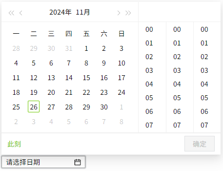
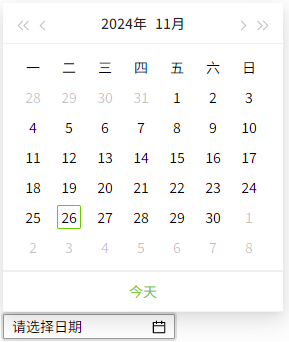
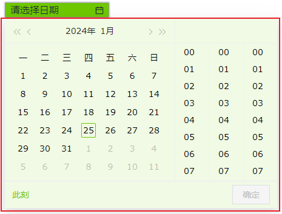

## 一、概述

日历控件用于提供直观的日期选择功能，支持多种日期格式化和显示方式，方便用户快速设置和选择日期时间信息。

## 二、使用场景

日历控件在以下场景中使用：

### 1.日期选择场景

- 当需要用户选择特定日期或日期范围时
- 数据筛选中的时间条件设置
- 报表生成的时间参数设置

## 三、快速开始

1. 拖拽日历控件到画布并调整位置尺寸
2. 设置"选择器类型"（Date 或 Datetime）
3. 配置"日期"属性设置默认显示日期
4. 在"格式"中选择或自定义日期显示格式
5. 调整样式属性（背景色、边框、字体等）
6. 设置"动作"定义日期选择后的交互行为

**示例：**

日期选择场景：

该示例是模拟用户选择数据筛选中时间筛选。用户点击日历控件选择开始时间和结束时间，系统根据时间去筛选对应的数据，如图1-1所示。

图 1-1

## 四、属性详解

|            |                                                                                                                                                                                                                                      |
| ---------- | ------------------------------------------------------------------------------------------------------------------------------------------------------------------------------------------------------------------------------------ |
| 名称       | 描述                                                                                                                                                                                                                                 |
| 名字       | 此控件的名称。                                                                                                                                                                                                                       |
| X          | 控件左侧距画布左侧的距离，单位px。                                                                                                                                                                                                   |
| Y          | 控件顶部距画布顶部的距离，单位px。                                                                                                                                                                                                   |
| W          | 控件的宽度，单位px。                                                                                                                                                                                                                 |
| H          | 控件的高度，单位px。                                                                                                                                                                                                                 |
| 角度       | 控件的旋转角度                                                                                                                                                                                                                       |
| 透明度     | 控件的透明度                                                                                                                                                                                                                         |
| 圆角       | 按钮四个角的圆角曲率。                                                                                                                                                                                                               |
| 日期       | 设置控件上显示的默认日期。                                                                                                                                                                                                           |
| 选择器类型 | 设置日历显示的内容格式，包含Datetime和Date。 当选择Datetime时，控件上可以选择年月日时分秒；  当选择Date时，只能选择年月日。  |
| 格式       | 对日期进行格式化，可下拉选择预设的格式，也可自行输入。 点击弹出格式窗口，在弹窗中双击选择格式。                                                                                                                                 |
| 背景       | 控件的背景色。                                                                                                                                                                        |
| 选择器背景 | 控件弹出日历窗口的背景色。                                                                                                                                                            |
| 边框颜色   | 控件的边框颜色。                                                                                                                                                                                                                     |
| 边框粗细   | 控件的边框粗细。                                                                                                                                                                                                                     |
| 字体       | 设置控件的字体。包括字体型号、字体大小、字体颜色、加粗、倾斜。                                                                                                                                                                       |
| 权限       | 设置控件的权限，控件显示隐藏/启动禁用                                                                                                                                                                                                |
