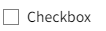
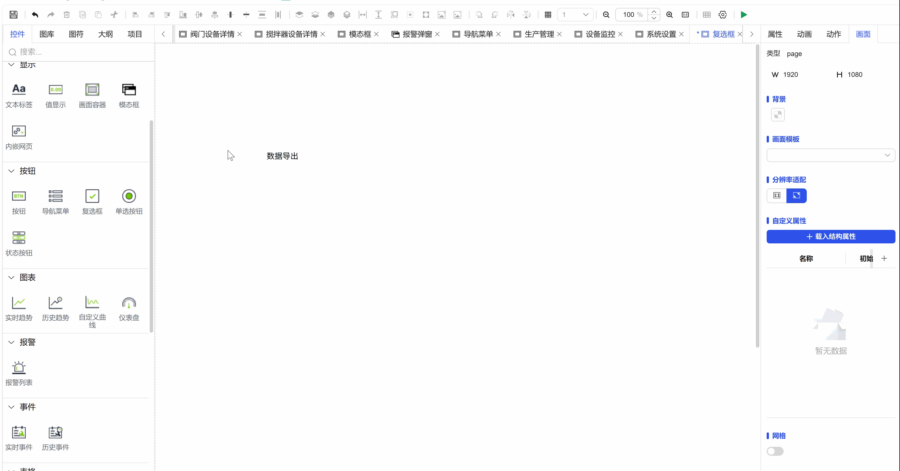
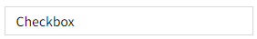

## 一、概述

复选框控件用于表示两种状态的切换选择，用户通过勾选或取消勾选来切换相应功能的状态，支持单个或多个选项的独立选择。

## 二、使用场景

复选框控件在以下场景中使用：

### 1.多选操作场景

- 当需要用户开启或关闭某个独立功能时
- 需要用户从多个选项中独立选择任意数量项时
- 数据筛选中的多条件组合选择

## 三、快速开始

1. 拖拽复选框控件到画布并调整位置尺寸
2. 在文本属性中设置控件显示的说明文字
3. 配置"选中"属性设置默认选中状态
4. 调整填充色、边框色等样式属性
5. 设置字体样式和对齐方式优化显示效果
6. 配置"动作"定义状态变化时的交互行为

**示例：**

### 1.多选操作**场景：**

1.1 多选操作场景示例

该示例是数据导出选项。设置多个复选框供用户选择需要导出的数据字段，如"导出基础信息"、"导出操作日志"、"导出统计报表"等，实现灵活的导出内容定制。如图1-1所示。

图 1-1

1.2 实际组态教程：

1. 拖拽复选框控件到画布并调整位置尺寸
2. 可是设置复选框填充的文本信息
3. 可以通过绑定选择属性，去改变其他变量的值（可选），保存运行即可

## 四、属性详解

| 名称   | 描述                                                                                                                                         |
| ------ | -------------------------------------------------------------------------------------------------------------------------------------------- |
| 名字   | 此控件的名称。                                                                                                                               |
| X      | 控件左侧距画布左侧的距离，单位px。                                                                                                           |
| Y      | 控件顶部距画布顶部的距离，单位px。                                                                                                           |
| W      | 控件的宽度，单位px。                                                                                                                         |
| H      | 控件的高度，单位px。                                                                                                                         |
| 角度   | 控件的旋转角度                                                                                                                               |
| 透明度 | 控件的透明度                                                                                                                                 |
| 选中   | 控件的选中状态。                                                                                                                             |
| 填充   | 控件的填充色。  控件显示的文本内容。  |
| 边框色 | 控件的边框色。                                                                              |
| 字体   | 设置文本内容的字体。包括字体型号、字体大小、字体颜色、粗体、倾斜、下划线、水平对齐方式、垂直对齐方式。                                       |
| 权限   | 设置控件的权限，控件显示隐藏/启动禁用                                                                                                        |
