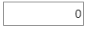
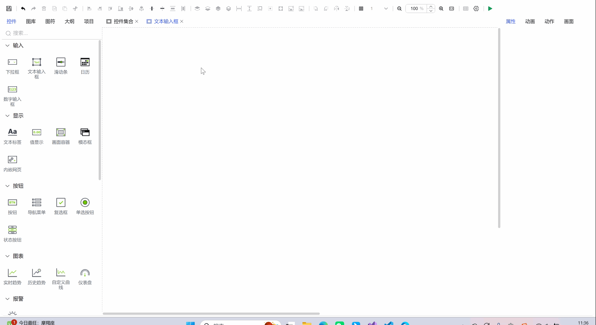
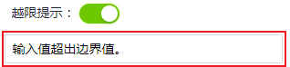
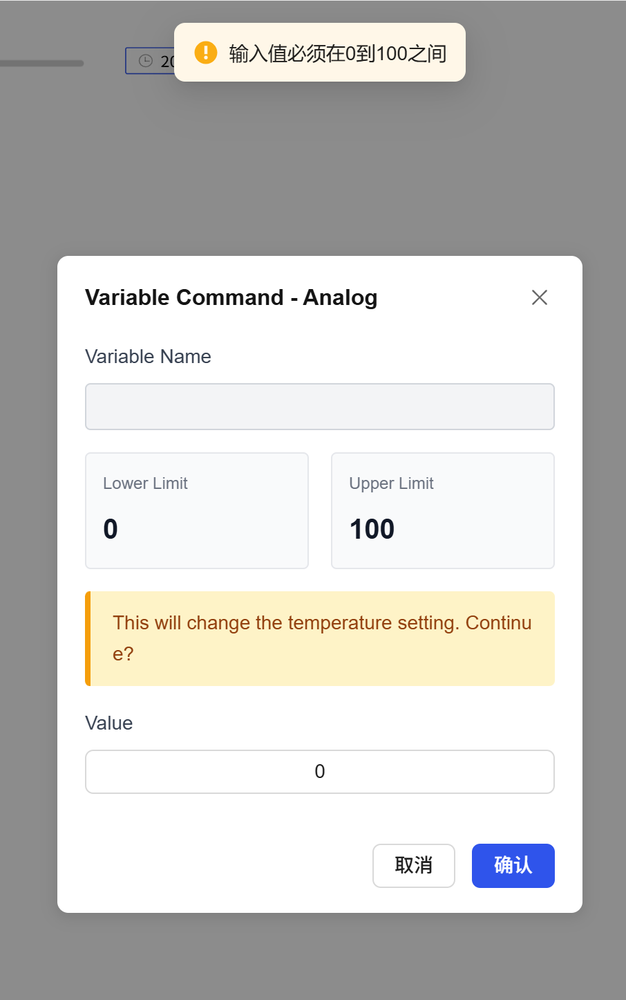
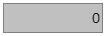

## 一、概述

数字输入框控件用于精确显示和输入数值数据，支持数值范围限制、小数位精度控制和安全边界检查，确保数字输入的准确性和有效性。

## 二、使用场景

数字输入框控件在以下场景中使用：

### 1.精确数值输入场景

- 将变量绑定至输入框，即可显示其他控件的数值
- 将设备变量或内部变量绑定至此输入框，以显示其数值

## 三、快速开始

1. 拖拽数字输入框控件到画布并调整位置尺寸
2. 设置"值"属性定义默认显示数值
3. 配置"小数位"确定数值显示精度
4. 启用"边界值"并设置最小值和最大值范围
5. 配置"超限提示"定义越界警告信息
6. 调整样式属性（填充色、边框、字体等）
7. 设置"动作"定义数值变化时的交互行为

**示例：**

数值输入场景：

该示例是模拟温度控制系统。设置边界值范围为0-100℃，用户只能输入在此范围内的温度值。当输入值超出范围时，系统显示超限提示并拒绝接受输入。如图1-1所示。

图 1-1

该实例主要是模拟将变量绑定到数值输入框，进行数据展示。如图1-2所示

图 1-2

## 四、属性详解

| 名称     | 描述                                                                                                                                                                                                                                 |
| -------- | ------------------------------------------------------------------------------------------------------------------------------------------------------------------------------------------------------------------------------------ |
| 名字     | 此控件的名称。                                                                                                                                                                                                                       |
| X        | 控件左侧距画布左侧的距离，单位px。                                                                                                                                                                                                   |
| Y        | 控件顶部距画布顶部的距离，单位px。                                                                                                                                                                                                   |
| W        | 控件的宽度，单位px。                                                                                                                                                                                                                 |
| H        | 控件的高度，单位px。                                                                                                                                                                                                                 |
| 角度     | 控件的旋转角度                                                                                                                                                                                                                       |
| 透明度   | 控件的透明度                                                                                                                                                                                                                         |
| 值       | 数字输入框内显示的值。                                                                                                                                                                                                               |
| 小数位   | 用于设置数字输入框内显示和输入的数值小数位的位数，不足自动补0。                                                                                                                                                                      |
| 边界值   | 设置是否启动界限。启用时，控件只能输入介于最大值和最小值之间的数值。 最小值 设置控件上允许输入的最小值 最大值 设置控件上允许输入的最大值                                                                         |
| 超限提示 | 设置是否启用越界提示。启用时，可以设置越界提示内容。  错误提示效果：  说明：越界提示必须在边界值启用时才会生效。 |
| 填充     | 数字输入框的背景色。                                                                                                                                                            |
| 边框颜色 | 数字输入框的边框颜色。                                                                                                                                                                                                               |
| 边框粗细 | 数字输入框的边框粗细。                                                                                                                                                                                                               |
| 字体     | 设置控件的字体。包括字体型号、字体大小、字体颜色、加粗、倾斜，以及水平对齐方式。                                                                                                                                                     |
| 权限     | 设置控件的权限，控件显示隐藏/启动禁用                                                                                                                                                                                                |
