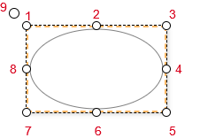
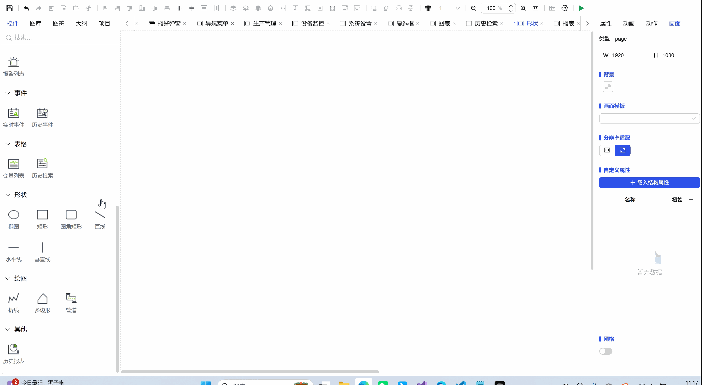

## 一、概述

椭圆形状控件用于在画布上创建和编辑椭圆形图形元素，通过简单的拖拽和属性调整实现灵活的图形设计，适用于界面装饰、数据区域划分和视觉引导等多种场景。

## 二、使用场景

椭圆控件在以下场景中使用：

### 1.数据可视化场景

- 用于图形化展示数据关系的辅助形状
- 数据分布图、关系图中的椭圆元素
- 进度指示、状态标识的圆形背景

## 三、快速开始

1. 从工具栏选择椭圆控件
2. 将鼠标放置在画布目标位置，按住鼠标左键
3. 拖动鼠标调整椭圆大小和形状
4. 释放鼠标左键完成椭圆创建
5. 通过选中框的8个控制点（位置1-8）调整椭圆大小
6. 使用旋转控制点（位置9）调整椭圆角度
7. 在属性面板中精确设置尺寸、位置和样式

**示例：**

### 1.数据可视化场景：

1.1 数据可视化场景示例

该示例是创建基本椭圆，设置基本属性，做如图1-1所示。

图 1-1

1.2 实际组态教程：

1. 拖拽椭圆控件到画布并调整位置尺寸
2. 可以设置椭圆的形状和填充，保存运行即可

## 四、属性详解

| 名称   | 描述                                                                   |
| ------ | ---------------------------------------------------------------------- |
| 名字   | 此控件的名称。                                                         |
| X      | 控件左侧距画布左侧的距离，单位px。                                     |
| Y      | 控件顶部距画布顶部的距离，单位px。                                     |
| W      | 控件的宽度，单位px。                                                   |
| H      | 控件的高度，单位px。                                                   |
| 角度   | 控件的旋转角度                                                         |
| 透明度 | 控件的透明度                                                           |
| 填充   | 控件的填充色 控件的填充程度 填充的方向 设置填充值的范围 |
| 边框   | 控件的边框颜色 控件的边框的线条种类 控件的边框的线条粗细     |
| 权限   | 设置控件的权限，控件显示隐藏/启动禁用                                  |
