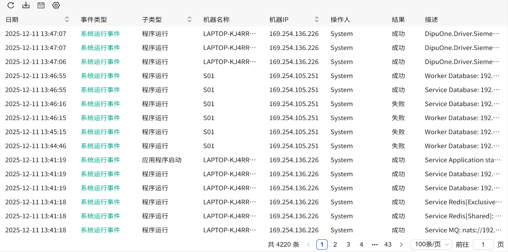

## 一、概述

事件列表控件用于动态展示系统中发生的事件信息，支持实时刷新、数据导出、列自定义以及数据筛选，通过表格形式清晰呈现事件详情，便于用户及时掌握系统动态。

## 二、使用场景

实时事件控件在以下场景中使用：

### 1.系统监控场景

- 当需要实时追踪系统操作、状态变化等动态事件时
- 用户操作日志、设备状态变更、数据修改记录等实时监控
- 多用户协同工作环境中的事件追踪

## 三、快速开始

1. 拖拽事件列表控件到画布并调整位置尺寸
2. 设置"自动刷新"定义数据更新间隔
3. 在"列设置"中配置需要显示的事件列
4. 配置边框样式和表格线粗细颜色
5. 设置"表头"和"表体"的样式和字体
6. 在"事件颜色"中为不同事件类型设置显示颜色
7. 在"其他"中设置事件最多显示条数（最大2000条）

**示例：**

### 1.系统监控场景：

1.1 系统监控场景示例

该示例是生产线操作事件监控。设置刷新频率为2秒，显示列包括"日期"、"操作人"、"机器名称"、"机器IP"、"事件类型"、"结果"，通过不同颜色区分正常操作和异常事件，实时监控生产线操作情况。如图1-1所示。

图 1-1

1.2 实际组态教程：

1. 拖拽实时事件控件到画布并调整位置尺寸
2. 可以在列设置中设置实时事件的的列表数据项
3. 可以设置不同事件的颜色显示
4. 可以设置事件刷新频率，全部设置完成保持运行即可

## 四、属性详解

| 名称                              | 描述                                                         |
| --------------------------------- | ------------------------------------------------------------ |
| 名字                              | 此控件的名称。                                               |
| X                                 | 控件左侧距画布左侧的距离，单位px。                           |
| Y                                 | 控件顶部距画布顶部的距离，单位px。                           |
| W                                 | 控件的宽度，单位px。                                         |
| H                                 | 控件的高度，单位px。                                         |
|  | 控件的透明度                                                 |
| 刷新频率                          | 设置刷新频率                                                 |
| 边框颜色                          | 设置控件外边框及表体的表格线颜色。                           |
| 边框粗细                          | 设置控件外边框及表体的表格线的粗细。                         |
| 表头                              | 设置表头的背景色、字体型号、字体大小、加粗、倾斜、字体颜色。 |
| 表体                              | 设置表体的背景色、字体型号、字体大小、加粗、倾斜、字体颜色。 |
| 颜色                              | 设置每个事件类型在控件上显示的颜色。                         |
| 按钮样式                          | 设置控件上使用的按钮的样式。点击按钮样式的设置按钮进行设置。 |
| 筛选面板                          | 设置表头背景色，表体背景色                                   |
| 列设置                            | 设置需要显示在控件上的列名。                                 |
| 其他                              | 设置报警最多显示条数                                         |
| 权限                              | 设置控件的权限，控件显示隐藏/启动禁用                        |
