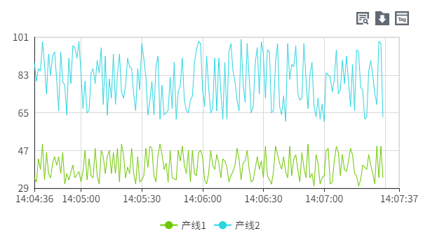

## 一、概述

历史趋势图控件用于分析展示数据在过去一段时间内的变化趋势，通过对历史数据的可视化呈现，帮助用户分析数据规律、识别异常和进行趋势预测。

## 二、使用场景

历史趋势控件在以下场景中使用：

### 1.历史数据分析场景

- 当需要对过去某段时间的数据进行趋势分析和回顾时
- 生产质量的历史波动分析、设备运行的历史记录查看
- 业务指标的周期性变化规律研究

## 三、快速开始

1. 拖拽历史趋势图控件到画布并调整位置尺寸
2. 在"时间范围"中选择"最近"或"自定义"时间段
3. 在"数据"中配置曲线变量、名称和显示样式
4. 配置X轴时间格式和Y轴显示格式和显示范围
5. 配置图例显示的位置

**示例：**

### 1.历史数据分析**场景：**

1.1 历史数据分析场景示例

该示例是设备能耗分析趋势图。设置时间范围为当天，配置"日用电量"曲线，通过趋势分析发现能耗异常日期。如图1-1所示。

图 1-1

1.2 实际组态教程：

1. 拖拽历史趋势控件到画布并调整位置尺寸
2. 图表中Y轴数据在数据中添加数据行，数据行可以绑定用户想关注的数据，同时可以设置该数据的线条样式等
3. 可以设置图表的按钮的显示以及样式，可以设置X轴和Y轴的显示格式和范围

## 四、属性详解

| 名称                                | 描述                                                                                                                                                                                                                                                                                                                                                                                                                                                                                                                                                                                                                                                                                                                                                                                                                                                                                                                                                                                                                                                          |
| ----------------------------------- | ------------------------------------------------------------------------------------------------------------------------------------------------------------------------------------------------------------------------------------------------------------------------------------------------------------------------------------------------------------------------------------------------------------------------------------------------------------------------------------------------------------------------------------------------------------------------------------------------------------------------------------------------------------------------------------------------------------------------------------------------------------------------------------------------------------------------------------------------------------------------------------------------------------------------------------------------------------------------------------------------------------------------------------------------------------- |
| 名字                                | 此控件的名称。                                                                                                                                                                                                                                                                                                                                                                                                                                                                                                                                                                                                                                                                                                                                                                                                                                                                                                                                                                                                                                                |
| X                                   | 控件左侧距画布左侧的距离，单位px。                                                                                                                                                                                                                                                                                                                                                                                                                                                                                                                                                                                                                                                                                                                                                                                                                                                                                                                                                                                                                            |
| Y                                   | 控件顶部距画布顶部的距离，单位px。                                                                                                                                                                                                                                                                                                                                                                                                                                                                                                                                                                                                                                                                                                                                                                                                                                                                                                                                                                                                                            |
| W                                   | 控件的宽度，单位px。                                                                                                                                                                                                                                                                                                                                                                                                                                                                                                                                                                                                                                                                                                                                                                                                                                                                                                                                                                                                                                          |
| H                                   | 控件的高度，单位px。                                                                                                                                                                                                                                                                                                                                                                                                                                                                                                                                                                                                                                                                                                                                                                                                                                                                                                                                                                                                                                          |
|  | 控件的旋转角度                                                                                                                                                                                                                                                                                                                                                                                                                                                                                                                                                                                                                                                                                                                                                                                                                                                                                                                                                                                                                                                |
|    | 控件的透明度                                                                                                                                                                                                                                                                                                                                                                                                                                                                                                                                                                                                                                                                                                                                                                                                                                                                                                                                                                                                                                                  |
| 时间范围                            | 按照设置的时间段进行查询。 最近 设置数据展示的时间范围。 自定义 设置开始时间和结束时间，自定义数据展示的时间范围。                                                                                                                                                                                                                                                                                                                                                                                                                                                                                                                                                                                                                                                                                                                                                                                                                                                                                                                        |
| 数据                                | 点击数据集按钮为历史趋势图设置数据来源及样式。 点击该按钮可以设置曲线的数据源和样式。变量设置线条的数据来源。 点击变量栏最右侧的如下符号，可以将变量的路径直接复制到名称栏。 名称 设置线条名称。 Y轴 选择一个Y轴，作为当前变量的Y轴。 线条颜色 设置线条的颜色。 线条类型 设置线条的类型。 线条样式 设置线条的样式。 线宽 设置线条的粗细。 区域填充 设置线条和轴之间的区域背景色。 报警线 设置是否将变量的报警值作为一条直线显示在当前控件上。点击报警线的设置按钮，选择需要显示的报警线，并为其设置样式。 勾选报警线的checkbox，用于在控件上启用报警线的显示。 平均线 设置是否将变量在查询时间段内的平均值作为一条直线显示在当前控件上。启用后可以设置平均线的线型。 平均线线宽 设置平均线的线宽。 标记样式 设置线条连接点的样式。 标记大小 设置线条连接点的大小，单位px。 小数位 鼠标移到线条上所显示的数值的小数位数。 聚合模式 设置数据的聚合方式。当查询类型为固定点数和周期性时，该字段生效。 |
| 显示                                | 设置按钮的显示、隐藏。 选择变量按钮 控制选择变量按钮的显示、隐藏。显示的情况下，在运行页面可以通过此按钮重新设置变量及其对应曲线的显示样式。 导出按钮 控制导出按钮的显示、隐藏。显示的情况下，在运行页面可以将查询到的数据进行导出。 查询按钮 控制查询按钮的显示、隐藏。显示的情况下，在运行页面可以重新设置查询的时间范围和方式。                                                                                                                                                                                                                                                                                                                                                                                                                                                                                                                                                                                                                                                                                              |
| 按钮样式                            | 设置按钮的颜色。 选择变量按钮 设置选择变量按钮的颜色。 查询按钮 设置查询按钮的颜色。 导出按钮 设置导出按钮的颜色。                                                                                                                                                                                                                                                                                                                                                                                                                                                                                                                                                                                                                                                                                                                                                                                                                                                                                                              |
| 颜色                                | 设置控件的颜色效果。 背景 设置控件的整体背景色。 栅格 设置栅格的线条颜色。 X轴 设置X轴的轴线颜色。                                                                                                                                                                                                                                                                                                                                                                                                                                                                                                                                                                                                                                                                                                                                                                                                                                                                                                                              |
| 边距                                | 设置历史趋势图与其选中框之间的间距。确保图表能清晰显示，并为图表元素（如时间或图例）预留足够的空间。                                                                                                                                                                                                                                                                                                                                                                                                                                                                                                                                                                                                                                                                                                                                                                                                                                                                                                                                                          |
| X轴                                 | 设置X轴的样式。 显示栅格 控制栅格的显示、隐藏。 时间格式 设置X轴显示的时间的格式,可以选择系统预置的时间格式，也可以手动输入，设置的时间格式须符合Echarts的时间格式要求。 字体 设置X轴显示的文字的字体、字体大小、粗体、斜体、字体颜色。                                                                                                                                                                                                                                                                                                                                                                                                                                                                                                                                                                                                                                                                                                                                                                                         |
| Y轴                                 | 设置Y轴的样式。 显示栅格 控制栅格的显示、隐藏。 启用子图 控制主图表中是否允许嵌入另一个图表。 分度数 设置在Y轴上插入的分割线数量。 轴 显示轴的行列数。点击该按钮可以设置轴的样式。 名称 Y轴的名称。 自动显示范围 Y轴的量程根据值的范围动态变化。如果选中，则将自动确定Y轴的值范围。如果未选中，则将使用最小值和最大值。选择自动后，最小值和最大值变为失效状态。 最小值 Y轴的最小值。 最大值 Y轴的最大值。 小数位 设置Y轴的刻度值上显示的小数位数。 显示 设置Y轴的显示、隐藏。 位置 设置Y轴的位置。 偏移 设置Y轴相对于默认位置的偏移。 轴颜色 设置Y轴的颜色。 字体 设置Y轴坐标的字体。 字体大小 设置Y轴坐标的字体大小。 字体颜色 设置Y轴坐标的字体颜色。 字体加粗 设置Y轴坐标的字体粗细。 字体倾斜 设置Y轴坐标的字体倾斜。 子图权重 子图在主图表中所占的空间大小。 子图背景 设置子图的背景色。                                                         |
| 图例                                | 设置图例的样式。 显示 控制图例的显示、隐藏。默认显示。 位置 设置图例的显示位置。 字体 设置图例的字体、字体大小、粗体、斜体、字体颜色。                                                                                                                                                                                                                                                                                                                                                                                                                                                                                                                                                                                                                                                                                                                                                                                                                                                                                          |
| 权限                                | 设置控件的权限，控件显示隐藏/启动禁用                                                                                                                                                                                                                                                                                                                                                                                                                                                                                                                                                                                                                                                                                                                                                                                                                                                                                                                                                                                                                         |
