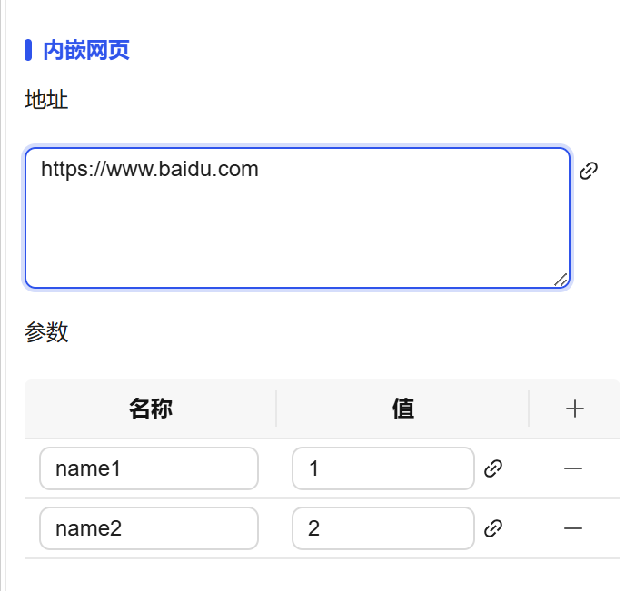

## 一、概述

内嵌网页控件用于在当前画面中嵌入和显示外部网站的网页内容，实现多系统集成和第三方应用的无缝接入，支持参数动态拼接和自定义样式设置。

## 二、使用场景

内嵌网页控件在以下场景中使用：

### 1.系统集成场景

- 当需要将第三方系统或外部网站集成到当前应用中时
- 外部服务或工具的直接嵌入使用
- 需要显示实时数据大屏或监控视频画面时

## 三、快速开始

1. 拖拽内嵌网页控件到画布并调整位置尺寸
2. 在"地址"属性中输入要嵌入的网页URL地址，可绑定现实动态更新。
3. 在"参数"中设置需要拼接的URL参数（可选）
4. 配置边框样式（颜色、粗细、圆角）定义显示效果
5. 设置权限控制网页的访问和显示条件

**示例：**

### 1.系统集成**场景：**

1.1 系统集成场景示例

该示例是在画面直接嵌入网页。可以嵌入百度网页，为用户提供网络查询功能。如图1-1所示。

图 1-1

1.2 实际组态教程：

1. 拖拽内嵌网页控件到画布并调整位置尺寸
2. 在地址里面输入网页IP地址或者通过绑定的方式动态改变IP地址
3. 可以加入参数，该参数会默认加入地址后面，形成新的IP地址

## 四、属性详解

| 名称     | 描述                                                                                                                                                                                               |
| -------- | -------------------------------------------------------------------------------------------------------------------------------------------------------------------------------------------------- |
| 名字     | 此控件的名称。                                                                                                                                                                                     |
| X        | 控件左侧距画布左侧的距离，单位px。                                                                                                                                                                 |
| Y        | 控件顶部距画布顶部的距离，单位px。                                                                                                                                                                 |
| W        | 控件的宽度，单位px。                                                                                                                                                                               |
| H        | 控件的高度，单位px。                                                                                                                                                                               |
| 角度     | 控件的旋转角度                                                                                                                                                                                     |
| 圆角     | 按钮四个角的圆角曲率。                                                                                                                                                                             |
| 边框     | 设置内嵌网页的边框，支持进行边框色和边框粗细设置。                                                                                                                                                 |
| 内嵌网页 | 地址 输入网页IP地址，即可显示相应的网页  参数 可以自定义对地址栏里面的IP地址后面的参数，自动拼接到地址栏IP地址后面形成新的IP地址 |
| 权限     | 设置控件的权限，控件显示隐藏/启动禁用                                                                                                                                                              |
