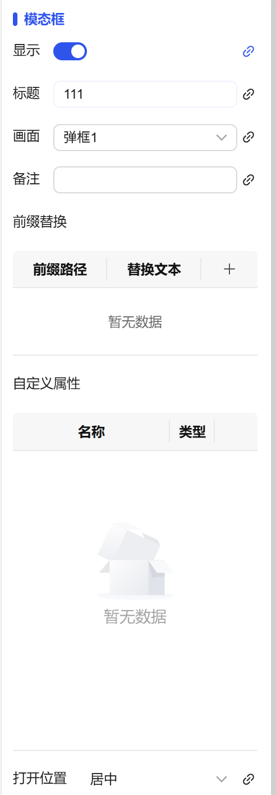

## 一、概述

模态框控件用于在特定条件触发时弹出指定的弹框画面，通过打断式交互引导用户专注处理当前任务，支持自定义打开位置和属性传递。

## 二、使用场景

模态框控件在以下场景中使用：

### 1.信息展示场景

- 需要突出显示详细信息或报警信息时
- 数据详情查看、报表展示、帮助说明等
- 当需要用户确认重要操作或输入关键信息时

## 三、快速开始

1. 拖拽模态框控件到画布并调整位置尺寸
2. 在"画面"属性中选择要弹出的弹框画面
3. 设置"标题"定义弹框的显示标题
4. 配置"打开位置"确定弹框在屏幕中的显示位置
5. 通过"显示"属性控制弹框的显示和隐藏状态
6. 设置触发条件和动作实现自动弹出逻辑

**示例：**

### 1.信息展示**场景：**

1.1 信息展示场景示例

该示例是实现设备报警弹窗功能。当触发某个条件时，触发模态框显示确认弹框，包含报警信息。如图1-1所示。

图 1-1

1.2 实际组态教程：

1. 拖拽模态框控件到画布并调整位置尺寸
2. 输入弹框标题，画面选择所需弹框，通过显示来选择弹出弹框显示还是隐藏弹框
3. 将显示绑定到变量上，触发条件时，弹出弹框

## 四、属性详解

| 名称   | 描述                                                                                                                                                                                                                                                                                                        |
| ------ | ----------------------------------------------------------------------------------------------------------------------------------------------------------------------------------------------------------------------------------------------------------------------------------------------------------- |
| 名字   | 此控件的名称。                                                                                                                                                                                                                                                                                              |
| X      | 控件左侧距画布左侧的距离，单位px。                                                                                                                                                                                                                                                                          |
| Y      | 控件顶部距画布顶部的距离，单位px。                                                                                                                                                                                                                                                                          |
| W      | 控件的宽度，单位px。                                                                                                                                                                                                                                                                                        |
| H      | 控件的高度，单位px。                                                                                                                                                                                                                                                                                        |
| 模态框 | 显示 显示/隐藏模态框绑定的弹框画面 标题 绑定的弹框画面的标题 画面 为控件绑定弹框画面，如果所选画面设置了自定义属性，则将显示所选画面的自定义属性，可以修改自定义属性的值。  打开位置 所绑定的弹框画面在屏幕中的打开位置 |
