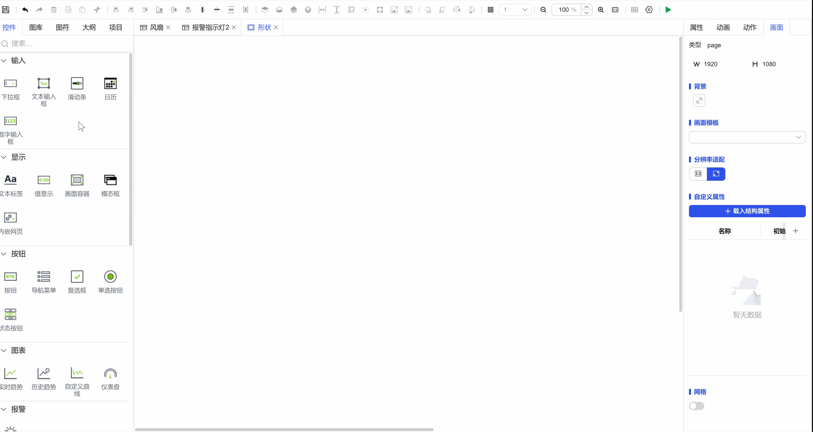
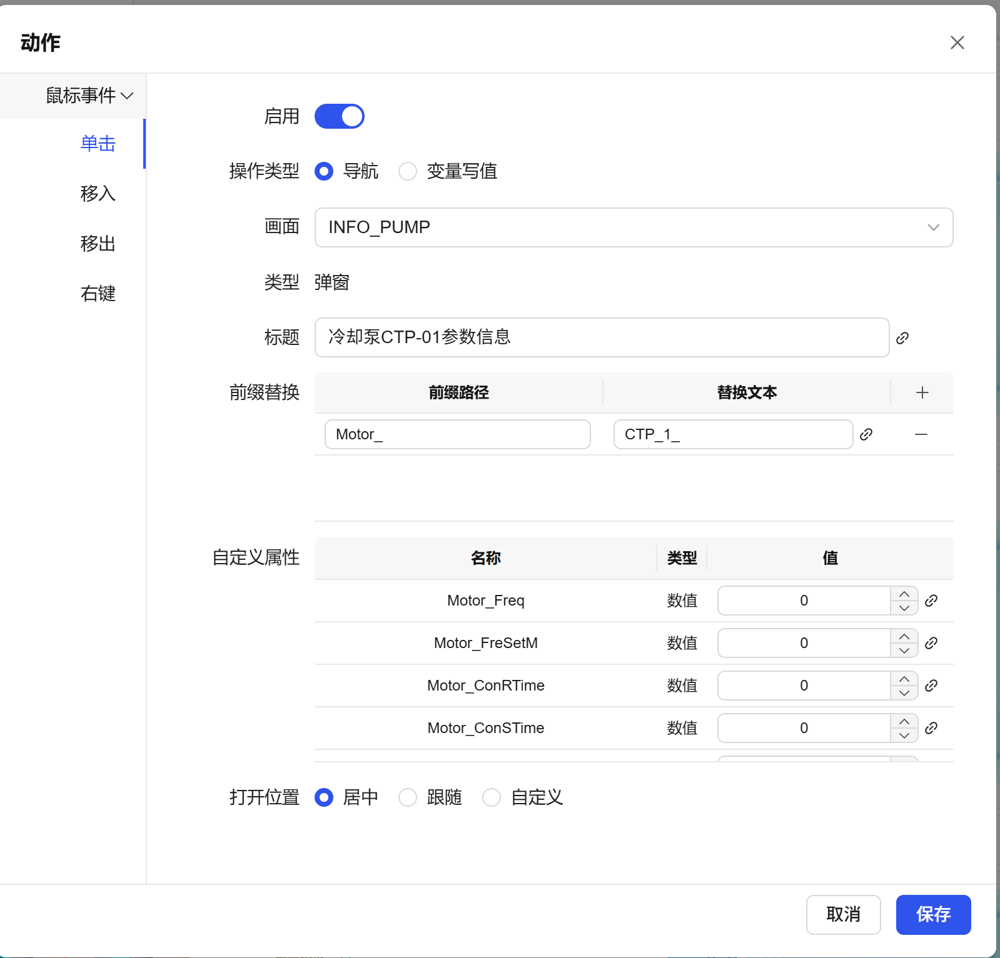

## 一、概述

导航动作是构建多画面应用的核心交互功能，允许您在满足特定条件时，自动或响应用户操作跳转到指定的目标画面或弹出模态对话框。

## 二、导航目标类型与配置

### 1.导航到画面

- **功能描述**：从项目画面列表中，选择一个常规画面作为跳转目标。
- **可配置项**：

  - **目标画面**：从列表中选择要打开的常规画面。
  - **打开位置**：设置目标画面在应用中的打开方式（如新标签页、当前页替换）。
  - **画面标题**：可为本次打开的动作指定一个自定义的标题。
- **应用场景**：主菜单切换、步骤流程跳转、查看详细信息页面等。

**示例：**

图 1-1

### 2. 导航到弹窗

- **功能描述**：从项目画面列表中，选择一个专门设计的弹窗画面作为弹出目标。
- **可配置项**：

  - **目标弹窗**：从列表中选择要弹出的弹窗画面。
  - **打开位置**：设置弹窗在屏幕中的显示位置（居中、跟随、自定义）。
  - **弹窗标题**：指定弹窗的标题文字。
  - **自定义属性绑定**：**核心功能**。可对弹窗中定义的“自定义属性”进行数据绑定，从而实现向弹窗传递参数或动态内容。例如，向一个“设备详情”弹窗传入不同的设备ID。
  - **前缀替换**：**高效复用功能**。通过替换弹窗内部数据源的前缀（如变量名、标签ID前缀），可以在不重复构建弹窗的情况下，使其展示不同的数据集。例如，一个通用的“参数设置”弹窗，通过替换前缀，即可用于设置A设备和B设备的不同参数。
- **应用场景**：弹出详细信息对话框、进行参数设置、显示确认或消息提示框等需要中断当前流程的交互。

**示例：**

图 1-2

## 三、使用流程

1. 在控件或事件的 **“动作”** 配置中，选择 **“导航”** 类型。
2. 选择导航的目标类型：**画面** 或 **弹窗**。
3. 根据所选类型，从列表中选择具体的目标画面/弹窗。
4. 配置相应的打开位置、标题等参数。
5. （**弹窗特有**）进行**自定义属性绑定**或配置**前缀替换**，以实现数据的动态传递和弹窗的灵活复用。
6. 设置触发该导航动作的条件（如按钮点击、数据变化等）。
