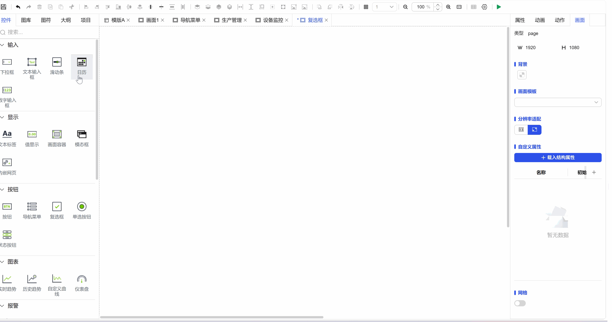
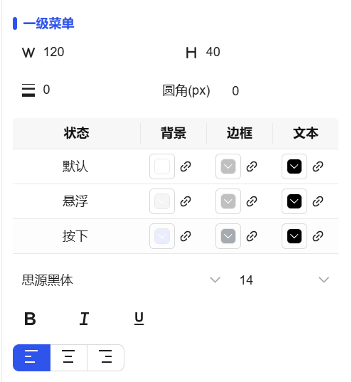
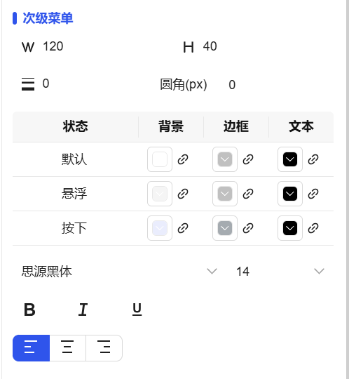

## 一、概述

导航菜单控件用于提供清晰的页面导航结构，支持两级菜单层级，方便用户快速定位和访问系统功能模块，提升操作效率和用户体验。

## 二、使用场景

导航菜单控件在以下场景中使用：

### 1.系统导航场景

- 当应用包含多个功能模块需要统一导航管理时
- 大型系统的功能分类和页面跳转控制
- 多层级业务系统的结构化菜单展示
- 侧边栏和顶部导航的灵活切换

## 三、快速开始

1. 拖拽导航菜单控件到画布并调整位置尺寸
2. 在"布局"中选择水平或垂直排列方式
3. 在"数据"中编辑各级菜单的名称和对应值
4. 配置一级菜单的尺寸、字体和状态颜色
5. 设置二级菜单的显示样式和交互效果
6. 调整整体菜单的背景、边框和圆角样式
7. 设置"动作"定义菜单项点击后的跳转行为

**示例：**

### 1.系统导航**场景：**

1.1 系统导航场景示例

该示例是构建企业管理系统导航。一级菜单设置为["生产管理", "设备监控", "系统设置"]，每个一级菜单下配置相应的二级菜单项，如"生产管理"下包含["生产计划", "进度跟踪", "产量统计"]。如图1-1所示。

**注意**：如果要实现点击导航项跳转，导航项名称必须和已有画面名称一一对应

图 1-1

1.2 实际组态教程：

1. 拖拽导航菜单控件到画布并调整位置尺寸
2. 可以分别设置一级菜单和二级菜单的样式，包括不同状态下对应的背景色，边框，文本
3. 找到数据栏，点击编辑菜单数据，将显示的菜单名称在此编辑即可，注意如果要实现点击菜单项跳转画面功能，菜单名称必须是已有画面的名称，必须是一一对应。
4. 点击动作，开启特殊事件，即可实现点击菜单项跳转功能

## 四、特殊事件

| 点击项   |                                                                                                                                                                                                                                                                                                                                                                                       |                                                                      |
| -------- | ------------------------------------------------------------------------------------------------------------------------------------------------------------------------------------------------------------------------------------------------------------------------------------------------------------------------------------------------------------------------------------- | -------------------------------------------------------------------- |
| 说明     | 当用户在菜单列表中点击某一具体项时立即触发。                                                                                                                                                                                                                                                                                                                                          |                                                                      |
| 入参     | 菜单数据中的值                                                                                                                                                                                                                                                                                                                                                                        |                                                                      |
| 操作类型 | 导航（跳转到画面或弹窗）                                                                                                                                                                                                                                                                                                                                                              | 菜单数据中“值”必须与目标画面或弹窗的名称完全一致，否则无法正确跳转。 |
|          |                                                                                                                                                                                                                                                                                                                                                                                       |                                                                      |
| 配置流程 | 1.在控件“动作”设置中，选择**“点击项”**作为触发事件 2.选择**“导航”作为执行动作类型 3.设置目标画面或弹窗 4.配置打开位置（替换当前窗口/在新标签页打开） 5.保存配置，完成精确导航设置 通过为“点击项”事件配置动作，您可以构建出灵活、高效且符合用户操作习惯的导航系统，实现不同菜单项点击后的差异化跳转行为。图 1-2 |                                                                      |

## 五、属性详解

| 名称     | 描述                                                                                                                                                                                                                                                                                                                                                                           |
| -------- | ------------------------------------------------------------------------------------------------------------------------------------------------------------------------------------------------------------------------------------------------------------------------------------------------------------------------------------------------------------------------------ |
| 名字     | 此控件的名称。                                                                                                                                                                                                                                                                                                                                                                 |
| X        | 控件左侧距画布左侧的距离，单位px。                                                                                                                                                                                                                                                                                                                                             |
| Y        | 控件顶部距画布顶部的距离，单位px。                                                                                                                                                                                                                                                                                                                                             |
| W        | 控件的宽度，单位px。                                                                                                                                                                                                                                                                                                                                                           |
| H        | 控件的高度，单位px。                                                                                                                                                                                                                                                                                                                                                           |
| 角度     | 控件的旋转角度                                                                                                                                                                                                                                                                                                                                                                 |
| 透明度   | 控件的透明度                                                                                                                                                                                                                                                                                                                                                                   |
| 布局     | 设置菜单的整体布局方式。包含水平、垂直，菜单项间距                                                                                                                                                                                                                                                                                                                             |
| 菜单     | 可以设置背景、边框、线宽、圆角等                                                                                                                                                                                                                                                                                                                                               |
| 一级菜单 | 设置一级菜单的显示样式。 W 一级菜单的宽度，单位px。 H 一级菜单的高度，单位px。 字体 设置一级菜单的字体。包括字体型号、字体大小、加粗、倾斜、水平对齐方式、垂直对齐方式。 可以为菜单设置不同操作状态下的颜色效果。状态包括：默认、悬浮、选中。 可以为每种状态设置背景色和字体颜色。  |
| 次级菜单 | 设置二级菜单的显示样式 W 二级菜单的宽度，单位px。 H 二级菜单的高度，单位px。 字体 设置二级菜单的字体。包括字体型号、字体大小、加粗、倾斜、水平对齐方式、垂直对齐方式。 可以为菜单设置不同操作状态下的颜色效果。状态包括：默认、悬浮、选中。 可以为每种状态设置背景色和字体颜色。    |
| 数据     | 编辑各级菜单的数据，菜单名称和菜单的值                                                                                                                                                                                                                                                                                                                                         |
| 权限     | 设置控件的权限，控件显示隐藏/启动禁用                                                                                                                                                                                                                                                                                                                                          |
