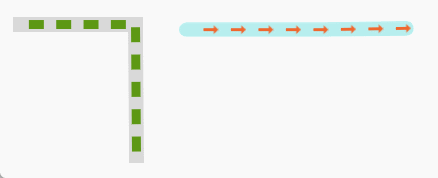
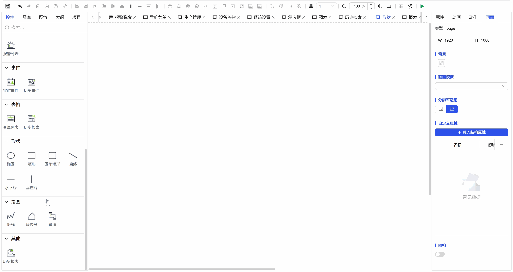
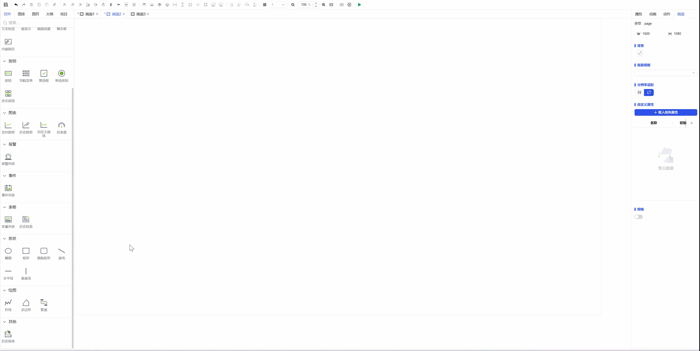

## 一、概述

管道形状控件用于在画布上创建和编辑管道图形，模拟工业流程中的物理管道，支持多段连接和自定义样式，适用于工艺流程图的管道网络绘制和系统连接示意图。

## 二、使用场景

管道控件在以下场景中使用：

### 1.数据可视化场景

- 当需要绘制工业流程中的管道连接和物料传输路径时
- 设备间的物理或逻辑连接示意图
- 创建设备布局中的管道走向和连接关系

## 三、快速开始

1. 单击鼠标左键，从工具栏选择管道控件
2. 在画布起始位置单击鼠标左键并拖动鼠标绘制第一段管道
3. 松开鼠标完成第一段，再次按下拖动绘制下一段管道
4. 重复步骤绘制多段连接管道，形成完整管道路径
5. 单击鼠标右键完成绘制
6. 通过选中框的控制点调整管道整体大小和角度
7. 双击管道进入编辑状态，拖动端点调整管道形状

**示例：**

### 1.数据可视化场景：

1.1 数据可视化场景示例

该示例是创建管道，设置基本属性，如图1-1所示。

图 1-1

1.2 实际组态教程：

1. 单击鼠标左键，从工具栏选择折线控件
2. 在画布起始位置单击鼠标左键并拖动鼠标绘制第一条线段
3. 单机鼠标左键完成第一条线段，再次按下拖动绘制下一条线段
4. 重复步骤绘制多个线段，单击鼠标右键确定终点位置
5. 设置管道的具体形式，以及运行时的背景色和停止时的背景色
6. 设置流体的样式，以及间距，流速，流向等
7. 保存运行即可

## 四、管道控件专属操作

除通用绘图操作外，管道控件支持以下专属交互操作，以提升绘制效率和精确度：

### 1.连续绘制模式

| 操作         | 效果与图示                                                                                                        |
| ------------ | ----------------------------------------------------------------------------------------------------------------- |
| 双击管道端点 | 进入连续绘制模式。鼠标将自动吸附到该端点，可继续拖动绘制下一段连接的管道，实现不间断的管道网络绘制。如图1-2所示。 |

图 1-2

### 2.高级调整与辅助功能

| 操作                  | 功能说明                                                                                                                           |
| --------------------- | ---------------------------------------------------------------------------------------------------------------------------------- |
| 按住Ctrl键 + 拖动端点 | 进入自由旋转模式。此时拖动端点可任意角度旋转管道方向，而非仅限水平或垂直延伸，适用于绘制斜向管道。                                 |
| 绘制/移动时显示对齐线 | 在绘制新管道或移动现有管道时，系统会自动显示智能对齐参考线（如水平、垂直或与其他管道端点对齐），辅助实现精确的端点对接与布局对齐。 |

## 五、属性详解

| 名称   | 描述                                                                                                                                                               |
| ------ | ------------------------------------------------------------------------------------------------------------------------------------------------------------------ |
| 名字   | 此控件的名称。                                                                                                                                                     |
| X      | 控件左侧距画布左侧的距离，单位px。                                                                                                                                 |
| Y      | 控件顶部距画布顶部的距离，单位px。                                                                                                                                 |
| W      | 控件的宽度，单位px。                                                                                                                                               |
| H      | 控件的高度，单位px。                                                                                                                                               |
| 角度   | 控件的旋转角度                                                                                                                                                     |
| 透明度 | 控件的透明度                                                                                                                                                       |
| 管道   | 选择管道的形状 运行时管道的背景色 停止时管道的背景色 管道的直径 管道是否为立体                                                                 |
| 流体   | 管道中流体的开启 管道中流体的形状 管道中流体的宽度和高度 管道中流体的间距 管道中流体的流速 管道中流体的流向 停止时管道中的流体的样式 |
| 权限   | 设置控件的权限，控件显示隐藏/启动禁用                                                                                                                              |
