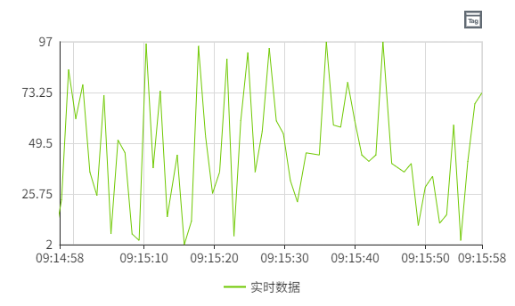
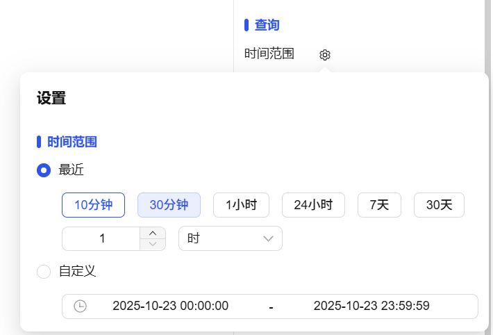
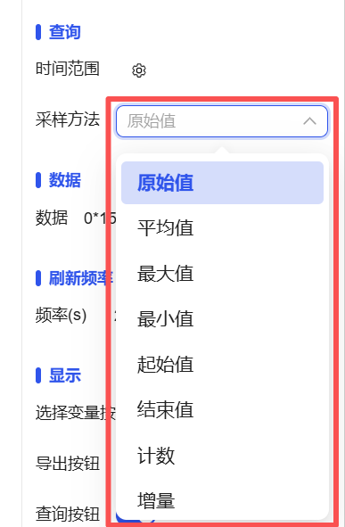
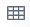

## 一、概述

实时趋势图控件用于可视化展示数据随时间变化的动态趋势，通过时间轴（X轴）和数据轴（Y轴）的坐标系统，实时反映数据的波动规律和发展态势。

## 二、使用场景

实时趋势控件在以下场景中使用：

### 1.实时监控场景

- 当需要实时监测设备运行参数、工艺指标等动态数据时
- 工业自动化系统中的温度、压力、流量等工艺参数趋势监控
- 系统性能指标、资源使用率的实时跟踪

## 三、快速开始

1. 拖拽实时趋势图控件到画布并调整位置尺寸
2. 在"数据"中配置曲线变量、名称和显示样式，定义趋势图Y轴数据
3. 设置"查询"时间范围定义数据展示区间
4. 配置X轴和Y轴的显示样式和刻度设置
5. 调整颜色方案（背景、栅格、轴线等）
6. 设置图例位置和显示控制
7. 配置刷新频率确保数据实时更新

**示例：**

### 1.实时监控**场景：**

1.1 实时监控场景示例

该示例是温度监控趋势图。配置温度曲线分别显示"环境温度"，设置1分钟刷新频率，实时展示温度变化趋势。如图1-1所示。

图 1-1

1.2 实际组态教程：

1. 拖拽实时趋势控件到画布并调整位置尺寸
2. 图表中Y轴数据在数据中添加数据行，数据行可以绑定用户想关注的数据，同时可以设置该数据的线条样式等
3. 可以设置图表的刷新频繁，以及X轴的时间范围和时间格式

## 四、属性详解

| 名称                                | 描述                                                                                                                                                                                                                                                                                                                                                                                                                                                                                                                                                                                                                                                                                                                                                                                                                                                                                                                                                                                                          |
| ----------------------------------- | ------------------------------------------------------------------------------------------------------------------------------------------------------------------------------------------------------------------------------------------------------------------------------------------------------------------------------------------------------------------------------------------------------------------------------------------------------------------------------------------------------------------------------------------------------------------------------------------------------------------------------------------------------------------------------------------------------------------------------------------------------------------------------------------------------------------------------------------------------------------------------------------------------------------------------------------------------------------------------------------------------------- |
| 名字                                | 此控件的名称。                                                                                                                                                                                                                                                                                                                                                                                                                                                                                                                                                                                                                                                                                                                                                                                                                                                                                                                                                                                                |
| X                                   | 控件左侧距画布左侧的距离，单位px。                                                                                                                                                                                                                                                                                                                                                                                                                                                                                                                                                                                                                                                                                                                                                                                                                                                                                                                                                                            |
| Y                                   | 控件顶部距画布顶部的距离，单位px。                                                                                                                                                                                                                                                                                                                                                                                                                                                                                                                                                                                                                                                                                                                                                                                                                                                                                                                                                                            |
| W                                   | 控件的宽度，单位px。                                                                                                                                                                                                                                                                                                                                                                                                                                                                                                                                                                                                                                                                                                                                                                                                                                                                                                                                                                                          |
| H                                   | 控件的高度，单位px。                                                                                                                                                                                                                                                                                                                                                                                                                                                                                                                                                                                                                                                                                                                                                                                                                                                                                                                                                                                          |
|  | 控件的旋转角度                                                                                                                                                                                                                                                                                                                                                                                                                                                                                                                                                                                                                                                                                                                                                                                                                                                                                                                                                                                                |
|    | 控件的透明度                                                                                                                                                                                                                                                                                                                                                                                                                                                                                                                                                                                                                                                                                                                                                                                                                                                                                                                                                                                                  |
| 查询                                | 可以设置实时趋势的时间范围，也可以自定义时间段                                                                                                                                                                                                                                                                                                                                                                                                                                                                                                                                                                                                                                                                                                                                                                                                                                                          |
| 数据                                | 设置实时趋势图的数据来源及样式。  点击该按钮可以设置曲线的数据源和样式。  变量设 置线条的数据来源。点击变量栏最右侧的如下符号，可以将变量的路径直接复制到名称栏。 名称 设置线条名称。 Y轴 选择一个Y轴，作为当前变量的Y轴。 线条颜色 设置线条的颜色。 线条类型 设置线条的类型。 线条样式 设置线条的样式。 线宽 设置线条的粗细。 区域填充 设置线条和轴之间的区域背景色。 报警线 设置是否将变量的报警值作为一条直线显示在当前控件上。 点击报警线的设置按钮，选择需要显示的报警线，并为其设置样式。 勾选报警线的checkbox，用于在控件上启用报警线的显示。 标记样式 设置线条连接点的样式。 标记大小 设置线条连接点的大小，单位px。 小数位 鼠标移到线条上所显示的数值的小数位数。                                                                                       |
| 刷新频率                            | 按此频率对控件上的数据进行刷新。                                                                                                                                                                                                                                                                                                                                                                                                                                                                                                                                                                                                                                                                                                                                                                                                                                                                                                                                                                              |
| 显示                                | 选择变量按钮 控制选择变量按钮的显示、隐藏。显示的情况下，在运行页面可以通过此按钮重新设置变量及其对应曲线的显示样式。 导出按钮 导出实时趋势报表 查询按钮 查询实时趋势按钮                                                                                                                                                                                                                                                                                                                                                                                                                                                                                                                                                                                                                                                                                                                                                                                                            |
| 按钮样式                            | 选择变量按钮 设置选择变量按钮的颜色。 导出按钮 设置导出按钮的颜色。 查询按钮 设置查询按钮的颜色。                                                                                                                                                                                                                                                                                                                                                                                                                                                                                                                                                                                                                                                                                                                                                                                                                                                                                    |
| 颜色                                | 设置控件的颜色效果。 背景 控件的整体背景色。 栅格 栅格的线条颜色。 X轴X 轴的轴线颜色。                                                                                                                                                                                                                                                                                                                                                                                                                                                                                                                                                                                                                                                                                                                                                                                                                                                                                          |
| 边距                                | 设置实时趋势图与其选中框之间的间距。确保图表能清晰显示，并为图表元素（如时间或图例）预留足够的空间。                                                                                                                                                                                                                                                                                                                                                                                                                                                                                                                                                                                                                                                                                                                                                                                                                                                                                                          |
| X轴                                 | 设置X轴的样式。 显示栅格 控制栅格的显示、隐藏。 时间格式 设置X轴显示的时间的格式,可以选择系统预置的时间格式，也可以手动输入，设置的时间格式须符合Echarts的时间格式要求 时间范围 X 轴显示的时间范围。 字体 设置X轴显示的文字的字体、字体大小、粗体、斜体、字体颜色。                                                                                                                                                                                                                                                                                                                                                                                                                                                                                                                                                                                                                                                                                                   |
| Y轴                                 | 设置Y轴的样式。 显示栅格 控制栅格的显示、隐藏。 启用子图 控制主图表中是否允许嵌入另一个图表。 分度数 设置在Y轴上插入的分割线数量。 轴 显示轴的行列数。点击该按钮可以设置轴的样式。 名称 Y轴的名称。 自动显示范围 Y轴的量程根据值的范围动态变化。如果选中，则将自动确定Y轴的值范围。如果未选中，则将使用最小值和最大值。选择自动后，最小值和最大值变为失效状态。 最小值 Y轴的最小值。 最大值 Y轴的最大值。 小数位 设置Y轴的刻度值上显示的小数位数。 显示 控制Y轴的显示、隐藏。 位置 设置Y轴的显示位置。 偏移 设置Y轴相对于默认位置的偏移。 轴颜色 设置Y轴的颜色。 字体 设置Y轴坐标的字体。 字体大小 设置Y轴坐标的字体大小。 字体颜色 设置Y轴坐标的字体颜色。 字体粗细 设置Y轴坐标的字体粗细。 字体倾斜 设置Y轴坐标的字体倾斜。 子图权重 设置子图在主图表中所占的空间大小。 子图背景 设置子图的背景色。 |
| 图例                                | 设置图例的样式。 显示 控制图例的显示、隐藏。默认显示。 位置 设置图例的显示位置。 字体 设置图例的字体、字体大小、粗体、斜体、字体颜色。                                                                                                                                                                                                                                                                                                                                                                                                                                                                                                                                                                                                                                                                                                                                                                                                                                          |
| 权限                                | 设置控件的权限，控件显示隐藏/启动禁用                                                                                                                                                                                                                                                                                                                                                                                                                                                                                                                                                                                                                                                                                                                                                                                                                                                                                                                                                                         |
