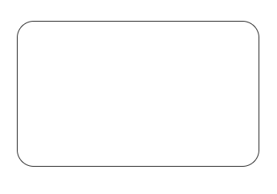
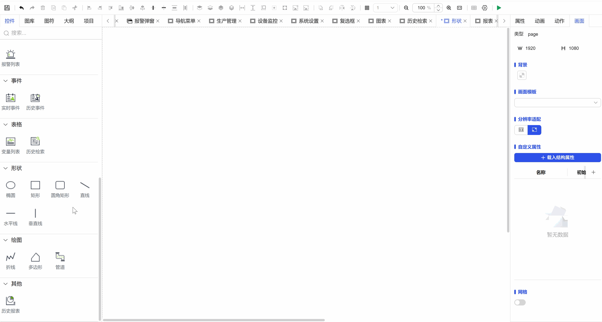

## 一、概述

圆角矩形形状控件用于在画布上创建和编辑带有圆角的矩形图形元素，结合了矩形的实用性和圆角的视觉柔和度，是现代界面设计中广泛使用的基础形状元素。

二、使用场景

圆角矩形控件在以下场景中使用：

### 1.数据可视化场景

- 用于图形化展示数据关系的辅助形状
- 数据分布图、关系图中的圆角矩形元素
- 进度指示、状态标识的圆角矩形背景

## 三、快速开始

1. 从工具栏选择圆角矩形控件
2. 将鼠标放置在画布目标位置，按住鼠标左键
3. 拖动鼠标调整圆角矩形的大小和比例
4. 释放鼠标左键完成圆角矩形创建
5. 通过选中框的8个控制点调整整体大小
6. 使用旋转控制点调整角度方向
7. 在属性面板中精确设置圆角半径、尺寸和样式

**示例：**

### 1.数据可视化场景：

1.1 数据可视化场景示例

该示例是创建圆角矩形，设置基本属性，做如图1-1所示。

图 1-1

1.2 实际组态教程：

1. 拖拽圆角矩形控件到画布并调整位置尺寸
2. 可以设置圆角矩形的形状和填充，保存运行即可

## 四、属性详解

| 名称   | 描述                                                                   |
| ------ | ---------------------------------------------------------------------- |
| 名字   | 此控件的名称。                                                         |
| X      | 控件左侧距画布左侧的距离，单位px。                                     |
| Y      | 控件顶部距画布顶部的距离，单位px。                                     |
| W      | 控件的宽度，单位px。                                                   |
| H      | 控件的高度，单位px。                                                   |
| 角度   | 控件的旋转角度                                                         |
| 透明度 | 控件的透明度                                                           |
| 圆角   | 控件四周的角度的弧度                                                   |
| 填充   | 控件的填充色 控件的填充程度 填充的方向 设置填充值的范围 |
| 边框   | 控件的边框颜色 控件的边框的线条种类 控件的边框的线条粗细     |
| 权限   | 设置控件的权限，控件显示隐藏/启动禁用                                  |
