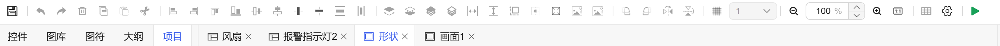
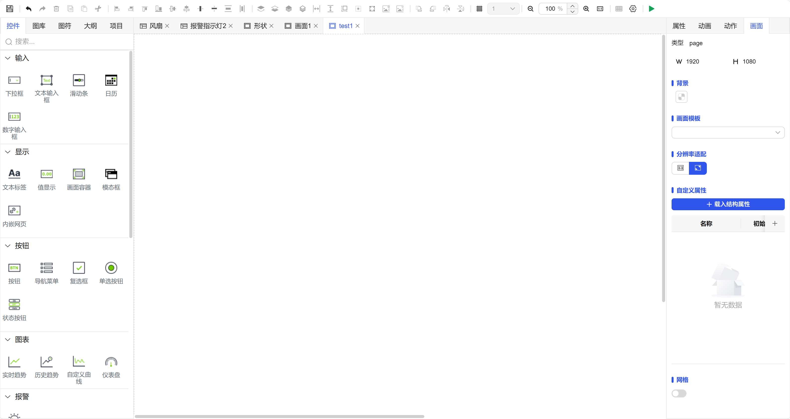
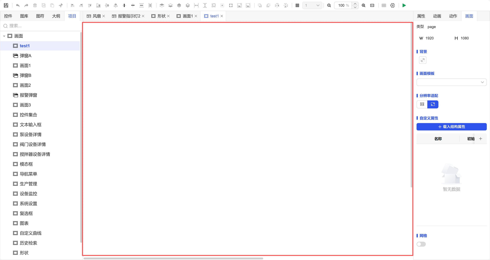

## 一、概述

所有组态画面均在 DipuOne 内置的**所见即所得编辑器**中完成设计和绘制。该编辑器为您提供实时预览、直观操作、即时反馈等核心优势，极大地简化了创建和编辑过程，提升了开发效率与界面一致性。

- **首次启动**：打开项目时，会显示一个欢迎窗口，提供**新建画面、新建弹窗**等快速启动选项。
- **后续启动**：可以选择之前已经建立的画面项目，让您能够**无缝接续工作**。

图 1-1

## 二、编辑器界面布局

### 1. 工具栏

编辑器顶部设有工具栏，提供一系列常用功能的快捷按钮。将鼠标悬停在任何按钮上，会出现**提示信息框**，清晰标明该按钮的功能。

| 功能分类 | 功能名称       | 作用描述                     | 用法说明                                     |
| -------- | -------------- | ---------------------------- | -------------------------------------------- |
| 文件操作 | 保存           | 保存当前编辑的内容           | 点击后立即保存当前画布上的所有修改           |
|          | 撤销           | 撤销上一步操作               | 点击后回退到上一步操作前的状态               |
|          | 重做           | 重做被撤销的操作             | 点击后恢复被撤销的操作                       |
| 编辑操作 | 删除           | 删除选中的元素               | 选中一个或多个元素后点击删除                 |
|          | 复制           | 复制选中的元素               | 选中元素后点击，然后在画布其他位置粘贴       |
|          | 粘贴           | 粘贴已复制的元素             | 在画布上粘贴已复制的元素                     |
|          | 剪切           | 剪切选中的元素               | 选中元素后点击，元素被移除并可粘贴到其他位置 |
| 对齐操作 | 左对齐         | 将选中元素靠左对齐           | 选中多个元素后，以最左侧元素为基准对齐       |
|          | 右对齐         | 将选中元素靠右对齐           | 选中多个元素后，以最右侧元素为基准对齐       |
|          | 顶部对齐       | 将选中元素顶部对齐           | 选中多个元素后，以最顶部元素为基准对齐       |
|          | 底部对齐       | 将选中元素底部对齐           | 选中多个元素后，以最底部元素为基准对齐       |
|          | 水平居中       | 将选中元素水平居中对齐       | 选中多个元素后，在水平方向居中排列           |
|          | 垂直居中       | 将选中元素垂直居中对齐       | 选中多个元素后，在垂直方向居中排列           |
| 分布操作 | 垂直等间距     | 使选中元素垂直方向等间距分布 | 选中二个及以上元素后，在垂直方向均匀分布     |
|          | 水平等间距     | 使选中元素水平方向等间距分布 | 选中二个及以上元素后，在水平方向均匀分布     |
| 层级操作 | 上移           | 将选中元素向上移动一层       | 调整元素在Z轴方向的显示顺序                  |
|          | 下移           | 将选中元素向下移动一层       | 调整元素在Z轴方向的显示顺序                  |
|          | 置顶           | 将选中元素置于最顶层         | 将元素移动到所有其他元素之上                 |
|          | 置底           | 将选中元素置于最底层         | 将元素移动到所有其他元素之下                 |
| 尺寸操作 | 等宽           | 使选中元素宽度一致           | 以最宽或最后一个选中的元素宽度为基准         |
|          | 等高           | 使选中元素高度一致           | 以最高或最后一个选中的元素高度为基准         |
|          | 等大小         | 使选中元素宽度和高度都一致   | 使所有选中元素尺寸完全相同                   |
| 内容操作 | 内容居中       | 使元素内部内容居中显示       | 针对有内容的元素，如图标、文本标签等         |
|          | 元素全屏最大化 | 将选中元素最大化至全屏显示   | 用于详细查看或编辑单个复杂元素               |
| 组合操作 | 组合           | 将多个元素组合成一个组       | 选中多个元素后组合，便于统一移动和操作       |
|          | 拆分           | 将已组合的元素拆分开         | 将组合还原为独立元素                         |
| 变换操作 | 顺时针旋转90°  | 将选中元素顺时针旋转90度     | 改变元素的方向和角度                         |
|          | 逆时针旋转90°  | 将选中元素逆时针旋转90度     | 改变元素的方向和角度                         |
|          | 水平翻转       | 将选中元素水平镜像翻转       | 创建对称或镜像效果                           |
|          | 垂直翻转       | 将选中元素垂直镜像翻转       | 创建对称或镜像效果                           |
| 视图操作 | 网格           | 显示/隐藏画布网格            | 辅助精确对齐和布局                           |
|          | 缩小           | 缩小画布视图                 | 查看整体布局                                 |
|          | 放大           | 放大画布视图                 | 查看细节或进行精细调整                       |
|          | 原始大小       | 恢复画布视图到100%大小       | 返回默认视图比例                             |

## 使用建议

1. **批量操作**：多数对齐和分布功能需要**先选中2个或更多元素**才能生效
2. **操作顺序**：建议先使用对齐功能，再使用分布功能，最后调整层级
3. **组合使用**：复杂布局时，可先将相关元素组合，对组合进行操作，最后再拆分
4. **视图缩放**：精细调整时放大视图，整体布局时缩小视图，结合网格线更精准

这些工具能够显著提升界面设计的效率和质量，建议根据实际需求灵活组合使用。

图 1-2

### 2. 窗口面板

编辑器提供多个可打开/关闭的功能窗口，您可以根据工作需要灵活配置。各窗口通过侧边栏图标或菜单进行开关控制。

图 1-3

| 窗口 | 功能描述                                                                                                       |
| ---- | -------------------------------------------------------------------------------------------------------------- |
| 控件 | 展示所有可用的控件库，便于您查找、查看并将其拖拽到画布上使用。                                                 |
| 图库 | 用于集中管理和使用项目中的所有图片素材。                                                                       |
| 图符 | 用于集中管理和使用项目中的所有可复用图符。                                                                     |
| 大纲 | 以树状列表形式展示当前打开画面上的所有控件，并显示其锁定、隐藏等状态。支持在此面板中快速选中、锁定、隐藏控件。 |
| 项目 | 展示项目结构信息，包括所有画面和画面模板的列表。                                                               |
| 属性 | 显示属性配置面板，用于对当前选中的控件的各项属性进行详细设置。                                                 |
| 动画 | 用于为选中的控件添加动画效果，如闪烁、填充等。                                                                 |
| 动作 | 用于为选中的控件添加交互动作，可配置的触发事件包括鼠标事件（单击、移入、移出、右键）和特殊事件（值变化等）。   |
| 画面 | 显示当前打开画面的专属属性面板，用于快速修改画面的宽高、背景、画面模板、分辨率、自定义属性、网格等全局设置。   |

### 3. 画面管理菜单

通过此菜单可以对项目中的画面进行组织和管理。

| 功能     | 描述                                     |
| -------- | ---------------------------------------- |
| 新建画面 | 创建一个新的常规画面。                   |
| 新建弹窗 | 创建一个新的弹窗画面。                   |
| 复制     | 复制当前选中的画面或弹窗。               |
| 粘贴     | 粘贴刚刚复制的画面或弹窗，生成一个副本。 |
| 重命名   | 为选中的画面或弹窗重命名。               |
| 删除     | 删除选中的画面或弹窗。                   |

图 1-4

### 4. 画布

界面的中央核心区域，**所见即所得**的绘制工作区。您在此处通过拖拽控件、调整布局来设计和构建界面。

图 1-5

### 5. 项目设置

用于配置整个项目的全局属性，例如：

- **启动画面**：设置项目运行时首先显示的画面。
- **报警样式**：设置报警等级、报警名称、字体颜色、背景色等。
- **语音设置**：配置报警时的语音提示功能，包含语音的开关、音量、音高、报警文本。
- **语言启用**：为适应不同国家用户，在此配置项目中**启用哪些语言**。配置后，用户可在运行时切换至已启用的语言界面。**默认开启中文和英文**。

图 1-6

## 三、预览功能

为了测试已绘制画面的交互与功能是否符合预期，编辑器提供了**预览模式**。

- **进入方式**：点击编辑器中的 **“预览”** 按钮。
- **预览效果**：系统将在**新的浏览器标签页**中打开当前画面。
- **交互测试**：在预览模式下，您可以像真实用户一样与控件进行交互，例如：点击按钮执行其脚本动作，或在输入框中输入值以查看变量更新效果，从而验证所有绑定和脚本逻辑是否正确工作。

图 1-7
