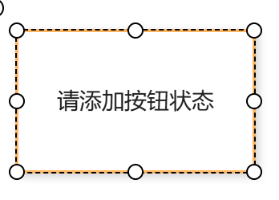
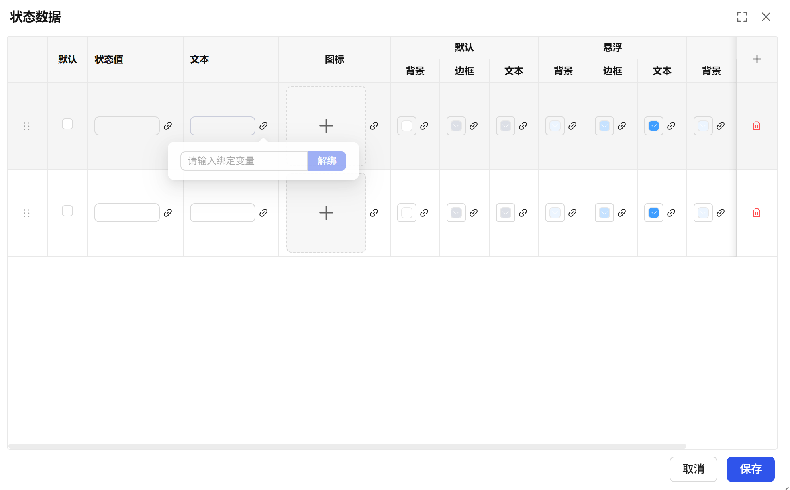
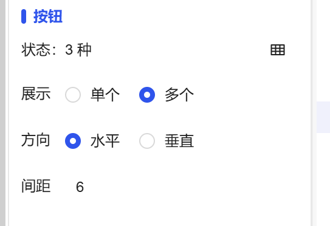

## 一、概述

状态按钮控件用于根据数据状态动态显示对应的按钮样式，支持多状态配置和可视化反馈，通过状态值与按钮样式的映射关系实现智能化的界面展示。

## 二、使用场景

状态按钮控件在以下场景中使用：

### 1.多状态控制场景

- 当需要用户从多个互斥选项中必须选择一个时
- 需要确保唯一性的配置项选择
- 筛选条件的单选过滤设置

## 三、快速开始

1. 拖拽状态按钮控件到画布并调整位置尺寸
2. 在"状态"中添加不同的状态数据并配置对应样式，并可为每个状态设置选中时和未选中时的样式
3. 设置"当前值"定义控件的初始状态
4. 选择"展示"方式（单个按钮或展示所有状态按钮）
5. 配置"方向"和"间距"调整按钮布局
6. 设置边框、圆角等整体样式属性
7. 为每个状态按钮配置对应的交互动作

**示例：**

### 1.多状态控制**场景：**

1.1 多状态控制场景示例

**该示例模拟设备信号灯控制。** 通过状态按钮创建“红灯”、“绿灯”两种状态，点击不同按钮时，信号灯显示区域将切换显示对应的灯光状态与颜色，实现直观的状态控制与反馈。如图1-1所示。

图 1-1

1.2 实际组态教程：

1. **拖拽状态按钮控件到画布并调整位置尺寸。**
2. **设置初始状态：** 在“当前值”属性中设置默认值，您也可以将该值绑定到一个变量或画面属性，以实现动态控制。
3. **添加并配置状态：** 在“状态”属性中，为每个需要展示的按钮状态进行配置：

   1. **状态值**：定义该状态对应的数据值。
   2. **状态文本**：设置该状态按钮上显示的文本。
   3. **样式定义**：为该状态分别设置其在 **默认、鼠标悬浮、按下** 三种交互状态下的**背景色、边框色和文本颜色**。
4. **选择展示模式：**

   1. **当选择“展示单个”时**：系统仅显示与“当前值”匹配的状态所对应的单个按钮。您只需按步骤3配置多个备选状态即可。
   2. **当选择“展示多个”时**：所有已添加的状态会以多个按钮的形式并排显示。您需要为每个状态额外配置两种模式下的样式：

      1. **选中时样式**：当该状态与“当前值”匹配（即被选中）时，在**默认、悬浮、按下**状态下的背景、边框、文本颜色。
      2. **未选中时样式**：当该状态未被选中时，在**默认、悬浮、按下**状态下的背景、边框、文本颜色。
5. **调整布局（仅“展示多个”模式有效）：** 通过“方向”和“间距”属性，设置多个状态按钮是水平排列还是垂直排列，以及按钮之间的间隔距离。
6. **绑定交互事件（可选）：** 可以为不同状态的按钮分别配置独立的 **“动作”** ，例如点击某个状态按钮时触发变量写值或画面跳转。

## 四、特殊事件

| 点击按钮 |                                                                                                                                                                                                                                                                                                                                                                                                                                                                                                                                                                                                                              |                                                |
| -------- | ---------------------------------------------------------------------------------------------------------------------------------------------------------------------------------------------------------------------------------------------------------------------------------------------------------------------------------------------------------------------------------------------------------------------------------------------------------------------------------------------------------------------------------------------------------------------------------------------------------------------------- | ---------------------------------------------- |
| 说明     | 当用户在点击状态按钮中的某个按钮时，将会触发对应的事件。                                                                                                                                                                                                                                                                                                                                                                                                                                                                                                                                                                     |                                                |
| 入参     | 状态数据中状态值                                                                                                                                                                                                                                                                                                                                                                                                                                                                                                                                                                                                             |                                                |
| 操作类型 | 导航                                                                                                                                                                                                                                                                                                                                                                                                                                                                                                                                                                                                                         | 点击某个状态按钮后，导航至指定的画面或弹窗。   |
|          | 变量写值                                                                                                                                                                                                                                                                                                                                                                                                                                                                                                                                                                                                                     | 点击某个状态按钮后，向指定的变量写入预设的值。 |
| 配置流程 | 在一个展示“启动”、“停止”、“复位”三个状态的状态按钮组中：             1.点击 **“启动”** 按钮，执行**变量写值**动作，将控制命令 1 写入设备启动变量。             2.点击 **“停止”** 按钮，执行**变量写值**动作，将控制命令 0写入设备启动变量。             3.点击 **“复位”** 按钮，执行**导航**动作，跳转到设备复位参数设置弹窗。 通过为“点击按钮”事件配置分状态动作，您可以构建出直观且功能集中的设备控制面板。 配置示例：如图1-2所示，在“动作”设置中，选择“点击按钮”作为触发事件，然后为列表中的每个状态分别配置其专属的“导航”或“变量写值”动作。图 1-2 |                                                |

## 五、属性详解

| 名称 | 描述                                                                                                                                                                                                                                                                                                                                                                                                                       |
| ---- | -------------------------------------------------------------------------------------------------------------------------------------------------------------------------------------------------------------------------------------------------------------------------------------------------------------------------------------------------------------------------------------------------------------------------- |
| 名字 | 此控件的名称。                                                                                                                                                                                                                                                                                                                                                                                                             |
| X    | 控件左侧距画布左侧的距离，单位px。                                                                                                                                                                                                                                                                                                                                                                                         |
| Y    | 控件顶部距画布顶部的距离，单位px。                                                                                                                                                                                                                                                                                                                                                                                         |
| W    | 控件的宽度，单位px。                                                                                                                                                                                                                                                                                                                                                                                                       |
| H    | 控件的高度，单位px。                                                                                                                                                                                                                                                                                                                                                                                                       |
| 角度 | 控件的旋转角度                                                                                                                                                                                                                                                                                                                                                                                                             |
| 圆角 | 按钮四个角的圆角曲率。                                                                                                                                                                                                                                                                                                                                                                                                     |
| 数据 | 当前值 可以改变状态按钮控件当前的值，做到不同显示                                                                                                                                                                                                                                                                                                                                                                     |
| 边框 | 控件的边框的线宽                                                                                                                                                                                                                                                                                                                                                                                                           |
| 按钮 | 状态 添加按钮的不同的状态的样式，包括选中时的背景，边框，文本和未选中时的背景，变宽，文本。注意该状态有一个默认状态  展示 可以选择展示单个按钮，也可以选择展示多个按钮，如果是多个按钮，就是状态中添加的状态有几个，显示几个 方向 设置按钮的水平、垂直的方向间距 按钮之间的间距   |
| 字体 | 设置文本内容的字体。包括字体型号、字体大小、字体颜色、粗体、倾斜、下划线。                                                                                                                                                                                                                                                                                                                                                 |
| 权限 | 设置控件的权限，控件显示隐藏/启动禁用                                                                                                                                                                                                                                                                                                                                                                                      |
