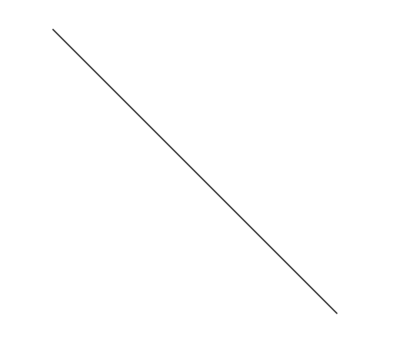

## 一、概述

直线形状控件用于在画布上创建和编辑直线图形元素，作为基础的连接和分隔工具，在界面布局、图表制作和视觉引导中发挥重要作用。

## 二、使用场景

直线控件在以下场景中使用：

### 1.数据可视化场景

- 用于图形化展示数据关系的辅助形状
- 数据分布图、关系图中的直线控件元素
- 进度指示、状态标识的直线控件背景

## 三、快速开始

1. 从工具栏选择直线控件
2. 将鼠标放置在画布起始位置，按住鼠标左键
3. 拖动鼠标至结束位置，确定直线方向和长度
4. 释放鼠标左键完成直线创建
5. 通过选中框的端点控制点调整直线长度和方向
6. 使用旋转控制点或中间控制点调整角度和位置
7. 在属性面板中精确设置长度、角度和样式参数

**示例：**

### 1.1 数据可视化场景示例

该示例是创建圆角矩形，设置基本属性，做如图1-1所示。

图 1-1

1.2 实际组态教程：

1. 直线矩形控件到画布并调整位置尺寸
2. 可以设置直线的线条样式和粗细，保存运行即可

## 四、属性详解

| 名称   | 描述                                                   |
| ------ | ------------------------------------------------------ |
| 名字   | 此控件的名称。                                         |
| X      | 控件左侧距画布左侧的距离，单位px。                     |
| Y      | 控件顶部距画布顶部的距离，单位px。                     |
| W      | 控件的宽度，单位px。                                   |
| H      | 控件的高度，单位px。                                   |
| 角度   | 控件的旋转角度                                         |
| 透明度 | 控件的透明度                                           |
| 线条   | 控件的线条颜色 控件的线条样式 控件的线条粗细 |
| 权限   | 设置控件的权限，控件显示隐藏/启动禁用                  |
