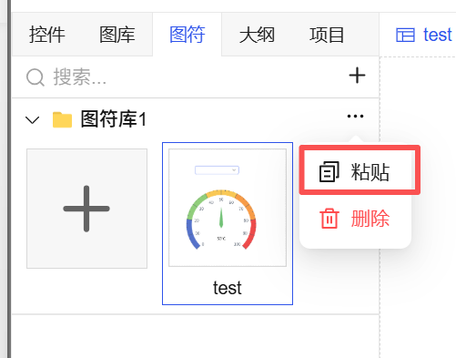
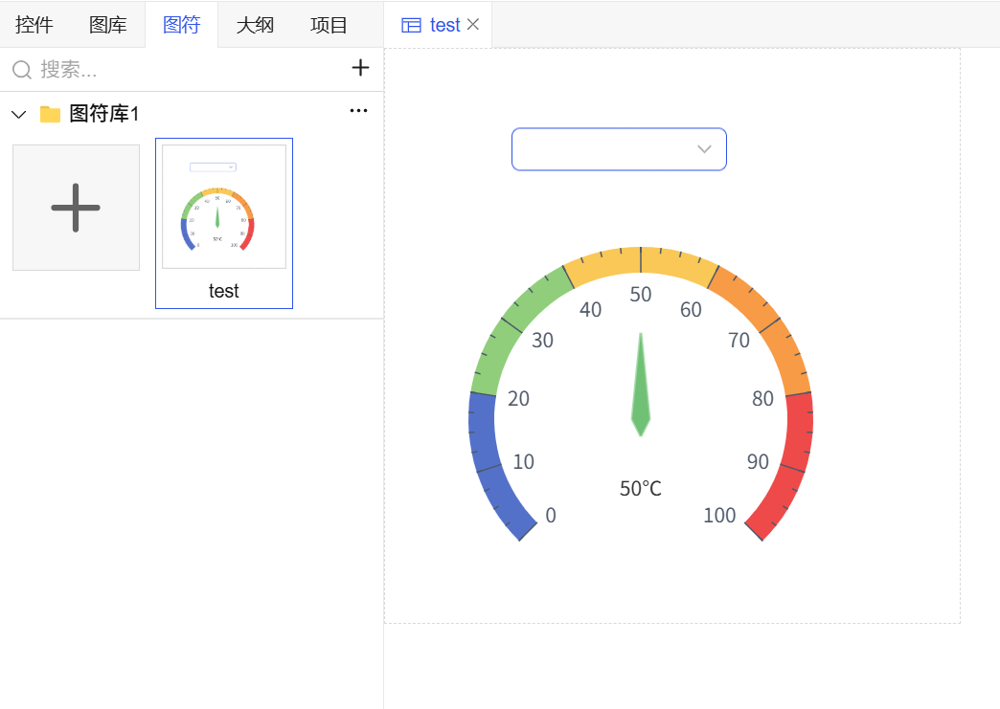
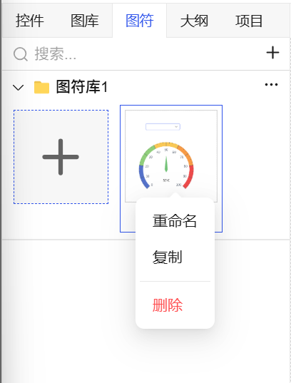

## 一、概述

图符库是项目中所有图符的集中管理中心。通过“图符”窗口，您可以对图符库和图符进行系统化的创建、组织、编辑和维护操作。

## 二、图符库操作

### 1. 新增图符库

- **操作路径**：在“图符”窗口中，点击右侧的 **“新增”** 按钮。
- **执行结果**：系统将自动创建一个新的图符库，其**默认名称为“图符库1”**。
- **命名管理**：

  - 新建成功后，库名将**自动处于可编辑状态**，此时可直接修改名称。
  - 若需再次修改，**双击**图符库名称即可重新进入编辑状态。

图 1-1

### 2. 粘贴图符

- **操作路径**：将已创建好的图符（从其他位置**复制**后），在目标图符库上执行**粘贴**操作。
- **执行结果**：图符将被添加至该图符库中。

图 1-2

### 3. 删除图符库

- **操作路径**：**右键点击**需要删除的图符库名称。
- **执行结果**：选择删除操作后，系统将**删除当前图符库及其包含的所有图符资源**。
- **安全提示**：删除前，系统会弹出确认对话框，以防止误操作。

图 1-3

## 三、图符操作（在指定图符库内）

### 1. 新建图符

- **操作路径**：在目标图符库下方，点击 **“+”** 按钮。
- **执行流程**：输入图符名称 → 确认 → 新建成功。
- **后续设计**：新建成功后，即可从控件面板拖拽基础控件，或从图片库拖拽图片资源到该图符的编辑区域进行设计。

图 1-4

### 2. 重命名图符

- **操作路径**：**右键点击**需要修改的图符，在菜单中选择“重命名”。
- **执行结果**：图符名称进入可编辑状态，输入新名称后确认即可。

### 3. 复制图符

- **操作路径**：**右键点击**需要复制的图符，在菜单中选择“复制”。
- **执行结果**：生成一个该图符的副本，可用于快速创建相似图符或在其他库中粘贴使用。

### 4. 删除图符

- **操作路径**：**右键点击**需要删除的图符，在菜单中选择“删除”。
- **执行结果**：从当前图符库中移除该图符。

图 1-5
