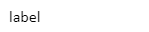
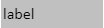
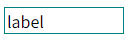

## 一、概述

文本标签控件用于显示文本内容，既支持静态文字展示，也可通过属性绑定动态数据源，实现内容的实时更新与动态显示。

## 二、使用场景

数字输入框控件在以下场景中使用：

### 1.静态信息展示场景

- 当需要显示固定不变的标题、说明或提示信息时
- 界面中的栏目名称、数据项标识等固定文本内容
- 点击文本标签文字，实现画面跳转或弹窗显示切换

### 2.动态数据展示场景

- 需要实时显示设备状态、系统参数等变化信息时

## 三、快速开始

1. 拖拽文本标签控件到画布并调整位置尺寸
2. 在"文本"属性中输入静态内容或绑定动态变量
3. 设置"溢出"属性定义文本超出时的处理方式
4. 配置样式属性（填充色、边框、字体对齐等）
5. 设置"动作"定义文本交互行为（如点击事件）

**示例：**

### 1.**静态信息展示场景：**

1.1 静态信息展示场景示例

该示例是模拟液冷界面的面板标题。使用文本标签显示"液冷控制系统"作为页面标题，设置合适的字体大小和颜色，形成清晰的视觉层次，并且点击文字可以弹出弹框。如图1-1所示。

图 1-1

1.2 实际组态教程：

1. 拖拽文本标签控件到画布并调整位置尺寸
2. 在文本中输入自己想显示的固定展示信息
3. 在面板动作模块中选择鼠标事件中的单击
4. 操作类型选择导航，可以选择跳转画面也可以选择跳转弹框，输入标题名，点击保存即可

### 2.动态数据展示场景

2.1 动态数据展示示例

该实例主要是模拟将变量绑定到文本显示值上，进行数据的实时展示。如图1-2所示

图 1-2

2.2 实际组态教程：

1. 点击文本后面的绑定图标
2. 可以选择变量进行绑定，也可以选择其他控件的属性进行绑定，选择好，点击保存即可

## 四、属性详解

| 名称     | 描述                                                                                                   |
| -------- | ------------------------------------------------------------------------------------------------------ |
| 名字     | 此控件的名称。                                                                                         |
| X        | 控件左侧距画布左侧的距离，单位px。                                                                     |
| Y        | 控件顶部距画布顶部的距离，单位px。                                                                     |
| W        | 控件的宽度，单位px。                                                                                   |
| H        | 控件的高度，单位px。                                                                                   |
| 角度     | 控件的旋转角度                                                                                         |
| 透明度   | 控件的透明度                                                                                           |
| 文本     | 控件显示的内容。                                                                                       |
| 溢出     | 文本溢出时的处理，隐藏、换行、省略3种可选                                                              |
| 填充     | 控件的背景色。                                      |
| 边框     | 控件的边框色。                                      |
| 边框粗细 | 控件的边框粗细。                                                                                       |
| 字体     | 设置文本内容的字体。包括字体型号、字体大小、字体颜色、加粗、倾斜、下划线、水平对齐方式、垂直对齐方式。 |
| 权限     | 设置控件的权限，控件显示隐藏/启动禁用                                                                  |
