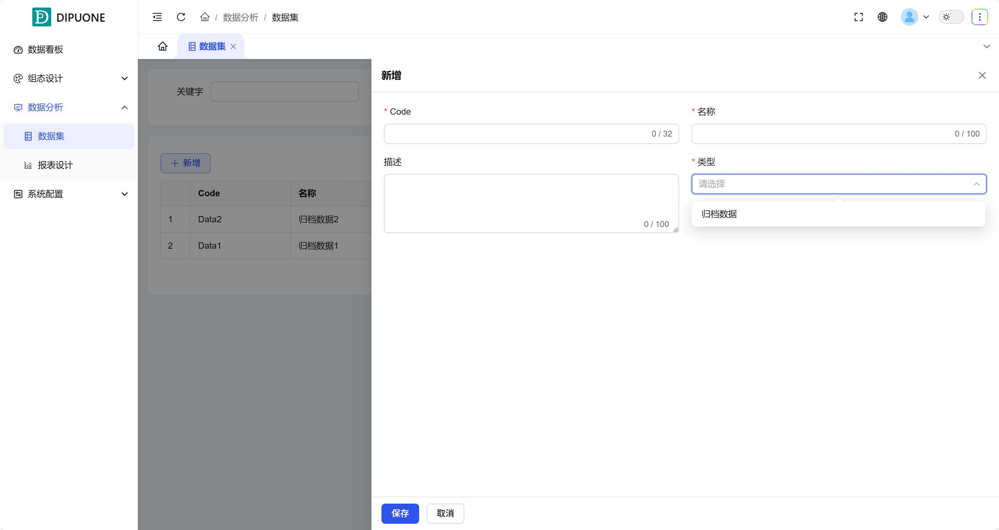

## 一、概述

数据集是 DipuCore 中连接原始数据与最终报表展示的核心枢纽。它面向用户提供了**自定义数据集设计**和**报表数据源定义**的能力。该模块的主要作用是**从历史归档数据中筛选和组合出特定的数据集合**，为后续在“报表设计”模块中进行可视化展示提供清晰、结构化的数据来源。

## 二、数据集列表（菜单列表区）

所有已创建的数据集在此列表中集中管理，主要字段如下：

| 字段     | 描述与作用                                                                       |
| -------- | -------------------------------------------------------------------------------- |
| Code     | 数据集的唯一编码标识符。                                                         |
| 名称     | 数据集的显示名称。                                                               |
| 类型     | 数据集的数据来源类型。目前仅支持“归档数据”，即从已配置归档的历史变量中提取数据。 |
| 描述     | 对该数据集包含的数据特征、用途的基本说明。                                       |
| 信息     | 显示该数据集中包含的数据标签（变量）数量。                                       |
| 创建时间 | 该数据集的创建时间。                                                             |
| 更新时间 | 该数据集的最后修改时间。                                                         |
| 操作     | 提供对该数据集的“修改”和“删除”操作按钮。                                         |

数据集管理页面如图 1-1 所示。

 图 1-1

## 三、功能操作区

### 1. 新增数据集

点击 **“新增”** 按钮，弹出创建表单。

- **必填参数**：`Code`（编码）、`名称`、`类型`。
- **流程**：填写基本信息并保存后，系统将创建一个空的数据集容器，后续需要进一步在其中添加具体的数据项。如图 1-2 所示。

 图 1-2

### 2. 修改（配置数据项）

点击列表中任一数据集行的 **“修改”** 操作按钮，进入数据集详细配置页面。

- **核心功能**：在此页面，您可以：
  - **新增/移除数据**：从可用的归档变量池中，选择需要纳入本数据集的特定变量。
  - **配置数据采样方式**：为数据集中的每个变量设置数据的统计与采样规则（如：平均值、最大值、原始值等）。如图 1-3 所示。

图1-3

### 3. 删除

点击 **“删除”** 操作按钮，可以**永久移除不再需要的数据集**。

- **重要提示**：此操作不可逆。删除数据集将影响所有引用该数据集的报表，请谨慎操作。

通过数据集模块，您可以灵活地组合来自不同设备的归档数据，形成面向特定分析主题（如“生产线A能耗分析”、“核心设备运行效率”）的数据视图，为生成有针对性的报表奠定基础。
