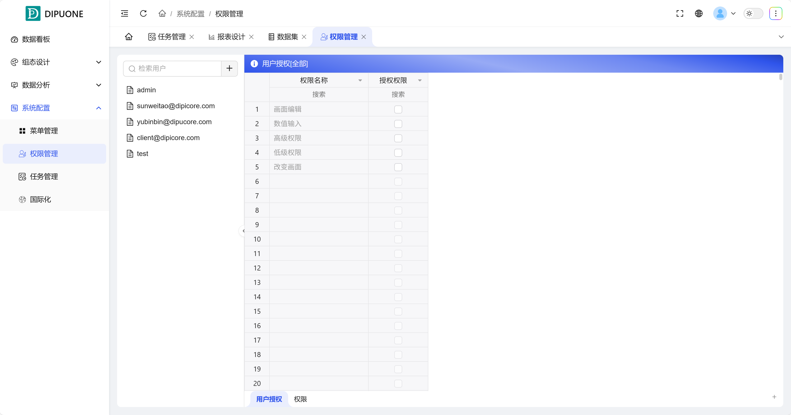
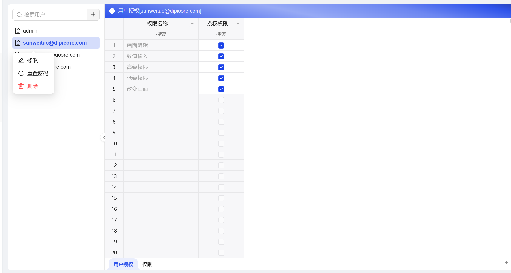
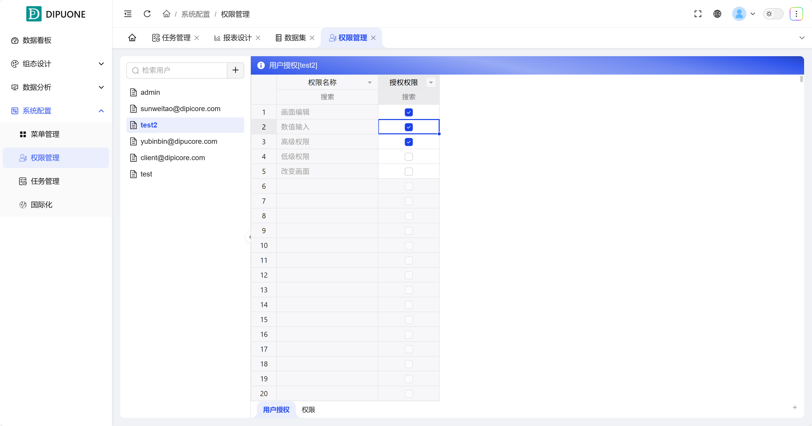

## 一、概述

DipuCore 提供基于角色的访问控制体系，内置三种标准角色，并支持自定义权限和灵活的用户授权，以满足不同层级的系统管理需求。

## 二、内置角色

系统预定义了三个核心角色，其权限由高到低如下：

| 角色               | 权限描述                                                                                                                                      |
| ------------------ | --------------------------------------------------------------------------------------------------------------------------------------------- |
| Admin (超级管理员) | 拥有系统的所有权限，是最高权限角色。通常用于初始系统配置和全局管理。                                                                          |
| 管理员             | 可以管理一个或多个项目（如创建、编辑、删除项目），并能管理用户。与 Admin 的唯一区别是：在创建或分配用户时，不能将其他用户的角色设置为 Admin。 |
| 普通用户           | 权限最受限，通常只能查看已授权项目的运行画面以及相关的设备数据，不具备任何管理功能。                                                          |

## 三、用户管理

默认使用 **Admin** 账户首次登录，可在用户管理界面进行以下操作：

### 1. 创建用户

- **路径**：进入 **“权限管理”** -> **“用户列表”**，点击 **“+”** 按钮。
- **关键设置**：在创建用户时，若勾选 **“允许后台管理”** 选项，则该用户将被赋予 **管理员** 角色；若不勾选，则为 **普通用户**。

### 2. 管理单个用户

在用户列表中，**右键点击**任一用户，可对其执行以下操作：

- **修改**：编辑用户的基本信息。
- **重置密码**：将用户密码重置为指定值。
- **删除**：从系统中移除该用户。

## 四、权限管理（高级）

系统支持对权限进行精细化定义和分配。

### 1. 编辑权限项

- **路径**：进入 **“权限管理”** -> **“权限”** 页面。
- **操作**：您可以在此**新增**自定义权限项、**添加权限注释，**或进行**删除**操作。所有操作均**支持批量处理**，提升管理效率。

### 2. 为用户授权

- **路径**：进入 **“权限管理”** -> **“用户授权”** 页面。在用户列表中，**单击**选中目标用户。
- **操作**：右侧将出现该用户的详细权限配置面板。通过**勾选或取消勾选**具体的权限项，即可为此用户授予或收回相应的操作权限。这使得权限分配可以超越内置角色的固定范围，实现高度个性化的控制。

