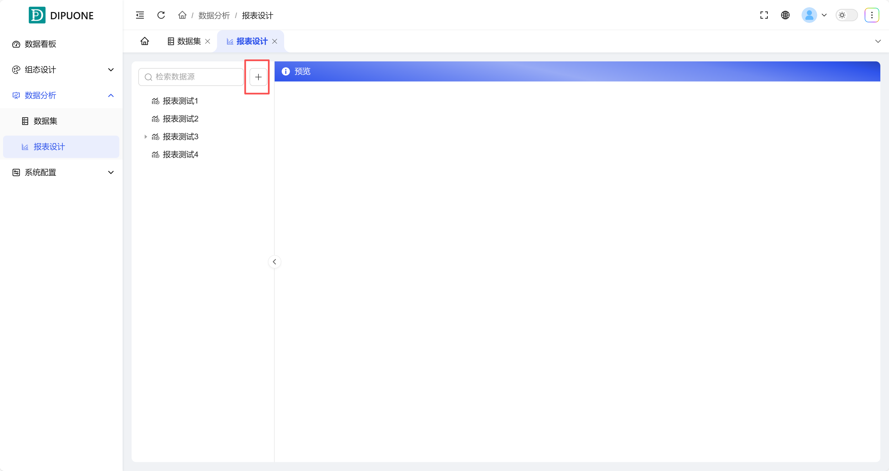
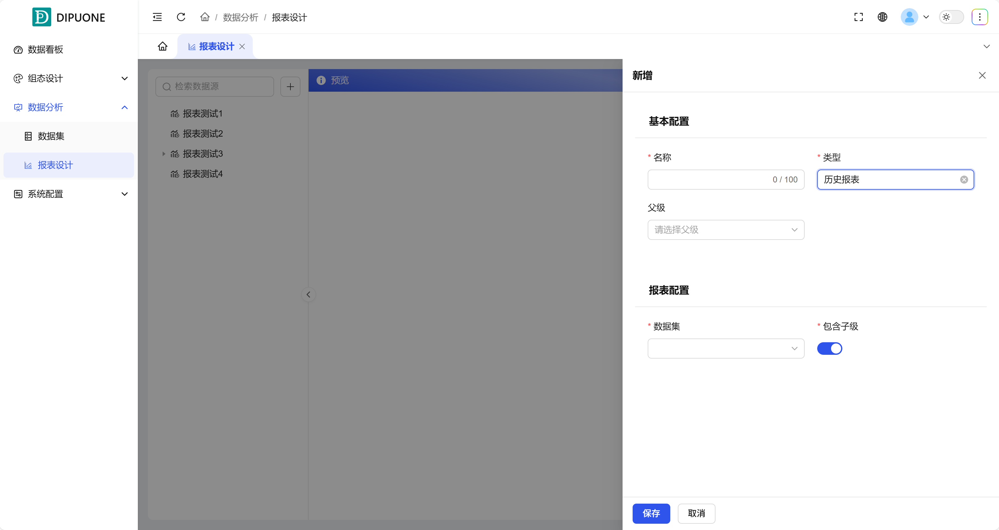
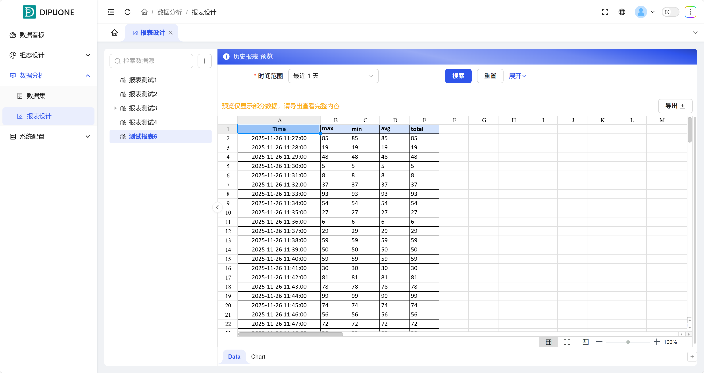

## 一、概述

报表设计模块提供了强大且灵活的数据可视化与导出工具。它既包含**系统内置的历史报表**，也支持用户完全**自定义报表格式**，旨在为关键生产数据提供直观、友好的展示方式。所有报表数据均基于**数据集**，赋予用户查看和分析核心生产数据的充分自由，其主要功能是**数据可视化展示**与**结构化数据下载**。如图1-1所示。

图 1-1

## 二、报表创建与管理（功能操作区）

1. 新增报表

点击 **“新增”** 按钮创建报表时，您可以选择两种创建类型：

| 报表类型 | 数据来源与特点                                                                                                                      | 配置说明                                                                |
| -------- | ----------------------------------------------------------------------------------------------------------------------------------- | ----------------------------------------------------------------------- |
| 历史报表 | 数据来源于您在“数据集”中预先配置好的数据集合。适合基于结构化数据进行标准化的图表和表格展示。                                        | 创建时，需要从数据集列表中选择一个作为本报表的数据来源。如图 1-2 所示。 |
| 模板报表 | 基于用户上传的自定义模板文件（如特定格式的Excel、Word），将数据动态填充至模板的指定位置。适合生成具有固定格式要求的正式文档或报告。 | 创建时，需要上传预先设计好的模板文件。如图 1-3 所示。                   |

如果类型是历史报表，将会选择数据集中个某个数据集作为数据来源 如图 1-2所示

图 1-2

如果类型是模版报表，将需要上传相应的模版，如图 1-3所示

图 1-3

## 三、报表展示与交互（数据展示区）

报表创建完成后，点击即可进入展示与操作界面。

### 1. 动态数据查询与可视化

在报表展示界面，您可以进行以下交互操作，以获取所需的数据视图：

- **筛选数据**：选择**时间范围**、**统计方法**（如求和、平均）、**采样方式**（如原始值、每小时最大值）来动态筛选和计算数据。
- **图表展示**：该模块支持**图形化展示**功能（如折线图、柱状图），将数据以更直观、可视化的形式呈现，有助于快速洞察数据趋势与规律。如图1-4所示。

### 2. 数据导出

报表界面提供便捷的**导出功能**，支持将当前查询结果或可视化图表导出为多种格式（如Excel），便于存档、分享或进一步分析。

通过报表设计模块，您可以将原始数据转化为信息明确、形式专业的报告，有效支撑决策分析与信息沟通。

图 1-4
