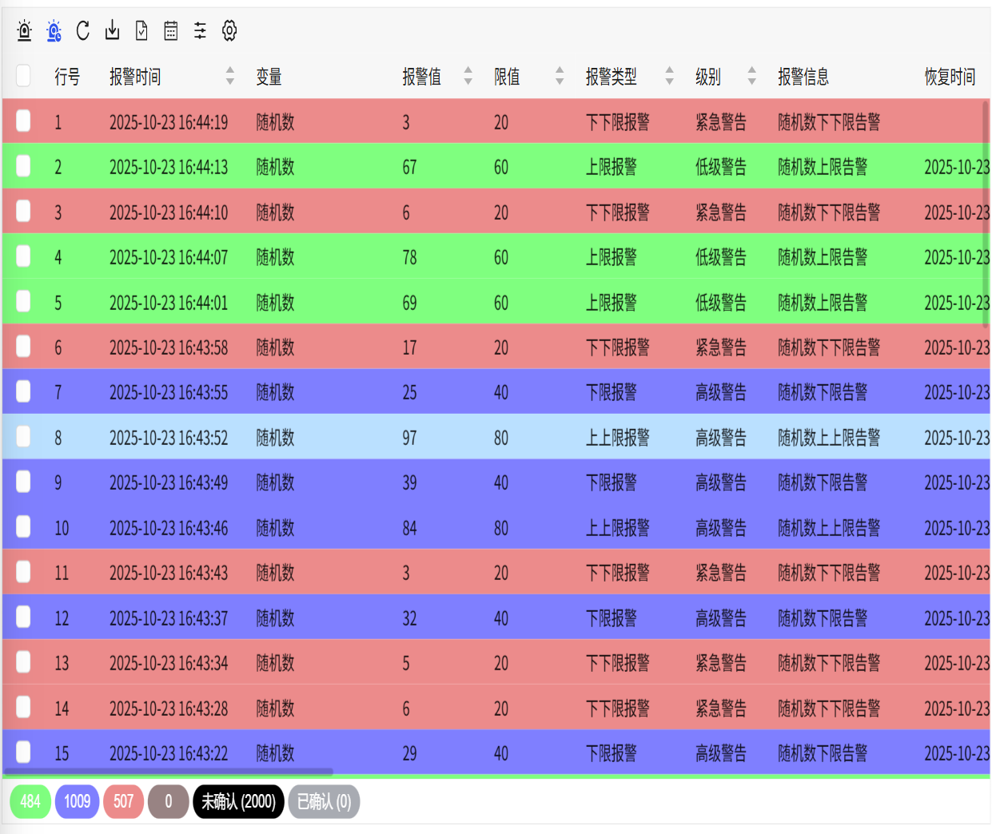
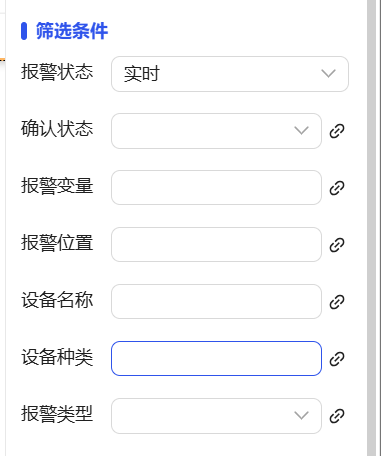

## 1. Overview

Alarm list controls are used to centrally display real-time and historical alarm information, supporting multi-node alarm data integration, real-time status monitoring and historical record queries, providing alarm confirmation, suspension, filtering and other management functions to ensure timely and effective alarm response and processing.

## 2. Usage Scenarios

Alarm list controls are used in the following scenarios:

### 1. Fault Handling Scenarios

- When quick location and confirmation of current system abnormal status is needed
- Processing tracking and status updates of device fault alarms
- Operation management such as alarm confirmation, suspension, and recovery

## 3. Quick Start

1. Drag the alarm list control to the canvas and adjust position and size
2. Set the "Display" property to configure the function buttons that need to be displayed
3. Configure the "Blink" frequency to set the visual prompt effect of alarm items
4. Set the "Auto Refresh" time interval to ensure real-time data updates
5. Adjust border style and table line color
6. Configure the style and font of "Header" and "Body"
7. Set the "Filter Panel" style to optimize query experience
8. Set the maximum number of alarms to display in "Others"

**Example:**

### 1. Fault Handling Scenario:

1.1 Fault Handling Scenario Example

This example is real-time alarm monitoring of a production line. Set the auto-refresh interval to 5 seconds, enable the alarm blink function, monitor the operating status of all devices on the current production line. When an abnormality occurs, operators can immediately confirm the alarm and take measures. As shown in Figure 1-1.

Figure 1-1

1.2 Actual Configuration Tutorial:

1. Drag the alarm list control to the canvas and adjust position and size
2. You can set the list data items of the alarm list in the appearance display
3. You can set whether to enable blinking
4. You can set the filter conditions for alarm data in the filter conditions
5. Save and run, then you can see the data display of the set alarm variables, see real-time alarm data and historical alarm data, and you can also add alarm variables, etc.

## 4. Special Events

| **Right Mouse Click** |                                                                                                                                                                                                                                                                                                                                                                                                                                                                                                                                                                                                                                                                                                                                                                                                                                                                                                                                                                           |                                                        |
| :-------------------: | ------------------------------------------------------------------------------------------------------------------------------------------------------------------------------------------------------------------------------------------------------------------------------------------------------------------------------------------------------------------------------------------------------------------------------------------------------------------------------------------------------------------------------------------------------------------------------------------------------------------------------------------------------------------------------------------------------------------------------------------------------------------------------------------------------------------------------------------------------------------------------------------------------------------------------------------------------------------------- | ------------------------------------------------------ |
| Description           | When a user **clicks the right mouse button** on a record in the alarm list, this event will be triggered. By configuring this event, you can implement the **advanced associated information viewing** function.                                                                                                                                                                                                                                                                                                                                                                                                                                                                                                                                                                                                                                                                                                                                                        |                                                        |
| Input Parameter       | A record on the alarm list                                                                                                                                                                                                                                                                                                                                                                                                                                                                                                                                                                                                                                                                                                                                                                                                                                                                                  |                                                        |
| Operation Type        | **Navigation**                                                                                                                                                                                                                                                                                                                                                                                                                                                                                                                                                                                                                                                                                                                                                                                                                                                                                              | When right-clicking on a record in the alarm list, navigate to the bound popup window |
|                       |                                                                                                                                                                                                                                                                                                                                                                                                                                                                                                                                                                                                                                                                                                                                                                                                                                                                                                              |                                                        |
| Configuration Process | **1. Design Associated Screen**: Create a popup window and place a **"Page Container"** control inside the popup window. **2. Bind Associated Screen**: Bind the "Page Container" to a detailed screen you have prepared in advance that is associated with alarm information (for example: device real-time monitoring screen, historical trend analysis screen, etc.). **3. Configure Right-click Action**: In the "Action" settings of the alarm list control, select **"Right Mouse Click"** as the trigger event. **4. Set Navigation Action**: Configure the execution action as **"Navigation"** -> **"Popup"**, and select the associated popup window designed in the previous step. **5. Key Parameter Passing**: In the popup action parameter configuration, you must bind the system's built-in event parameter `_event_alarm_page` to the custom property of the target popup window. This parameter will automatically carry the context information of the alarm record that the user right-clicked. **Note**: Correctly binding the _event_alarm_page parameter is the key to ensuring that the associated screen can correctly load the corresponding alarm data. **Configuration Example**: At runtime, when a user right-clicks on an alarm in the alarm list, the system will pop up a dialog box. This dialog box dynamically loads and displays detailed monitoring or analysis screens related to that alarm through the page container inside it, thus achieving seamless association and quick viewing of "alarm-details". As shown in Figure 1-2Figure 1-2 |                                                        |

## 5. Property Details

| Name                              | Description                                                                     |
| --------------------------------- | ------------------------------------------------------------------------------- |
| Name                              | The name of this control.                                                       |
| X                                 | The distance from the left side of the control to the left side of the canvas, in px. |
| Y                                 | The distance from the top of the control to the top of the canvas, in px.       |
| W                                 | The width of the control, in px.                                                |
| H                                 | The height of the control, in px.                                               |
|  | The opacity of the control                                                      |
| Display                           | Set which buttons to display on the control.                                   |
| Blink                             | Set the frequency of alarm blinking and whether to enable blinking             |
| Auto Refresh                      | Set the time interval for automatically refreshing the alarm list               |
| Border Color                      | Set the color of the outer border and table lines of the control.               |
| Border Thickness                  | Set the thickness of the outer border and table lines of the control.          |
| Header                            | Set the background color, font type, font size, bold, italic, font color of the header. |
| Body                              | Set the background color, font type, font size, bold, italic, font color of the body. |
| Filter Panel                      | Set the style of the filter panel.  |
| Others                            | Set the maximum number of alarms to display                                     |
| Permission                        | Set the permissions of the control, control display/hide or enable/disable      |
