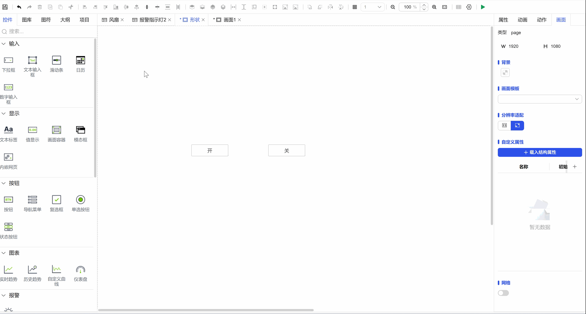
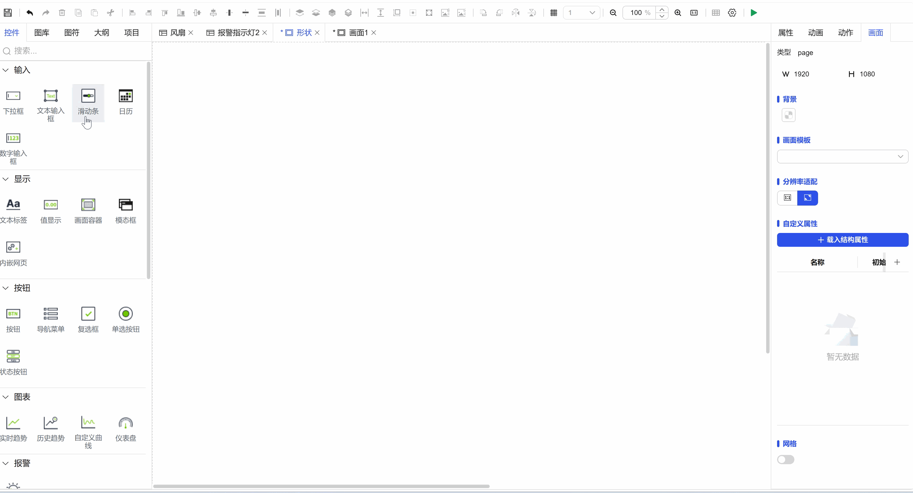

## 1. Overview

In DipuOne, reasonable use of animation effects can significantly enhance the user interface interaction experience, making information communication more intuitive, status feedback clearer, and operation guidance more natural. Through smooth visual transitions and dynamic responses, animations can effectively reduce user cognitive load, improve operational efficiency and interface pleasure.

## 2. Enablement and Settings

- **Identify Animation Properties**: When a control supports animation effects, it will display a separate **"Animation"** property section in the right property panel.
- **Configure Animation**: Click the **"Settings"** button next to this property section to enter the animation configuration interface and define dynamic behavior for the control.

## 3. Animation Type Details

DipuOne provides multiple animation types to adapt to different interaction needs:

| Animation Type | Core Principles and Visual Performance                                                                                                                                                                                                                                            |
| -------------- | --------------------------------------------------------------------------------------------------------------------------------------------------------------------------------------------------------------------------------------------------------------------------------- |
| Blink          | Eye-catching periodic light-dark or color alternating changes. Triggered or controlled by binding variable value changes. Display content: During blinking, can switch to custom background color, or replace with specific warning images to strengthen visual reminder effects. |
| Fill           | Through data value changes, dynamically control the fill level of graphic elements (such as progress, capacity, proportion). Fill animation intuitively displays the increase/decrease and proportion changes of values.                                                          |

Examples:

Figure 1-1

Figure 1-2

Note: If you're still not clear, you can see how to configure animations in Case 2 of the configuration examples.
