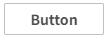
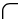
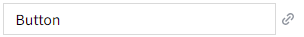
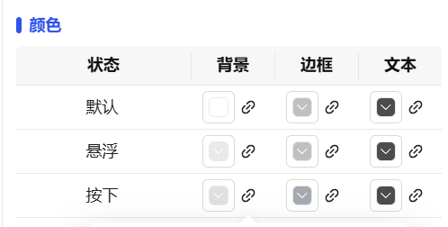

## 1. Overview

Button controls are used to trigger specific operations or display status information. Through interactive methods such as clicking and hovering, they enable command transmission between users and the system, supporting rich visual effects and status feedback.

## 2. Usage Scenarios

Button controls are used in the following scenarios:

### 1. Operation Trigger Scenarios

- When users need to confirm submission, save data, or execute specific commands
- Manual triggering of system functions and control command issuance
- Visual display of device start/stop status, connection status, and alarm status

### 2. Navigation Jump Scenarios

- Jumping between interfaces and switching of functional modules
- Forward and backward control in multi-step processes

## 3. Quick Start

1. Drag the button control to the canvas and adjust position and size
2. Set the text content displayed on the button in the "Fill Text" property
3. Configure the "Color" property to define visual effects under different interaction states
4. Set border thickness and corner radius to adjust button appearance style
5. Optionally add "Fill Background Image" to enhance visual effects
6. Configure font style and alignment to optimize text display
7. Set "Action" to define interactive behavior after button click

**Example:**

### 1. Operation Trigger Scenario:

1.1 Operation Trigger Scenario Example

This example is a device control panel. Set "Start" and "Stop" buttons. Clicking the "Start" button issues a device start command, while the button state changes to a pressed effect, providing clear interactive feedback. As shown in Figure 1-1.

Figure 1-1

1.2 Actual Configuration Tutorial:

1. Drag the button control to the canvas and adjust position and size
2. Enter the text displayed on the button in Fill, and you can also set the button's background color, border, etc.
3. Add the button's click event in Actions, and change certain states or values of the device through events

### 2. Navigation Jump Scenario

2.1 Navigation Jump Scenario Example

This example demonstrates the function of screen jumping by clicking a button, to meet users' needs to view data by clicking buttons. As shown in Figure 1-2.

Figure 1-2

2.2 Actual Configuration Tutorial:

1. Drag the button control to the canvas and adjust position and size
2. Enter the text displayed on the button in Fill, and you can also set the button's background color, border, etc.
3. Add the button's click event in Actions, and set the screen to jump to

## 4. Property Details

| Name                            | Description                                                                                                                                                               |
| ------------------------------- | ------------------------------------------------------------------------------------------------------------------------------------------------------------------------- |
| Name                            | The name of this control.                                                                                                                                                 |
| X                               | The distance from the left side of the control to the left side of the canvas, in px.                                                                                     |
| Y                               | The distance from the top of the control to the top of the canvas, in px.                                                                                                 |
| W                               | The width of the control, in px.                                                                                                                                          |
| H                               | The height of the control, in px.                                                                                                                                         |
|  | The corner radius of the button's four corners.                                                                                                                            |
| Fill Text                       | The content displayed by the control.                                                                           |
| Fill Background Image           | The background image of the control. Only JPG, GIF, PNG, SVG, JPEG formats are supported.                                                                                 |
| Border Thickness                | The thickness of the border line.                                                                                                                                         |
| Color                           | Set the color effects of the control under different operation states. States include: Default, Hover, Pressed. You can set background color, border color, and font color for each state.  |
| Font                            | Set the font of the text content. Includes font type, font size, bold, italic, horizontal alignment, vertical alignment.                                                  |
| Permission                      | Set the permissions of the control, control display/hide or enable/disable                                                                                                |
