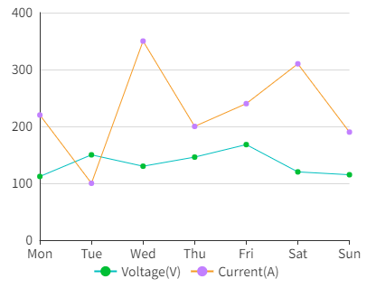
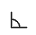
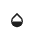
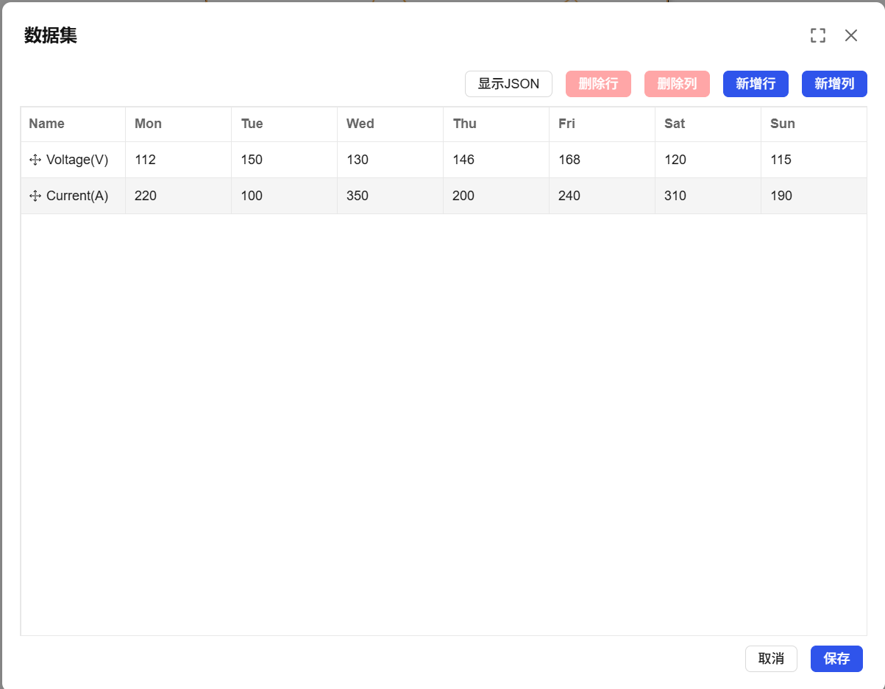
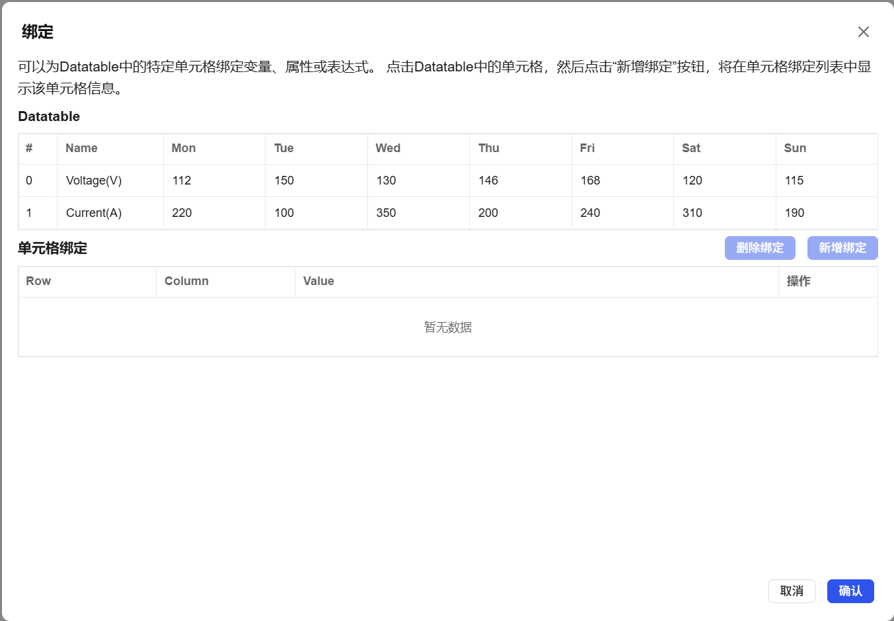

## 1. Overview

Custom curve controls are used to display curve forms customized according to specific business needs and data characteristics, supporting flexible data binding and style configuration, suitable for data visualization scenarios that require non-standard mathematical expressions.

## 2. Usage Scenarios

Custom curve controls are used in the following scenarios:

### 1. Customized Data Analysis Scenarios

- When special business logic or non-standard data relationships need to be displayed
- Display of non-linear relationships between process parameters, custom correlation analysis of business indicators
- Visualization of dedicated curve models established based on empirical data

## 3. Quick Start

1. Drag the custom curve control to the canvas and adjust position and size
2. Configure dataset and cell binding relationships in "Data"
3. Set series style to define the display effect of curves
4. Configure color scheme (background, grid, coordinate axis colors, etc.)
5. Set the display range and style of X-axis and Y-axis
6. Adjust legend position and display control
7. Set margins to ensure chart elements are clearly displayed

**Example:**

### 1. Customized Data Analysis Scenario:

1.1 Customized Data Analysis Scenario Example

This example is a product quality and process parameter relationship curve. Through historical data, establish a non-linear relationship curve between product quality scores and process parameters such as temperature and voltage, used to guide production optimization. As shown in Figure 1-1.

Figure 1-1

1.2 Actual Configuration Tutorial:

1. Drag the custom curve control to the canvas and adjust position and size
2. Add datasets in Data, and bind corresponding variables or properties to each cell of the new dataset through the bind button
3. You can set line styles for datasets added in step 2 in Series Style
4. You can also set X-axis font, etc., Y-axis display range, etc., then save and run

## 4. Property Details

| Name                                | Description                                                                                                                                                                                                                                                                                                                                                                                                                                                                                                                         |
| ----------------------------------- | ---------------------------------------------------------------------------------------------------------------------------------------------------------------------------------------------------------------------------------------------------------------------------------------------------------------------------------------------------------------------------------------------------------------------------------------------------------------------------------------------------------------------------- |
| Name                                | The name of this control.                                                                                                                                                                                                                                                                                                                                                                                                                                                                                                               |
| X                                   | The distance from the left side of the control to the left side of the canvas, in px.                                                                                                                                                                                                                                                                                                                                                                                                                                                                                           |
| Y                                   | The distance from the top of the control to the top of the canvas, in px.                                                                                                                                                                                                                                                                                                                                                                                                                                                                                           |
| W                                   | The width of the control, in px.                                                                                                                                                                                                                                                                                                                                                                                                                                                                                                         |
| H                                   | The height of the control, in px.                                                                                                                                                                                                                                                                                                                                                                                                                                                                                                         |
|  | The rotation angle of the control                                                                                                                                                                                                                                                                                                                                                                                                                                                                                                               |
|    | The opacity of the control                                                                                                                                                                                                                                                                                                                                                                                                                                                                                                                 |
| Data                                | Data: Set the dataset and cell binding of the custom curve. Click this button to set the dataset of the curve.  Click this button to set the cell binding of the dataset.  Series Style: Set the style of the custom curve.                                                                                                                                                                                              |
| Color                               | Set the color effects of the control. Background The overall background color of the control. Grid The line color of the grid. X-axis The axis line color of the X-axis. Y-axis The axis line color of the Y-axis.                                                                                                                                                                                                                                                                                                                                                                           |
| Margin                              | Set the spacing between the control and its selection box. Ensure the chart can be clearly displayed and reserve sufficient space for chart elements (such as legend).                                                                                                                                                                                                                                                                                                                                                                                                                                     |
| X-axis                              | Set the style of the text displayed on the X-axis, including font, font size, bold, italic, font color.                                                                                                                                                                                                                                                                                                                                                                                                                                                          |
| Y-axis                              | Set the style of the Y-axis. Show Grid Control the display and hide of the grid. Displayed by default. Division Count Set the number of division lines inserted on the Y-axis. Display Range Set the display and hide of the Y-axis range. Selected by default. When this item is selected, you need to set the upper and lower limits of the Y-axis. Auto Display Scale Value The range of the Y-axis dynamically changes according to the value range. If selected, the value range of the Y-axis will be automatically determined. If not selected, the specified upper and lower limits will be used. Note: Display Range and Auto Display Scale Value can only choose one. Decimal Places Set the number of decimal places displayed on the Y-axis scale values. Font Set the font, font size, bold, italic, font color of the text displayed on the Y-axis. |
| Legend                              | Set the style of the legend of the control. Display Control the display and hide of the legend. Displayed by default. Position Set the display position of the legend. Bottom is selected by default. Font Set the font, font size, bold, italic, font color of the legend.                                                                                                                                                                                                                                                                                                                                       |
| Permission                          | Set the permissions of the control, control display/hide or enable/disable                                                                                                                                                                                                                                                                                                                                                                                                                                                                                        |
