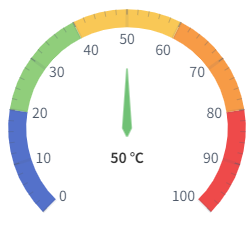
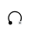
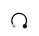
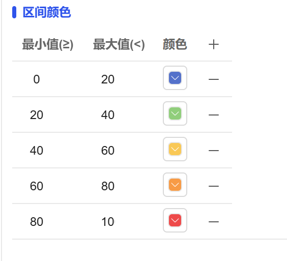

## 1. Overview

Dashboard controls visually display numerical data through pointers and dials, supporting multi-interval color division to intuitively reflect the relative position and status level of data. They are suitable for monitoring and status display of key indicators.

## 2. Usage Scenarios

Dashboard controls are used in the following scenarios:

### 1. Key Indicator Monitoring Scenarios

- When intuitive display of current values and status levels of key indicators is needed
- KPI indicator monitoring such as device utilization, production efficiency, quality pass rate
- Display of important parameters such as system resource usage and load status

## 3. Quick Start

1. Drag the dashboard control to the canvas and adjust position and size
2. Set "Measurement Range" to define the range of the gauge
3. Configure value, unit, pointer style, and display control in "Pointer"
4. Set the number and color of main and sub scales in "Scale"
5. Configure "Dial" background color, width, and progress display options
6. Set color division for different value ranges in "Range Color"
7. Adjust the start angle and end angle of the dial to define the display range

**Example:**

### 1. Key Indicator Monitoring Scenario:

1.1 Key Indicator Monitoring Scenario Example

This example is a device health assessment dashboard. Set five health levels: 0-20 blue (Excellent), 20-40 green (Good), 40-60 yellow (Average), 60-80 orange (Poor), 80-100 red (Dangerous). The device health status is intuitively displayed through the pointer position. As shown in Figure 1-1.

Figure 1-1

1.2 Actual Configuration Tutorial:

1. Drag the dashboard control to the canvas and adjust position and size
2. You can set the display or hide of the pointer, as well as the color and unit of the pointer. Bind the pointer's value to variables or properties to achieve real-time display effects
3. You can set the scale size of the dial, as well as the range of each scale interval and the color representation of that range for visual display

## 4. Property Details

| Name                                | Description                                                                                                                                                                                                                                                               |
| ----------------------------------- | ------------------------------------------------------------------------------------------------------------------------------------------------------------------------------------------------------------------------------------------------------------------ |
| Name                                | The name of this control.                                                                                                                                                                                                                                                     |
| X                                   | The distance from the left side of the control to the left side of the canvas, in px.                                                                                                                                                                                                                                 |
| Y                                   | The distance from the top of the control to the top of the canvas, in px.                                                                                                                                                                                                                                 |
| W                                   | The width of the control, in px.                                                                                                                                                                                                                                               |
| H                                   | The height of the control, in px.                                                                                                                                                                                                                                               |
|  | The rotation angle of the control                                                                                                                                                                                                                                                     |
|    | The opacity of the control                                                                                                                                                                                                                                                       |
|  | The start angle of the dial.                                                                                                                                                                                                                                                   |
|  | The end angle of the dial.                                                                                                                                                                                                                                                   |
| Pointer                             | Show Pointer: Set whether the pointer is displayed. Value: The value of the dashboard. Unit: The unit of the current value. Pointer Length: The length of the pointer. Background: The background color of the pointer. Border: The border color of the pointer. Border Thickness: The border thickness of the pointer. Font: Set the font, font size, bold, italic, font color of the pointer value and unit. |
| Measurement Range                   | The measurement range of the dashboard. Default 0~100.                                                                                                                                                                                                                                      |
| Scale                               | Main Scale Value: The number of main scales. Main Scale Color: The color of main scales. Sub Scale Value: The number of sub scale lines between two adjacent main scales. Sub Scale Color: The color of sub scales. Decimal Places: The number of decimal places displayed on scale values and pointer values.                                                                   |
| Dial                                | Color: The background color of the dial scale Width: The width of the scale Show Progress: Whether to display the value as a progress bar Progress Color: The color of the progress bar Font: Set the font, font size, bold, italic, font color of scale values Dial Range Color: The color corresponding to different value ranges on the dial                                           |
| Range Color                         | Set different colors for different value ranges to distinguish data                                                                                                                                                                      |
| Permission                          | Set the permissions of the control, control display/hide or enable/disable                                                                                                                                                                                                                              |
