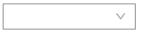
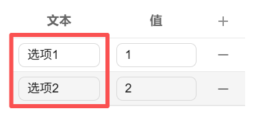
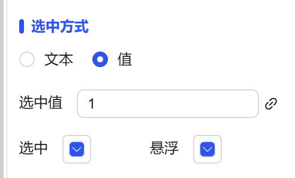
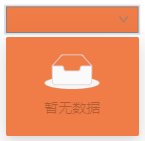
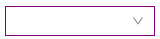

## 1. Overview

When dropdown box options are selected, interactive operations such as data updates and screen jumps can be triggered. Supports manual configuration of option lists to achieve flexible business scenario adaptation.

## 2. Usage Scenarios

Dropdown box controls are used in the following scenarios:

### 1. Data Selection Scenarios

- When users need to issue different commands based on different options
- Need to provide standardized input to avoid users freely entering incorrect data

### 2. Function Trigger Scenarios

- Update data display of other controls based on selection
- Implement screen jumps or popup display switching

## 3. Quick Start

1. Drag the dropdown box control to the canvas and adjust position and size
2. Configure the option list (text and value) in "Option Content"
3. Set "Selected Text" and "Selected Value" to determine the default option
4. Configure style properties (color, border, font, etc.) (**Optional**)
5. Set "Action" to define interactive behavior after selection (**Optional**)

**Example:**

Data Selection Scenario:

Simulate air conditioning mode selection. When the dropdown box options are set to ["Heating", "Cooling", "Dehumidification"], selecting different modes can trigger corresponding temperature setpoint changes, as shown in Figure 1-1.

Figure 1-1

Function Trigger Scenario:

Implement screen navigation function. For example, set options to ["Home", "Report", "Settings"]. When "Report" is selected, automatically jump to the report screen. **Note: The option name must match the screen name, otherwise correct jumping cannot be achieved.** As shown in Figure 1-2.

Figure 1-2

## 4. Special Events

| Value Change |                                                                                                                                                                                                                                                                                                                                    |                                                                      |
| ------------ | ---------------------------------------------------------------------------------------------------------------------------------------------------------------------------------------------------------------------------------------------------------------------------------------------------------------------------------- | -------------------------------------------------------------------- |
| Description  | When the selected value of the dropdown box changes, the corresponding event will be triggered                                                                                                                                                                                                                                                                                  |                                                                      |
| Input Parameter | Selected value (selected text)                                                                                                                                                                                                                                                                                                                 |                                                                      |
| Operation Type | Navigation                                                                                                                                                                                                                                                                                                                               | When operating, the "value" of the control option must exactly match the name of the target screen, otherwise correct jumping cannot be achieved. |
|              | Variable Write Value                                                                                                                                                                                                                                                                                                                           | Will write the selected value to the variable                                             |
| Configuration Process | 1. In the control's "Action" settings, select "Value Change" as the trigger event 2. Select "Navigation" as the execution action type 3. Set the target screen and ensure the option value matches the screen name 4. Save the configuration to complete the automatic jump setting By configuring the "Value Change" event, the control can automatically execute subsequent processes after user selection, greatly improving the automation level and user experience of the interface.Figure 1-3 |                                                                      |

## 5. Property Details

| Name                                | Description                                                                                                                                                                                                                                                                                             |
| ----------------------------------- | ------------------------------------------------------------------------------------------------------------------------------------------------------------------------------------------------------------------------------------------------------------------------------------------------ |
| Name                                | The name of this control.                                                                                                                                                                                                                                                                                   |
| X                                   | The distance from the left side of the control to the left side of the canvas, in px.                                                                                                                                                                                                                                                               |
| Y                                   | The distance from the top of the control to the top of the canvas, in px.                                                                                                                                                                                                                                                               |
| W                                   | The width of the control, in px.                                                                                                                                                                                                                                                                             |
| H                                   | The height of the control, in px.                                                                                                                                                                                                                                                                             |
|  | The rotation angle of the control                                                                                                                                                                                                                                                                                   |
|    | The opacity of the control                                                                                                                                                                                                                                                                                     |
| Corner Radius                       | The corner radius of the button's four corners.                                                                                                                                                                                                                                                                           |
| Option Content                      | You can add or delete selection items under the dropdown box, and set the text displayed by the selection item and the value corresponding to that text                                                                                                                                                                      |
| Selection Method                    | The text in the selection method corresponds to the text in the option content, and the value corresponds to the value in the option content. After selecting a selection method, change the corresponding selected value, and the dropdown box will display the corresponding text.  Selected: When the dropdown box is expanded, the background color of the currently selected option in the list When the mouse hovers over a dropdown option, the background color of that option |
| Fill Color                          | The fill color of the dropdown box.                                                                                                                                                                                                                                |
| Border Color                        | The border color of the dropdown box.                                                                                                                                                                                                                              |
| Border Thickness                    | The border thickness of the dropdown box.                                                                                                                                                                                                                                                                               |
| Font                                | The font of the dropdown options. Includes font type, font size, font color, bold, italic, underline settings.                                                                                                                                                                                                                 |
| Permission                          | Set the permissions of the control, control display/hide or enable/disable                                                                                                                                                                                                                                                            |
