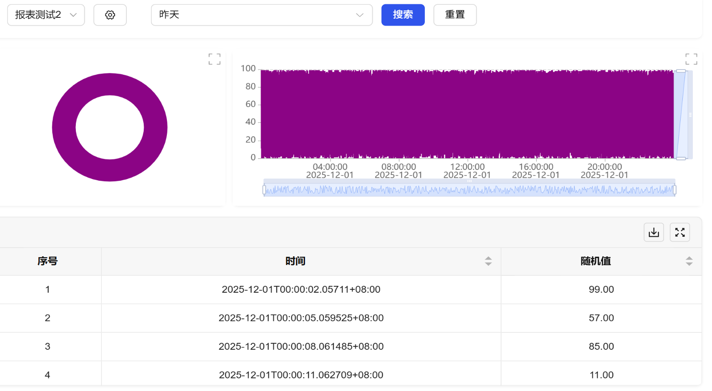

## 1. Overview

Historical report controls are used to centrally display and analyze variable data in visual forms such as tables and charts, supporting multi-dimensional data statistics and flexible format configuration, providing professional data presentation tools for historical data review, performance analysis, and decision support.

## 2. Usage Scenarios

Historical report controls are used in the following scenarios:

### 1. Data Statistics Scenarios

- When multi-dimensional statistics and visual display of historical data is needed
- Production data statistical reports, device operation efficiency analysis, energy consumption statistical analysis
- Quality indicator statistics, process parameter trend summaries

## 3. Quick Start

### 1. Design Phase Configuration

- Drag the historical report control to the canvas and adjust its position and size.
- Configure basic appearance properties: such as background, whether to display legend, and whether to enable dark mode.

### 2. Runtime Operation

- **View Reports**: Directly browse and view all historical reports and their data pre-configured in "Data Analysis - Report Design".
- **Create Report**: At runtime, you can create and configure historical reports for data to be observed as needed.
- **Modify Report**: Edit and adjust parameters of existing historical reports.
- **Data Export**: Export the query results of the current report to common file formats (such as Excel).
- **Data Filtering**: Filter data by selecting different time display forms (such as year, month, day, custom range), and can reset all data with one click.

### **Example:**

**1. Data Statistics Scenario:**

1.1 Data Statistics Scenario Example

This example is creating a monthly production data report. Bind key variables such as product output and energy consumption, set time frequency to daily statistics, display daily change trends and monthly summary data of each indicator, and display the output proportion of each product line through pie charts. As shown in Figure 1-1.

Figure 1-1

1.2 Actual Configuration Tutorial:

1. Drag the historical report control to the canvas and adjust position and size
2. Configure basic appearance properties of the report: such as background, whether to display legend, and whether to enable dark mode.
3. Save and enter runtime, you can view all historical reports and their data pre-configured in "Data Analysis - Report Design"
4. Create a new historical report, set sampling method to original value, time range to the last day, bind variable data
5. You can click Export in the table below to export data to Excel for viewing

## 4. Property Details

| Name     | Description                                |
| -------- | ------------------------------------------- |
| Name     | The name of this control.                      |
| X        | The distance from the left side of the control to the left side of the canvas, in px.  |
| Y        | The distance from the top of the control to the top of the canvas, in px.  |
| W        | The width of the control, in px.                |
| H        | The height of the control, in px.                |
| Background     | The background color of the report                        |
| Legend     | Display/hide legend of pie charts and line charts in the report |
| Dark Mode | Enable dark mode of the report                |
