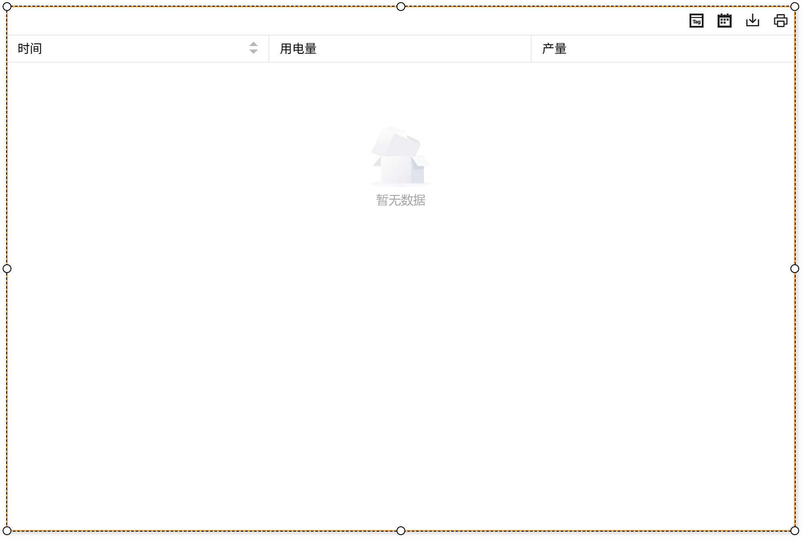
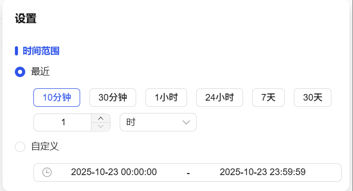
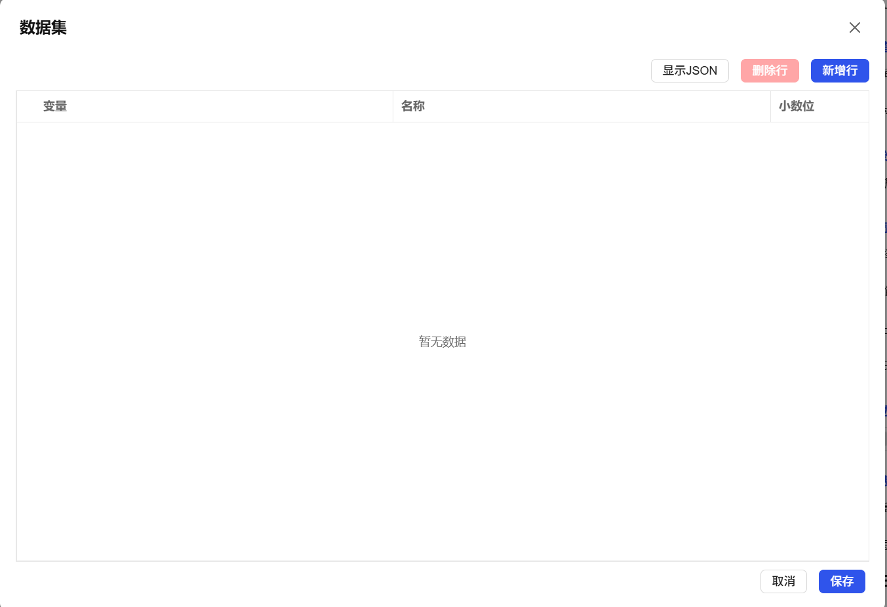

## 1. Overview

Historical retrieval controls are used to query and display historical data records of variables, supporting filtering by time period and multiple collection methods, providing professional query tools for data tracing, analysis, and report generation.

## 2. Usage Scenarios

Historical retrieval controls are used in the following scenarios:

### 1. Data Analysis Scenarios

- When statistical analysis and pattern research of historical data is needed
- Periodic analysis of production quality data, historical evaluation of device performance
- Statistical research on data change patterns and trend prediction

## 3. Quick Start

1. **Design Phase Configuration**:

   1. Drag the historical retrieval control to the canvas and adjust position and size
   2. Bind required variables in "Data"
   3. Set "Border" style to define control appearance
   4. Enable required function buttons in "Display" configuration
   5. Configure the display style and font of "Header" and "Body"
2. **Runtime Operation**:

   1. In settings, you can select variables in the variable list, and set sampling methods to define "Time Range" for querying
   2. In Select Variables, you can add required variables and delete unwanted variables.
   3. Execute query operations to view historical data results
   4. Use export function to save query results

**Example:**

### 1. Data Analysis Scenario:

1.1 Data Analysis Scenario Example

This example is energy consumption data analysis. Bind power consumption variables, query daily average power consumption trends for energy efficiency evaluation. As shown in Figure 1-1.

Figure 1-1

1.2 Actual Configuration Tutorial:

1. Drag the historical retrieval control to the canvas and adjust position and size
2. You can customize table data items in Data, and bind variables to data items, and define corresponding names
3. You can set whether to display function buttons in Display
4. You can set the row height, background, font, etc. of the header and body. After all settings are complete, save and run

## 4. Property Details

| Name                                | Description                                                                                                                     |
| ----------------------------------- | ------------------------------------------------------------------------------------------------------------------------------- |
| Name                                | The name of this control.                                                                                                           |
| X                                   | The distance from the left side of the control to the left side of the canvas, in px.                                                                                       |
| Y                                   | The distance from the top of the control to the top of the canvas, in px.                                                                                       |
| W                                   | The width of the control, in px.                                                                                                     |
| H                                   | The height of the control, in px.                                                                                                     |
|  | The rotation angle of the control                                                                                                           |
|    | The opacity of the control                                                                                                             |
| Time Range                          | Query according to the set time period.                                            |
| Collection Method                   | Set collection method                                                          |
| Data                                | Click the bind button in Data to open the dataset binding variables. Only variables with historical storage enabled can be bound  |
| Display                             | Set the on/off of Select Variable button, Query button, Export button, Print button                                                                   |
| Border                              | Set border color and border thickness                                                                                                   |
| Header                              | Set the background color, font type, font size, bold, italic, font color of the header.                                                             |
| Body                                | Set the background color, font type, font size, bold, italic, font color of the body.                                                             |
| Others                              | Set the maximum number of alarms to display                                                                                                     |
| Permission                          | Set the permissions of the control, control display/hide or enable/disable                                                                                    |
