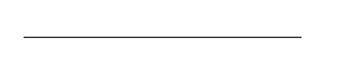
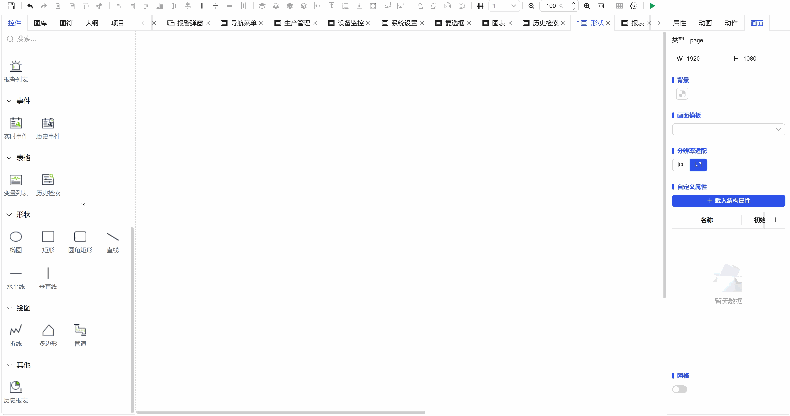

## 1. Overview

Horizontal line shape controls are used to create and edit horizontal straight line graphic elements on the canvas. They provide convenient tools for design scenarios that require strict horizontal alignment, ensuring horizontal lines and precise positioning.

## 2. Usage Scenarios

Horizontal line controls are used in the following scenarios:

### 1. Data Visualization Scenarios

- Used as auxiliary shapes for graphical display of data relationships
- Horizontal line elements in data distribution diagrams and relationship diagrams

## 3. Quick Start

1. Select the horizontal line control from the toolbar
2. Place the mouse at the starting position on the canvas, hold down the left mouse button
3. Drag the mouse horizontally to adjust the line length
4. Release the left mouse button to complete horizontal line creation (automatically maintains horizontal)
5. Adjust line length through the endpoint control points of the selection box
6. Use the middle control point to adjust the vertical position of the line
7. Precisely set length, position, and style parameters in the property panel

**Example:**

### 1.1 Data Visualization Scenario Example

This example is creating a horizontal line and setting basic properties, as shown in Figure 1-1.

Figure 1-1

1.2 Actual Configuration Tutorial:

1. Drag the horizontal line control to the canvas and adjust position and size
2. You can set the line style and thickness of the horizontal line, then save and run

## 4. Property Details

| Name   | Description                                                   |
| ------ | ------------------------------------------------------------- |
| Name   | The name of this control.                                         |
| X      | The distance from the left side of the control to the left side of the canvas, in px.                     |
| Y      | The distance from the top of the control to the top of the canvas, in px.                     |
| W      | The width of the control, in px.                                   |
| H      | The height of the control, in px. Fixed at 1px                          |
| Angle   | The rotation angle of the control                                         |
| Opacity | The opacity of the control                                           |
| Line   | The line color of the control The line style of the control The line thickness of the control |
| Permission   | Set the permissions of the control, control display/hide or enable/disable                  |
