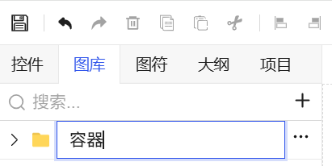
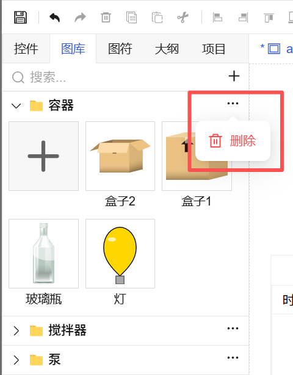
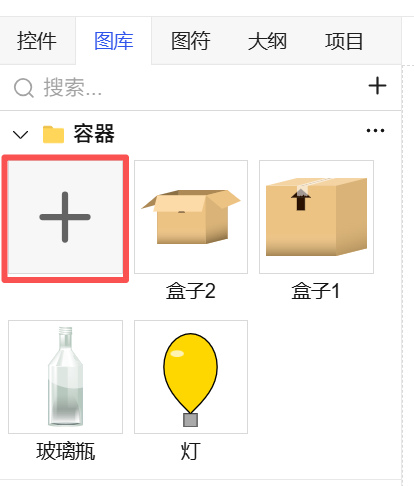
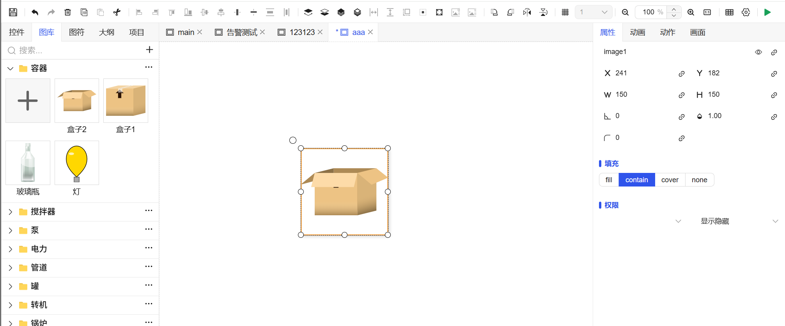

## 1. Overview

The Image Library is the centralized management center for image resources in the project. Through the "Image Library" window, you can systematically upload, categorize, and manage images. It supports uploading mainstream image formats such as **SVG, PNG, JPEG, GIF, JPG**. Uploaded images can be used directly in **screen editing, template design, and symbol creation**.

## 2. Image Library Operations

### 1. Add New Image Library

- **Operation Path**: In the "Image Library" window, click the **"+"** button.
- **Execution Result**: The system will automatically create a new image library, and the **library name will be in editable state**.
- **Follow-up Operations**: After modifying the library name, you can click the "Add" button within the library to upload images.

Figure 1-1

### 2. Delete Image Library

- **Operation Path**: Click the **three-dot menu button** in the top-right corner of the created image library.
- **Execution Result**: Select the "Delete" operation to delete the current image library and all images it contains.
- **Note**: Confirm before deletion, this operation cannot be undone.

Figure 1-2

### 3. Upload Images

- **Operation Path**: Within the image library, click the **"Add"** button.
- **Execution Process**:

  - The system will pop up an "Open File" dialog box.
  - **Select one or multiple** images in the local computer (multi-selection supported).
  - Click the **"Open"** button in the dialog box.
- **Execution Result**: The selected images will be uploaded to the current image library.

Figure 1-3

## 3. Image Operations

### 1. Rename Image

- **Operation Path**: In the image library, **right-click** the image that needs to be renamed.
- **Execution Result**: Select "Rename" in the menu, enter the new name and confirm.

### 2. Update Image

- **Operation Path**: In the image library, **right-click** the image that needs to be replaced.
- **Execution Result**: Select "Update" in the menu, re-select a local image to upload, the **new image will overwrite the old image**, while the image's reference relationships in the project remain unchanged.

### 3. Delete Image

- **Operation Path**: In the image library, **right-click** the image that needs to be deleted.
- **Execution Result**: Select "Delete" in the menu to remove the image from the current image library.

Figure 1-4

## 4. Using Images

After images are uploaded to the image library, using them is very simple:

1. Open the screen, template, or symbol editor where you need to use the image.
2. From the "Image Library" window, find and select the target image.
3. **Directly drag the image** to the target position on the canvas to complete placement.

Figure 1-5
