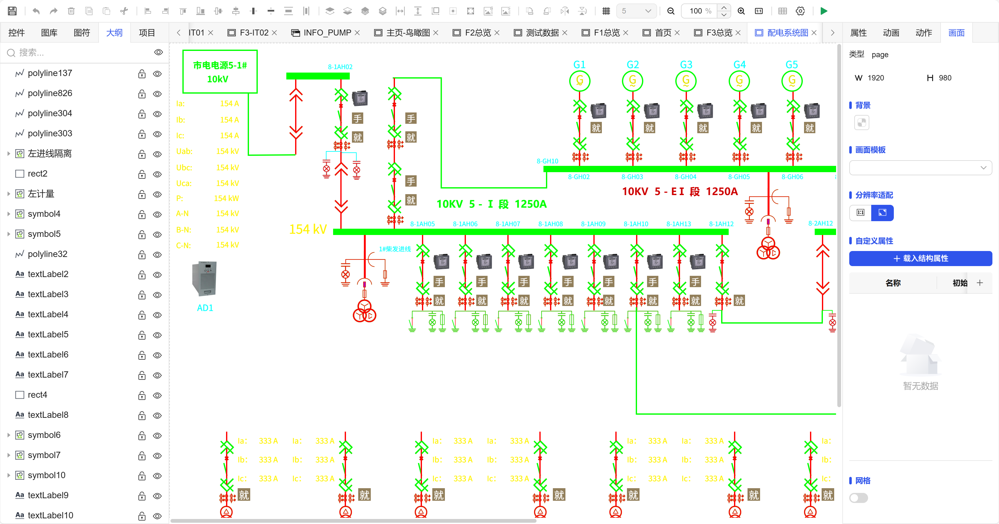

## 1. Function Overview

The outline view is the interface's **structured navigator and content list**. When you select a specific project (such as screen, popup) in the **Project**, the outline will clearly display all constituent elements in the project in a tree-structured list format, including all **controls, symbols**, and **images from the image library**, helping you quickly understand the screen structure and locate specific elements.

## 2. View Description

As shown in Fig 1-1, the outline view usually presents the following key information:

### 1. **Tree Hierarchical Structure**

- **Root Node**: All controls, symbols, and images inside the screen
- **Child Nodes**: Elements inside composite controls, sub-elements inside symbols, etc.

### 2. **Element List and Status**

| Element Type | Icon/Identifier | Status Display |
| ------------ | --------------- | -------------- |
| Basic Controls | Various control-specific icons (such as buttons, input boxes) | Name, locked/hidden status |
| Symbol Instances | Symbol-specific icons | Symbol name, expand to view internal sub-controls |
| Image Resources | Thumbnail or image icon | Image name, source image library |

**Note**: Each element item usually has **status identifiers** next to it, such as:

- **Lock Icon**: Indicates the element has been **locked** and cannot be directly edited on the canvas.
- **Eye Icon** (on/off): Indicates the element's **visibility**, hidden at runtime when off.

### 3. **Interactive Operations**

- **Quick Positioning**: **Click** any element in the outline list, and the corresponding element on the canvas will be **selected** at the same time.
- **Right-click Menu**: **Right-click** any element in the outline list to perform **delete** operations.

Fig 1-1

## 3. Application Value

Through the outline view, you can:

- **Quick Inventory**: Clearly grasp the **types and quantities** of all elements in the screen at a glance.
- **Precise Positioning**: In complex screens, bypass visual overlap and **directly find and select** target elements from the list.
- **Structure Management**: Conveniently adjust element hierarchy and batch modify properties (such as hiding multiple elements simultaneously).
- **Auxiliary Editing**: When elements are obscured by other elements on the canvas or are too small in size, outline operations are more convenient.

In summary, the outline view is a powerful auxiliary tool for managing and editing complex screens. It converts visual layout into structured data, greatly improving design efficiency and accuracy.