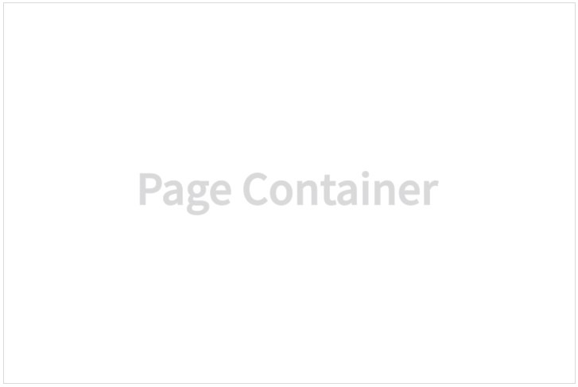
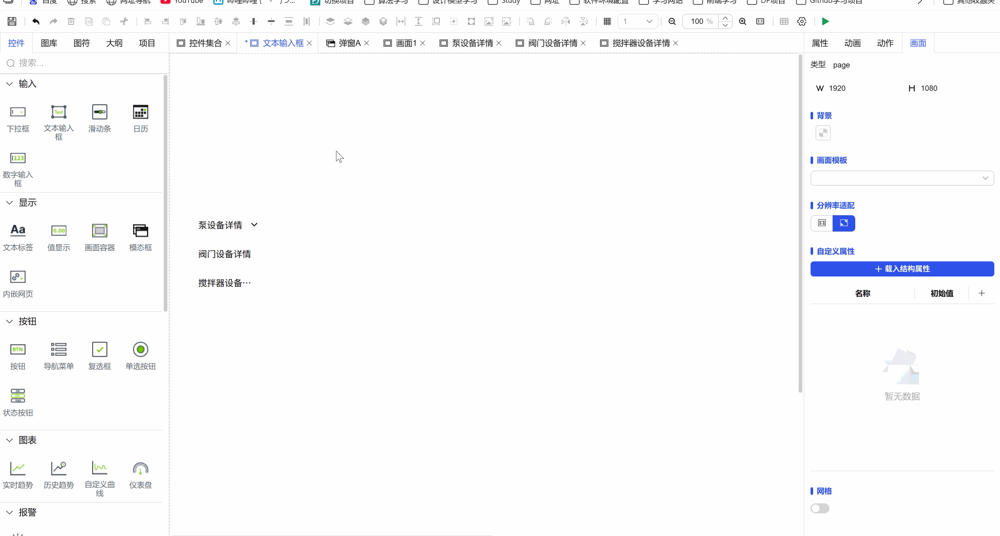
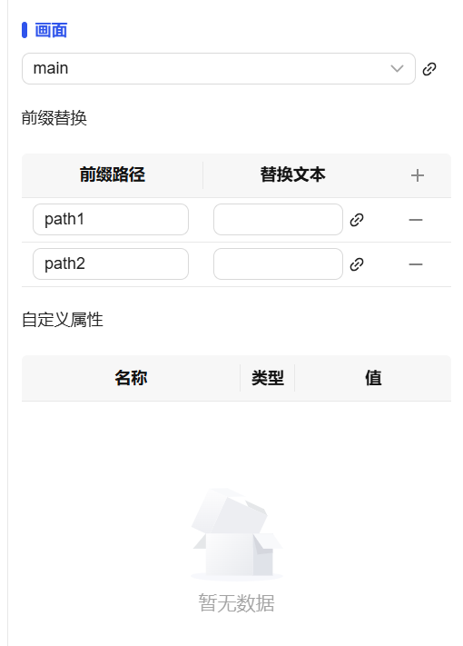

## 1. Overview

Page container controls are used to embed and display other screens within the current project in the current screen, achieving modular management and reuse of screens, supporting resolution adaptation and custom property passing.

## 2. Usage Scenarios

Page container controls are used in the following scenarios:

### 1. Dynamic Screen Switching Scenarios

- Dynamically switch to display different content screens based on business logic
- Content area display in tab-style interfaces

### 2. Static Screen Embedding Scenarios

- When embedding another screen in a screen

## 3. Quick Start

1. Drag the page container control to the canvas and adjust position and size
2. Select the screen under the current project to be embedded in the "Screen" property
3. Set the "Resolution Adaptation" mode to ensure content is displayed correctly
4. Configure border styles (color, thickness) to define container appearance
5. If there are custom properties, set corresponding values in the property panel
6. Set permissions to control screen access and display conditions

**Example:**

### 1. Dynamic Screen Switching Scenario:

1.1 Dynamic Screen Switching Scenario Example

This example implements the device detail viewing function. Based on the device type selected by the user, dynamically switch the screen content displayed in the page container, such as "Pump Device Details", "Valve Device Details" and other dedicated screens. As shown in Figure 1-1.

**Note**: This example is used in conjunction with the navigation menu. The use of the navigation menu will be introduced later. For now, you only need to focus on the use of the page container.

Figure 1-1

1.2 Actual Configuration Tutorial:

1. Drag the page container control to the canvas and adjust position and size
2. Bind the Screen property to the property of the navigation menu control, so clicking can display different pages.

### 2. Static Screen Embedding Scenario:

2.1 Static Screen Embedding Scenario Example

This example implements embedding another screen in a screen to achieve screen combination. As shown in Figure 1-2.

Figure 1-2

1.2 Actual Configuration Tutorial:

1. Drag the page container control to the canvas and adjust position and size
2. Select an appropriate resolution adaptation method, select the screen you want to embed in Screen, then save

## 4. Property Details

| Name       | Description                                                                                                                                                                                                                                                                                 |
| ---------- | -------------------------------------------------------------------------------------------------------------------------------------------------------------------------------------------------------------------------------------------------------------------------------------------- |
| Name       | The name of this control.                                                                                                                                                                                                                                                                       |
| X          | The distance from the left side of the control to the left side of the canvas, in px.                                                                                                                                                                                                                                                   |
| Y          | The distance from the top of the control to the top of the canvas, in px.                                                                                                                                                                                                                                                   |
| W          | The width of the control, in px.                                                                                                                                                                                                                                                                 |
| H          | The height of the control, in px.                                                                                                                                                                                                                                                                 |
| Angle      | The rotation angle of the control                                                                                                                                                                                                                                                                       |
| Opacity    | The opacity of the control                                                                                                                                                                                                                                                                         |
| Border     | Set the border of the page container, supporting border color and border thickness settings.                                                                                                                                                                                                                                   |
| Resolution Adaptation | Set the resolution adaptation of the page container, supporting options such as off, width-height proportional scaling, full scaling, etc. In addition, the resolution adaptation of the screen itself to be displayed in the page container will no longer take effect.                                                                                                                                                           |
| Screen     | Bind a screen to the control. If the selected screen has custom properties set, the custom properties of the selected screen will be displayed, and you can modify the values of custom properties.  Dropdown to select screens under the current project Bind button, click to pop up the property binding window to bind a screen to the control Display the custom properties of the selected screen and can modify them |
| Permission | Set the permissions of the control, control display/hide or enable/disable                                                                                                                                                                                                                                                |
