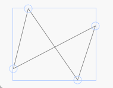
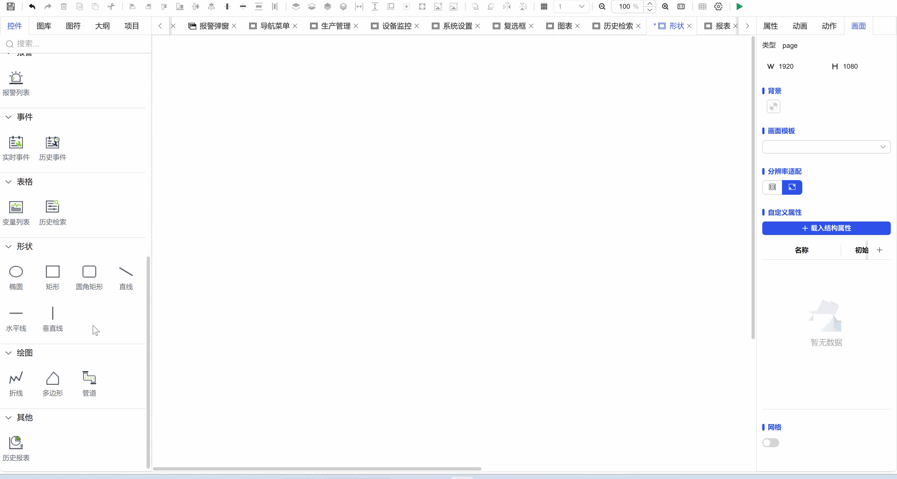

## 1. Overview

Polygon shape controls are used to create and edit multi-sided closed graphics on the canvas, supporting flexible drawing from triangles to complex polygons, achieving precise graphic design and editing through vertex control.

## 2. Usage Scenarios

Polygon controls are used in the following scenarios:

### 1. Data Visualization Scenarios

- Used to create non-standard shape elements in modern interfaces
- Custom graphic symbols and visual identifiers
- When standard geometric shapes such as triangles, pentagrams, and hexagons need to be created

## 3. Quick Start

1. Click the left mouse button to select the polygon control from the toolbar
2. Click the left mouse button at the starting position on the canvas to determine the first vertex
3. Move the mouse to view the preview line, then click the left mouse button again to determine the second vertex
4. Continue moving and clicking to add more vertices, forming the polygon outline
5. Click the right mouse button to complete polygon drawing (automatically closed)
6. Adjust overall size and rotation angle through the control points of the selection box
7. Double-click the polygon to enter edit mode, drag vertices to adjust the shape

**Example:**

### 1. Data Visualization Scenario:

1.1 Data Visualization Scenario Example

This example is creating a polygon and setting basic properties, as shown in Figure 1-1.

Figure 1-1

1.2 Actual Configuration Tutorial:

1. Click the left mouse button to select the zigzag line control from the toolbar
2. Click the left mouse button at the starting position on the canvas and drag the mouse to draw the first line segment
3. Click the left mouse button to complete the first line segment, then press and drag again to draw the next line segment
4. Repeat steps to draw multiple line segments, click the right mouse button to determine the end position

## 4. Property Details

| Name   | Description                                                                   |
| ------ | ----------------------------------------------------------------------------- |
| Name   | The name of this control.                                                         |
| X      | The distance from the left side of the control to the left side of the canvas, in px.                                     |
| Y      | The distance from the top of the control to the top of the canvas, in px.                                     |
| W      | The width of the control, in px.                                                   |
| H      | The height of the control, in px.                                                   |
| Angle   | The rotation angle of the control                                                         |
| Opacity | The opacity of the control                                                           |
| Fill   | The fill color of the control The fill degree of the control The direction of the fill Set the range of fill values |
| Border   | The border color of the control The line type of the control's border The line thickness of the control's border     |
| Permission   | Set the permissions of the control, control display/hide or enable/disable                                  |
