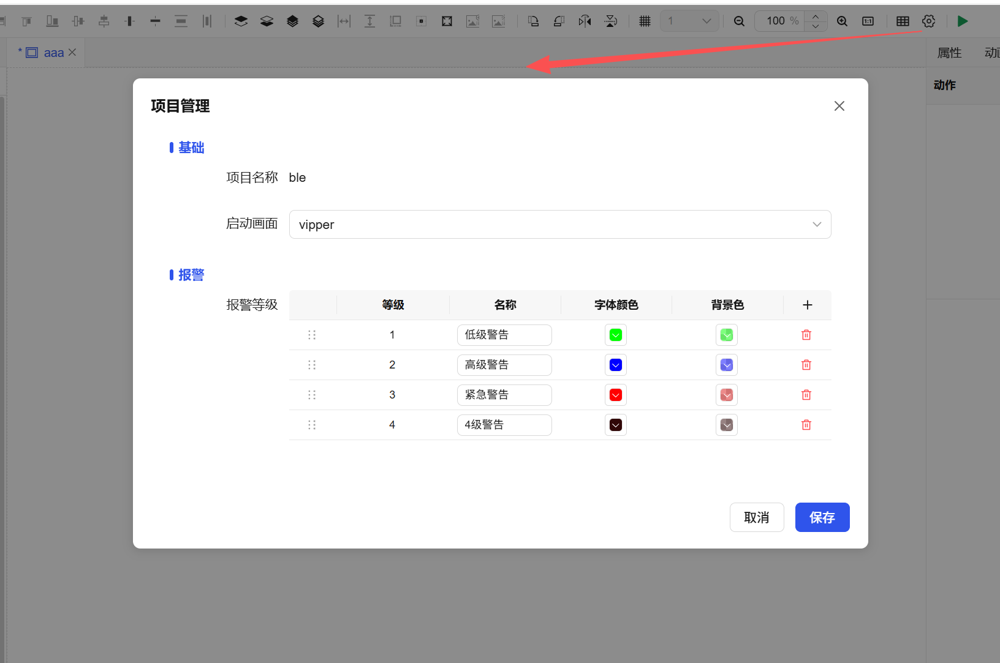
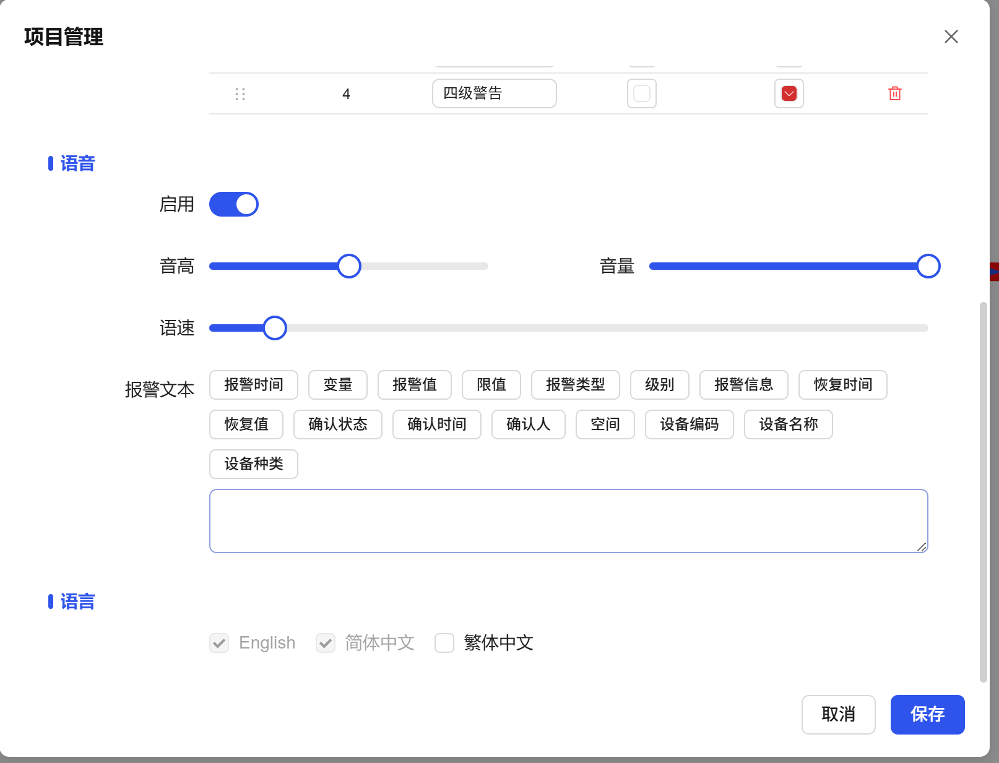

## 1. Overview

Project attributes are the global configuration center for projects, used to define and modify the project's basic settings, initial state, interaction experience, and core operating parameters such as internationalization, ensuring that the project can start and run as expected.

## 2. Attribute Configuration Details

| Configuration Item | Description |
| ------------------ | ----------- |
| Project Name | Display the name of the current project. |
| Startup Screen | Set the initial screen when the project runs. Defaults to the first screen created. After setting, clicking the "Run" button in the project list will automatically open this screen. |
| Alarm | Set alarm level, name, font color, list background color, etc., used to define the visual presentation of alarm information. |
| Voice | Configure voice prompt function for alarms, including: enable/disable, pitch, volume, speech rate, and can specify the alarm text to be broadcast. |
| Language | Configure the languages enabled in the project to adapt to users from different countries. Chinese and English are enabled by default. After configuration, users can switch interface languages at runtime. |

## 3. Configuration Process

1. In the project editor interface, find and open the **"Project Attributes"** settings panel.
2. Configure according to requirements under categories such as **basic information, startup settings, alarm configuration, voice prompts, internationalization**.
3. Save the settings, and the configuration will be applied to the entire project's runtime environment.

**Note**: Some configurations (such as startup screen) need to take effect after project **publishing or restarting**.

**Example:**

