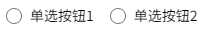
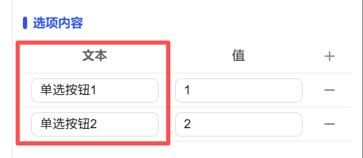
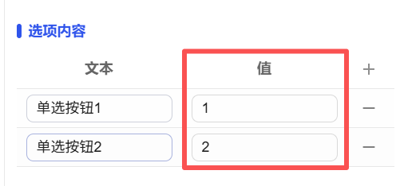
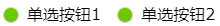
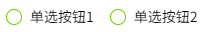

## 1. Overview

Radio button controls are used to select a unique item from multiple mutually exclusive options. When a user selects an option, other options are automatically deselected, ensuring that only one option is always in an active state.

## 2. Usage Scenarios

Radio button controls are used in the following scenarios:

### 1. Single Selection Scenarios

- When users must select one from multiple mutually exclusive options
- Configuration item selection that requires uniqueness
- Single selection filter settings for filtering conditions

## 3. Quick Start

1. Drag the radio button control to the canvas and adjust position and size
2. Set the display names of each option in "Option Text"
3. Configure the corresponding data values of each option in "Option Value"
4. Set "Selected Text" or "Selected Value" to determine the default selected item
5. Select "Style" layout method (horizontal or vertical arrangement)
6. Adjust visual styles such as fill color and border color
7. Set "Action" to define interactive behavior when options change

**Example:**

### 1. Single Selection Scenario:

1.1 Single Selection Scenario Example

This example is user gender selection. Set option text to ["Male", "Female", "Private"], corresponding option values to ["1", "2", "3"]. Users can only select one item and must select one item. As shown in Figure 1-1.

Figure 1-1

1.2 Actual Configuration Tutorial:

1. Drag the radio button control to the canvas and adjust position and size
2. Set the text used for display in Option Content and set the corresponding value
3. Select the selection method, either text selection or value selection, then save

## 4. Property Details

| Name     | Description                                                                                                                                                                 |
| -------- | --------------------------------------------------------------------------------------------------------------------------------------------------------------------------- |
| Name     | The name of this control.                                                                                                                                                  |
| X        | The distance from the left side of the control to the left side of the canvas, in px.                                                                                      |
| Y        | The distance from the top of the control to the top of the canvas, in px.                                                                                                  |
| W        | The width of the control, in px.                                                                                                                                            |
| H        | The height of the control, in px.                                                                                                                                           |
| Angle    | The rotation angle of the control                                                                                                                                           |
| Opacity  | The opacity of the control                                                                                                                                                  |
| Option Text | The name of the radio button option. The "name" here corresponds to "Selected Text".                   |
| Option Value | The value of the radio button option. The "name" here corresponds to "Selected Value".               |
| Selected Text | The corresponding text content of the current option.                                                                                                                      |
| Selected Value | The value of the current option. Note: Selected Text and Selected Value can only choose one. After setting one option, the other option is disabled. Only after clearing the currently set option value or unbinding it will the other option become editable. |
| Style    | The layout style of radio buttons. Includes horizontal and vertical.                                                                                                        |
| Fill Color | The fill color of radio buttons.                                                                           |
| Border Color | The border color of radio buttons.                                                                           |
| Font     | Set the font of the text content. Includes font type, font size, font color, bold, italic, underline.                                                                      |
| Permission | Set the permissions of the control, control display/hide or enable/disable                                                                                                |
