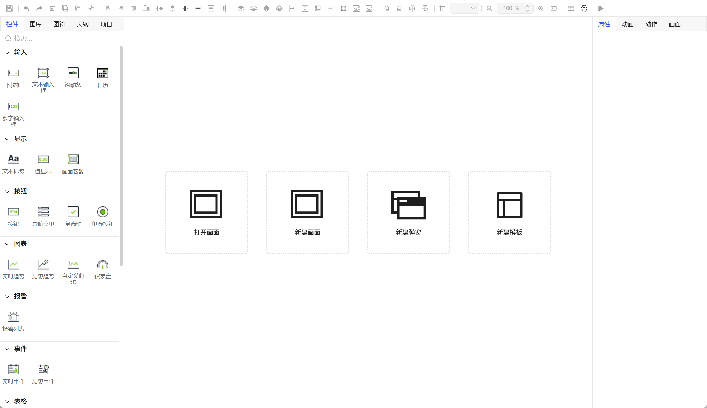
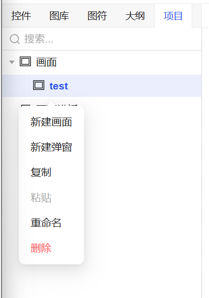
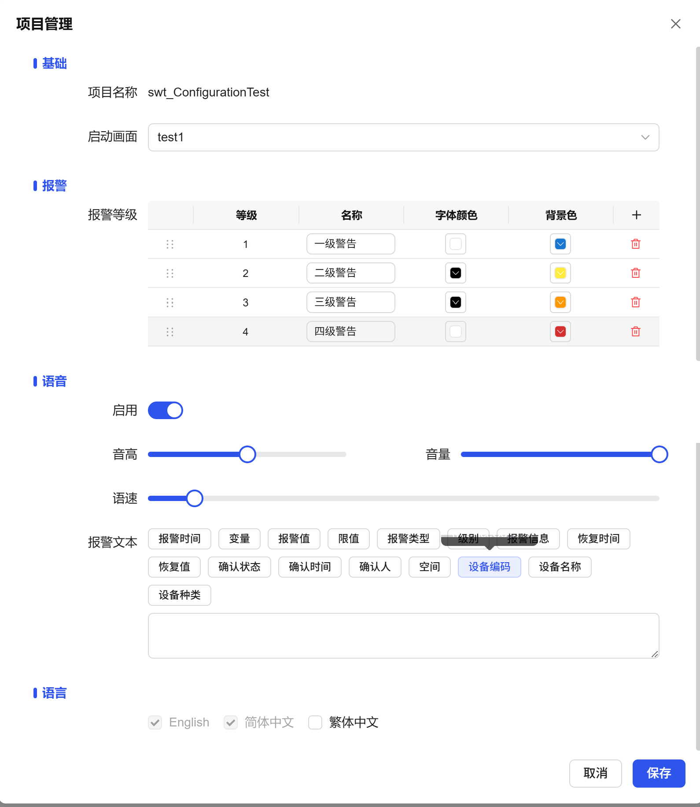
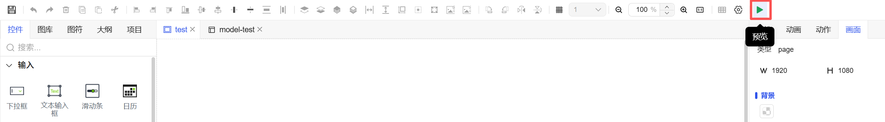

## 1. Overview

All configuration screens are designed and drawn in DipuOne's built-in **WYSIWYG editor**. This editor provides core advantages such as real-time preview, intuitive operation, and instant feedback, greatly simplifying the creation and editing process, and improving development efficiency and interface consistency.

- **First Launch**: When opening a project, a welcome window will be displayed, providing quick launch options such as **new screen, new popup**.
- **Subsequent Launches**: You can select previously created screen projects to **seamlessly continue work**.

Figure 1-1

## 2. Editor Interface Layout

### 1. Toolbar

The editor top has a toolbar that provides shortcuts for a series of commonly used functions. Hovering the mouse over any button will display a **tooltip box** clearly indicating the button's function.

| Function Category       | Function Name                   | Description                                                | Usage Instructions                                                            |
| ----------------------- | ------------------------------- | ---------------------------------------------------------- | ----------------------------------------------------------------------------- |
| File Operations         | Save                            | Save current editing content                               | Click to immediately save all modifications on the current canvas             |
|                         | Undo                            | Undo the previous operation                                | Click to revert to the state before the previous operation                    |
|                         | Redo                            | Redo the undone operation                                  | Click to restore the undone operation                                         |
| Edit Operations         | Delete                          | Delete selected elements                                   | Select one or more elements then click delete                                 |
|                         | Copy                            | Copy selected elements                                     | Select elements then click, then paste at other positions on the canvas       |
|                         | Paste                           | Paste copied elements                                      | Paste copied elements on the canvas                                           |
|                         | Cut                             | Cut selected elements                                      | Select elements then click, elements are removed and can be pasted elsewhere  |
| Alignment Operations    | Left Align                      | Align selected elements to the left                        | After selecting multiple elements, align based on the leftmost element        |
|                         | Right Align                     | Align selected elements to the right                       | After selecting multiple elements, align based on the rightmost element       |
|                         | Top Align                       | Align selected elements to the top                         | After selecting multiple elements, align based on the topmost element         |
|                         | Bottom Align                    | Align selected elements to the bottom                      | After selecting multiple elements, align based on the bottommost element      |
|                         | Horizontal Center               | Center selected elements horizontally                      | After selecting multiple elements, center them horizontally                   |
|                         | Vertical Center                 | Center selected elements vertically                        | After selecting multiple elements, center them vertically                     |
| Distribution Operations | Vertical Equal Spacing          | Distribute selected elements with equal vertical spacing   | After selecting 2 or more elements, distribute evenly in vertical direction   |
|                         | Horizontal Equal Spacing        | Distribute selected elements with equal horizontal spacing | After selecting 2 or more elements, distribute evenly in horizontal direction |
| Layer Operations        | Move Up                         | Move selected element up one layer                         | Adjust the display order of elements in Z-axis direction                      |
|                         | Move Down                       | Move selected element down one layer                       | Adjust the display order of elements in Z-axis direction                      |
|                         | Bring to Front                  | Place selected element at the top layer                    | Move element above all other elements                                         |
|                         | Send to Back                    | Place selected element at the bottom layer                 | Move element below all other elements                                         |
| Size Operations         | Equal Width                     | Make selected elements have equal width                    | Based on the widest or last selected element's width                          |
|                         | Equal Height                    | Make selected elements have equal height                   | Based on the tallest or last selected element's height                        |
|                         | Equal Size                      | Make selected elements have equal width and height         | Make all selected elements exactly the same size                              |
| Content Operations      | Center Content                  | Center element internal content display                    | For elements with content, such as icons, text labels, etc.                   |
|                         | Maximize Element to Full Screen | Maximize selected element to full screen display           | Used for detailed viewing or editing of individual complex elements           |
| Group Operations        | Group                           | Combine multiple elements into a group                     | Select multiple elements then group for unified movement and operation        |
|                         | Ungroup                         | Separate grouped elements                                  | Restore group to independent elements                                         |
| Transform Operations    | Rotate 90° Clockwise            | Rotate selected element 90° clockwise                      | Change element direction and angle                                            |
|                         | Rotate 90° Counterclockwise     | Rotate selected element 90° counterclockwise               | Change element direction and angle                                            |
|                         | Flip Horizontal                 | Flip selected element horizontally                         | Create symmetry or mirror effects                                             |
|                         | Flip Vertical                   | Flip selected element vertically                           | Create symmetry or mirror effects                                             |
| View Operations         | Grid                            | Show/Hide canvas grid                                      | Assist with precise alignment and layout                                      |
|                         | Zoom Out                        | Zoom out canvas view                                       | View overall layout                                                           |
|                         | Zoom In                         | Zoom in canvas view                                        | View details or make fine adjustments                                         |
|                         | Actual Size                     | Restore canvas view to 100% size                           | Return to default view scale                                                  |

## Usage Suggestions

1. **Batch Operations**: Most alignment and distribution functions require **selecting 2 or more elements first** to take effect
2. **Operation Order**: It is recommended to use alignment functions first, then distribution functions, and finally adjust layers
3. **Combined Usage**: For complex layouts, group elements first, perform operations on the group, then ungroup
4. **View Zooming**: Zoom in for fine adjustments, zoom out for overall layout, combined with grid lines for more precision

These tools can significantly improve the efficiency and quality of interface design. It is recommended to flexibly combine them according to actual needs.

Figure 1-2

### 2. Window Panels

The editor provides multiple functional windows that can be opened/closed, allowing you to flexibly configure according to work needs. Each window is controlled through sidebar icons or menus.

Figure 1-3

| Window        | Function Description                                                                                                                                                                                              |
| ------------- | ----------------------------------------------------------------------------------------------------------------------------------------------------------------------------------------------------------------- |
| Controls      | Display all available control libraries, making it easy for you to find, view, and drag them onto the canvas for use.                                                                                             |
| Image Library | Used to centrally manage and use all image materials in the project.                                                                                                                                              |
| Symbols       | Used to centrally manage and use all reusable symbols in the project.                                                                                                                                             |
| Outline       | Display all controls on the currently opened screen in a tree list format, showing their locked, hidden, etc. states. Supports quick selection, locking, and hiding of controls in this panel.                    |
| Project       | Display project structure information, including lists of all screens and screen templates.                                                                                                                       |
| Properties    | Display the property configuration panel for detailed settings of various properties of the currently selected control.                                                                                           |
| Animation     | Used to add animation effects to selected controls, such as blinking, filling, etc.                                                                                                                               |
| Actions       | Used to add interactive actions to selected controls. Configurable trigger events include mouse events (click, mouse enter, mouse leave, right click) and special events (value changes, etc.).                   |
| Screen        | Display the exclusive property panel of the currently opened screen for quick modification of global settings such as screen width/height, background, screen template, resolution, custom properties, grid, etc. |

### 3. Screen Management Menu

Through this menu, you can organize and manage screens in the project.

| Function   | Description                                                    |
| ---------- | -------------------------------------------------------------- |
| New Screen | Create a new regular screen.                                   |
| New Popup  | Create a new popup screen.                                     |
| Copy       | Copy the currently selected screen or popup.                   |
| Paste      | Paste the just copied screen or popup to generate a duplicate. |
| Rename     | Rename the selected screen or popup.                           |
| Delete     | Delete the selected screen or popup.                           |

Figure 1-4

### 4. Canvas

The central core area of the interface, the **WYSIWYG** drawing workspace. Here you design and build interfaces by dragging controls and adjusting layouts.

Figure 1-5

### 5. Project Settings

Used to configure global properties of the entire project, such as:

- **Startup Screen**: Set the screen that displays first when the project runs.
- **Alarm Styles**: Set alarm levels, alarm names, font colors, background colors, etc.
- **Voice Settings**: Configure voice prompt functions during alarms, including voice on/off, volume, pitch, alarm text.
- **Language Enablement**: To adapt to users from different countries, configure **which languages to enable** in the project. After configuration, users can switch to enabled language interfaces during runtime. **Chinese and English are enabled by default**.

Figure 1-6

## 3. Preview Function

To test whether the interaction and functionality of the drawn screen meet expectations, the editor provides **preview mode**.

- **Entry Method**: Click the **"Preview"** button in the editor.
- **Preview Effect**: The system will open the current screen in a **new browser tab**.
- **Interaction Testing**: In preview mode, you can interact with controls like a real user, for example: click buttons to execute their script actions, or input values in input boxes to check variable update effects, thereby verifying that all bindings and script logic work correctly.

Figure 1-7
