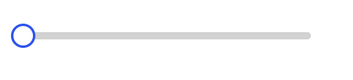
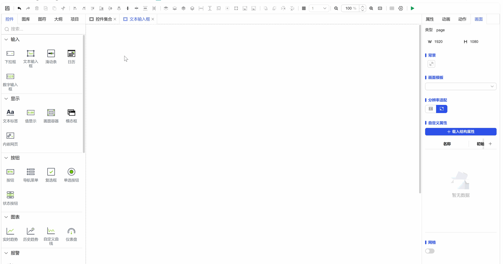

## 1. Overview

Slider controls are used to visually adjust and select parameter values within a specified numerical range, achieving precise numerical input and real-time feedback through sliding operations.

## 2. Usage Scenarios

Slider controls are used in the following scenarios:

### 1. Parameter Adjustment Scenarios

- When precise parameter adjustment is needed within a continuous numerical range
- Continuous variable adjustments such as volume control, brightness adjustment, speed settings
- Interactive scenarios for real-time preview of parameter change effects
- Parameter adjustments in conjunction with other controls to achieve linkage
- Real-time monitoring and control of system parameters

## 3. Quick Start

1. Drag the slider control to the canvas and adjust position and size
2. Set "Minimum Value" and "Maximum Value" to define the numerical range
3. Configure the "Value" property to set the initial position
4. Adjust style properties (background color, slider color, etc.)
5. Configure tooltip display style and decimal precision
6. Set "Action" to define interactive behavior when values change

**Example:**

Parameter Adjustment Scenario:

This example simulates volume adjustment functionality. Set the minimum value to 0, maximum value to 100, current value to 50. Users can adjust the volume in real-time by dragging the slider and accurately display the current volume value through tooltip information, as shown in Figure 1-1.

Figure 1-1

This example simulates an industrial boiler pressure monitoring system. When users drag the slider to adjust the pressure setpoint, the dashboard control on the right will rotate synchronously in real-time, displaying the current pressure value. This achieves intelligent linkage between the slider and dashboard, as shown in Figure 1-2.

Figure 1-2

## 4. Property Details

| Name     | Description                                                                                                                                                                                                                                                                         |
| -------- | ------------------------------------------------------------------------------------------------------------------------------------------------------------------------------------------------------------------------------------------------------------------------------------ |
| Name     | The name of this control.                                                                                                                                                                                                                                                               |
| X        | The distance from the left side of the control to the left side of the canvas, in px.                                                                                                                                                                                                                                           |
| Y        | The distance from the top of the control to the top of the canvas, in px.                                                                                                                                                                                                                                           |
| W        | The width of the control, in px.                                                                                                                                                                                                                                                         |
| H        | The height of the control, in px.                                                                                                                                                                                                                                                         |
| Angle    | The rotation angle of the control                                                                                                                                                                                                                                                               |
| Opacity  | The opacity of the control                                                                                                                                                                                                                                                               |
| Display  | Background Set the background color of the entire background bar. Slider Color Set the color of the slider part. Minimum Value Set the minimum value of the slider. Maximum Value Set the maximum value of the slider. Value Set the current value of the slider. Note: Once "Value" is bound, the slider cannot be dragged on the running page.                                       |
| Tooltip  | Set the display style of the slider tooltip information. Show Tooltip Control the display or hide of tooltip information. Background Set the background color of the tooltip information. Border Color Set the border color of the tooltip information. Decimal Places Set the decimal places of the tooltip value. Font Set the font type, font size, bold, italic, font color of the tooltip information. |
| Permission | Set the permissions of the control, control display/hide or enable/disable                                                                                                                                                                                                                                        |
