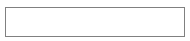
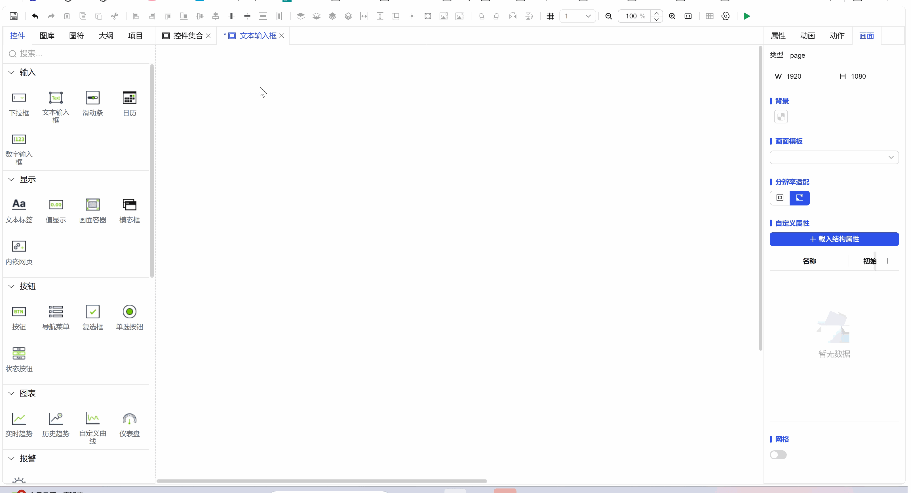

## 1. Overview

Text input boxes are used to receive any single-line text content input by users and support writing input values to data models or triggering related business operations.

## 2. Usage Scenarios

Text input box controls are used in the following scenarios:

### 1. Data Entry Scenarios

- When users need to input single-line text information
- Parameter settings and modifications in system configuration

## 3. Quick Start

1. Drag the text input box control to the canvas and adjust position and size
2. Set the default display content in the "Text" property (**Optional**)
3. Configure style properties (color, border, font, etc.) (**Optional**)
4. If password input is needed, enable the "Password" function (**Optional**)
5. Set "Action" to define interactive behavior after input completion (**Optional**)

**Example:**

Data Entry Scenario:

This example simulates information filling during user registration. When users need to input information such as username and email, text input boxes can be used to receive user input and save the input values to the user information database, as shown in Figure 1-1.

Figure 1-1

## 4. Property Details

| Name     | Description                                                                                                                           |
| -------- | -------------------------------------------------------------------------------------------------------------------------------------- |
| Name     | The name of this control.                                                                                                                 |
| X        | The distance from the left side of the control to the left side of the canvas, in px.                                                                                             |
| Y        | The distance from the top of the control to the top of the canvas, in px.                                                                                             |
| W        | The width of the control, in px.                                                                                                           |
| H        | The height of the control, in px.                                                                                                           |
| Angle    | The rotation angle of the control                                                                                                                 |
| Opacity  | The opacity of the control                                                                                                                   |
| Text     | The content displayed in the input box.                                                                                                           |
| Password | Not enabled by default. After enabling, the content entered in the text box will be displayed as password text.                                                                                 |
| Fill Color | The fill color of the text input box.                                                                                                           |
| Border Color | The border color of the text input box.                                                                                                         |
| Border Thickness | The border thickness of the text input box.                                                                                                         |
| Font     | Set the font of the input text. Includes font type, font size, font color, bold, italic, underline settings. And horizontal alignment: left align, center, right align. |
