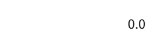
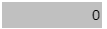

## 1. Overview

Value display controls are used to display text content. They support both static text display and dynamic data sources through property binding, enabling real-time content updates and dynamic display.

## 2. Usage Scenarios

Value display controls are used in the following scenarios:

### 1. Data Monitoring Scenarios

- When real-time display of dynamic data such as device status and sensor readings is needed
- Display of process parameters such as temperature, pressure, and flow in industrial monitoring systems
- You can see the historical trend chart of data through the trend popup, displaying data more intuitively

## 3. Quick Start

1. Drag the value display control to the canvas and adjust position and size
2. Bind the data source to be displayed in the "Data" property
3. Set the "Text" property to define display content (supports static text and dynamic binding)
4. Configure "Unit" and "Format" properties to optimize data display effects
5. Enable "Trend Popup" and set time range and sampling method
6. Adjust style properties (fill color, border, font, etc.)

**Example:**

### 1. Data Monitoring Scenario:

1.1 Data Monitoring Scenario Example

This example simulates a temperature monitoring system. Bind the value display control to a temperature sensor variable, set the unit to "℃", format to "0.0", and observe temperature changes over a period of time. As shown in Figure 1-1.

Figure 1-1

1.2 Actual Configuration Tutorial:

1. Drag the value display label control to the canvas and adjust position and size
2. Bind variables or properties of other controls in the Text property
3. Enable trend popup, set time range and sampling method, then click Save

## 4. Property Details

| Name     | Description                                                                                                                                                                                                                                                                                                                                  |
| -------- | ------------------------------------------------------------------------------------------------------------------------------------------------------------------------------------------------------------------------------------------------------------------------------------------------------------------------------------- |
| Name     | The name of this control.                                                                                                                                                                                                                                                                                                                        |
| X        | The distance from the left side of the control to the left side of the canvas, in px.                                                                                                                                                                                                                                                                                                    |
| Y        | The distance from the top of the control to the top of the canvas, in px.                                                                                                                                                                                                                                                                                                    |
| W        | The width of the control, in px.                                                                                                                                                                                                                                                                                                                  |
| H        | The height of the control, in px.                                                                                                                                                                                                                                                                                                                  |
| Angle    | The rotation angle of the control                                                                                                                                                                                                                                                                                                                        |
| Opacity  | The opacity of the control                                                                                                                                                                                                                                                                                                                          |
| Data     | The data received by the control. Text The content to be displayed. Can be manually entered or bound by clicking the bind button. Unit Set the unit of the displayed data. Can be manually entered or bound by clicking the bind button. Format The expected display content format. Can be manually entered or click the settings button, double-click to select the required format. Text Overflow Set how to handle text overflow: Hide, Wrap, Ellipsis (3 options available) |
| Display  | Trend Popup On or Off Time Range Set the time range of the control, including 5 minutes, 10 minutes, 30 minutes, 1 hour, 1 day, 1 week, 1 month, and custom Sampling Method Set the sampling method for the control, including original value, average value, maximum value, minimum value, start value, end value, count, increment                                                                                                           |
| Fill     | The fill color of the control.                                                                                                                                                                                                                                                                       |
| Border Color | The border color of the digital input box.                                                                                                                                                                                                                                                                                                                |
| Border Thickness | The border thickness of the digital input box.                                                                                                                                                                                                                                                                                                                |
| Font     | Set the font of the control content. Includes font type, font size, font color, bold, italic, underline, horizontal alignment, vertical alignment.                                                                                                                                                                                                                                |
