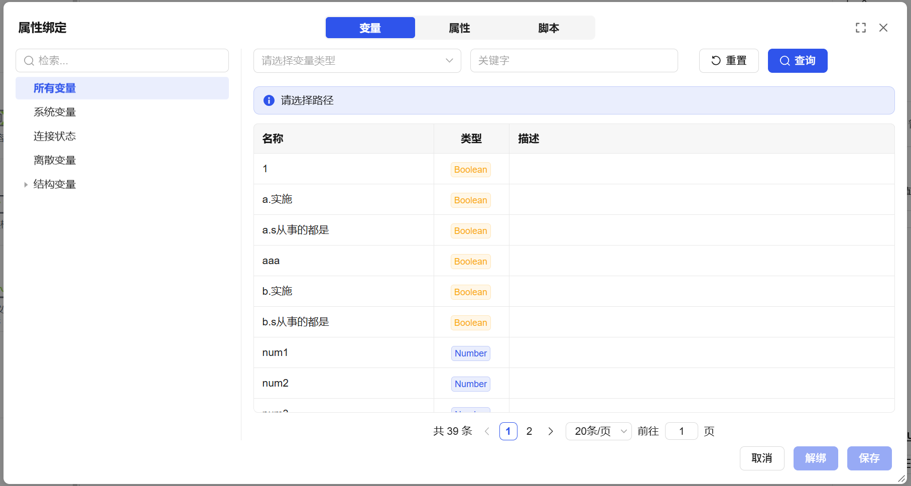
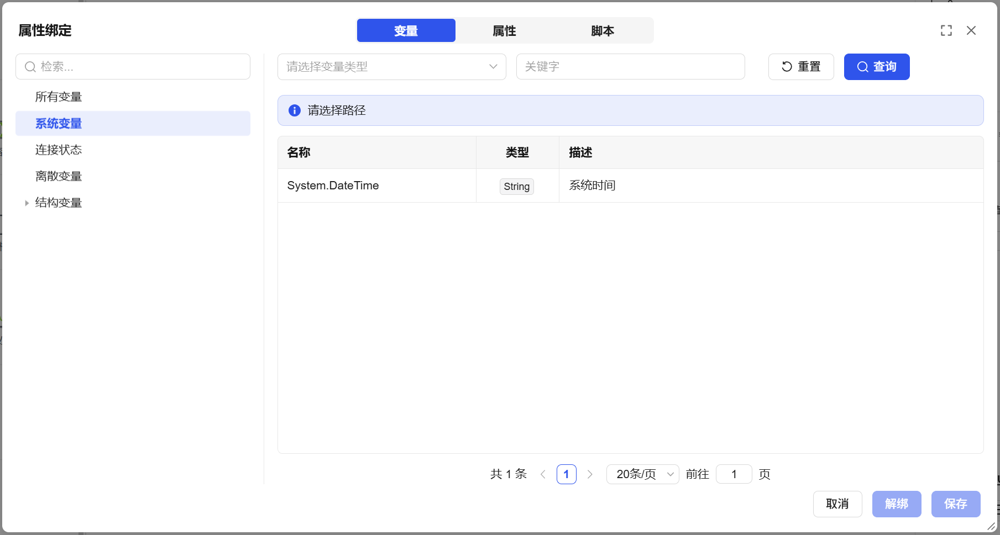
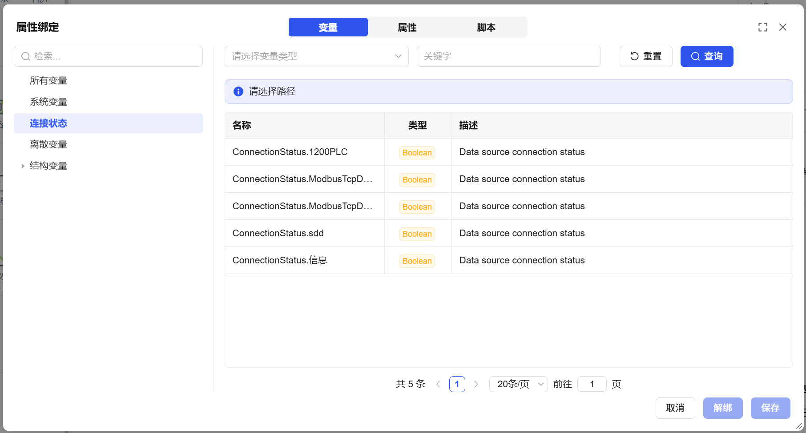
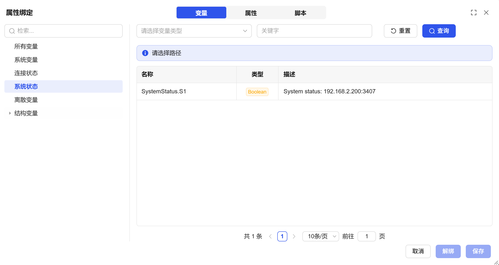
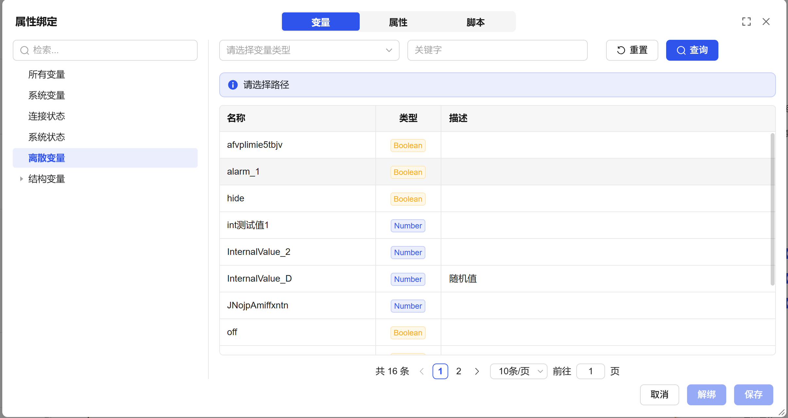
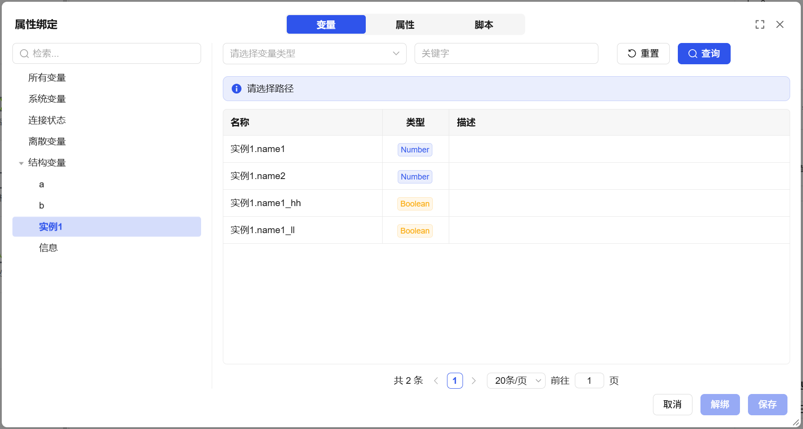

## 1. Overview

Variable binding is the core mechanism for building dynamic applications. By associating screen control properties with data variables, it achieves real-time mapping and interaction of data in the interface. When the bound variable value changes, the interface will automatically synchronize and update, and vice versa, forming a bidirectional data flow.

## 2. Variable Library Classification

| Variable Classification | Description and Included Content |
| ---------------------- | -------------------------------- |
| All Variables | Display all variables defined in the system, including each variable's name, data type, and detailed description, providing the most comprehensive variable view. |
| System Variables | Display the list of variables predefined and maintained by the system, currently displaying system time. |
| Connection Status | Specifically display connections in connection management, including their names, types, and descriptions. |
| System Status | Display server status information. |
| Discrete Variables | Display all unstructured basic variable lists. These variables are custom variables such as integer, floating point, boolean, string, and other single data type variables. |
| Structured Variables | Display structured composite variable lists. These variables correspond to device variables in device point tables and can be used to organize and manage a group of related data. |

**Example:**

### All Variables

Display all variables in the system, including variable names, types, and descriptions, as shown in Fig 1-1.

Fig 1-1

### System Variables

Display the system's variable list, as shown in Fig 1-2.

Fig 1-2

### Connection Status

Display connection status names, types, and descriptions, as shown in Fig 1-3.

Fig 1-3

### System Status

Display server status information, as shown in Fig 1-4.

Fig 1-4

### Discrete Variables

Display all unstructured variable lists, as shown in Fig 1-5.

Fig 1-5

### Structured Variables

Display structured variable lists, as shown in Fig 1-6.

Fig 1-6