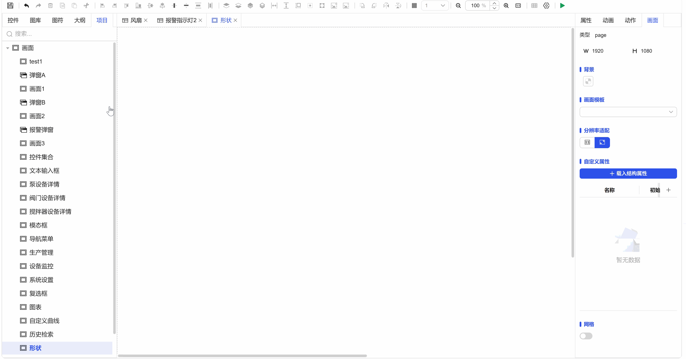

## 1. Overview

Variable write value is the core operation for implementing system logic control and data flow driving. Through this function, you can write the current property value of screen controls, manually entered custom values, or other variable values to the target variable. Once the target variable's value changes, it can trigger the linked logic, events, or animations bound to it, thereby driving the dynamic behavior of the entire application.

## 2. Function Details

### 1. Sources of Values to Write

- **Copy Control Property Value**: Directly write the current property value of a control on the screen (such as input box, dropdown box, slider) to the target variable.
- **Copy Other Variable Value**: Assign the current value of one variable to another variable.
- **Custom Fixed Value**: Directly manually input a fixed numeric value, string, or boolean value and write it to the target variable.

### 2. Core Functions and Value

- **Implement Logic Control**: By modifying variable values, they can serve as switches or status identifiers for conditional judgments, thereby controlling program flows in other parts (such as showing/hiding controls, enabling/disabling functions).
- **Drive Events and Animations**: Many events (action execution) and animation effects are triggered by changes in variable values. Through write operations, these responses can be actively triggered.
- **Implement Data Synchronization**: Synchronize data states between different controls or modules.

## 3. Typical Application Process

1. **Configure Write Action**: In the "Actions" settings of a control (such as a button), select "Variable Write Value".
2. **Select Target Variable**: Specify the variable to write to.
3. **Set the Value to Write**:

   1. Select "Bind" to get the value from control properties or other variables.
   2. Select "Custom" to directly input a fixed value.
4. **Set Trigger Conditions**: Define when to execute this write operation (such as when a button is clicked).
5. **Produce Effect**: When the action is triggered, the target variable value changes, thereby driving the execution of all events, animations, or conditional logic bound to that variable.

**Example:**

Figure 1-1
