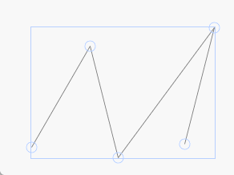
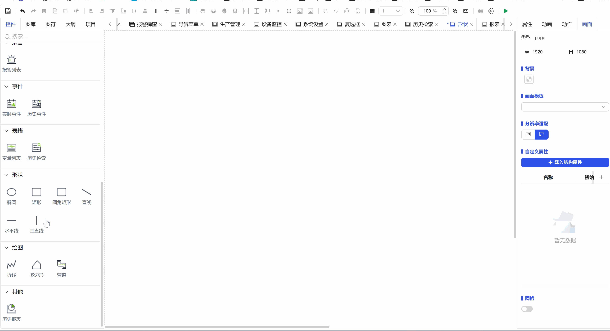

## 1. Overview

Zigzag line shape controls are used to create and edit zigzag graphics composed of multiple connected line segments on the canvas, supporting free drawing and precise editing, suitable for creating complex paths, connection lines, and polygon outlines.

## 2. Usage Scenarios

Zigzag line controls are used in the following scenarios:

### 1. Data Visualization Scenarios

- Used to draw polygon outlines, custom shapes, and complex paths
- Basic lines of line charts, custom connection paths in flowcharts
- When custom trend lines, connection lines, or paths need to be created

## 3. Quick Start

1. Click the left mouse button to select the zigzag line control from the toolbar
2. Click the left mouse button at the starting position on the canvas and drag the mouse to draw the first line segment
3. Click the left mouse button to complete the first line segment, then press and drag again to draw the next line segment
4. Repeat steps to draw multiple line segments, click the right mouse button to determine the end position
5. Double-click the zigzag line to enter edit mode, adjust the position of each vertex
6. Precisely set style and global parameters in the property panel

**Example:**

### 1. Data Visualization Scenario:

1.1 Data Visualization Scenario Example

This example is creating a zigzag line and setting basic properties, as shown in Figure 1-1.

Figure 1-1

1.2 Actual Configuration Tutorial:

1. Click the left mouse button to select the zigzag line control from the toolbar
2. Click the left mouse button at the starting position on the canvas and drag the mouse to draw the first line segment
3. Click the left mouse button to complete the first line segment, then press and drag again to draw the next line segment
4. Repeat steps to draw multiple line segments, click the right mouse button to determine the end position

## 4. Property Details

| Name   | Description                                                   |
| ------ | ------------------------------------------------------------- |
| Name   | The name of this control.                                         |
| X      | The distance from the left side of the control to the left side of the canvas, in px.                     |
| Y      | The distance from the top of the control to the top of the canvas, in px.                     |
| W      | The width of the control, in px. Fixed at 1px                          |
| H      | The height of the control, in px.                                   |
| Angle   | The rotation angle of the control                                         |
| Opacity | The opacity of the control                                           |
| Line   | The line color of the control The line style of the control The line thickness of the control |
| Permission   | Set the permissions of the control, control display/hide or enable/disable                  |
