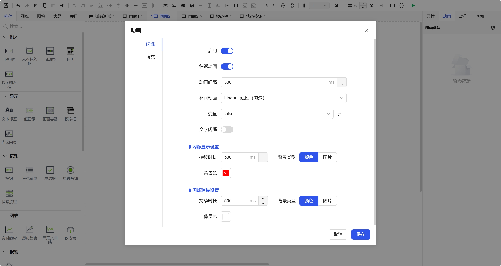
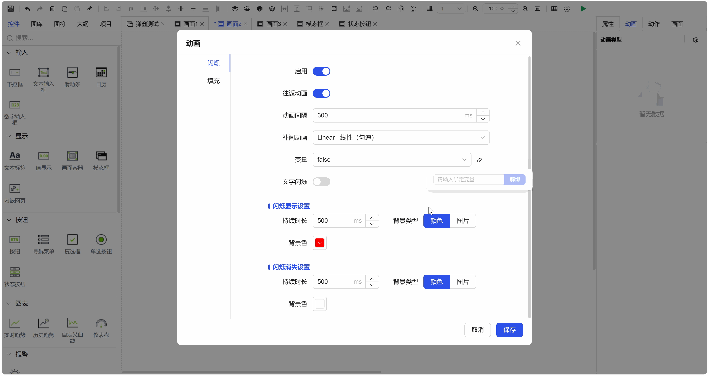
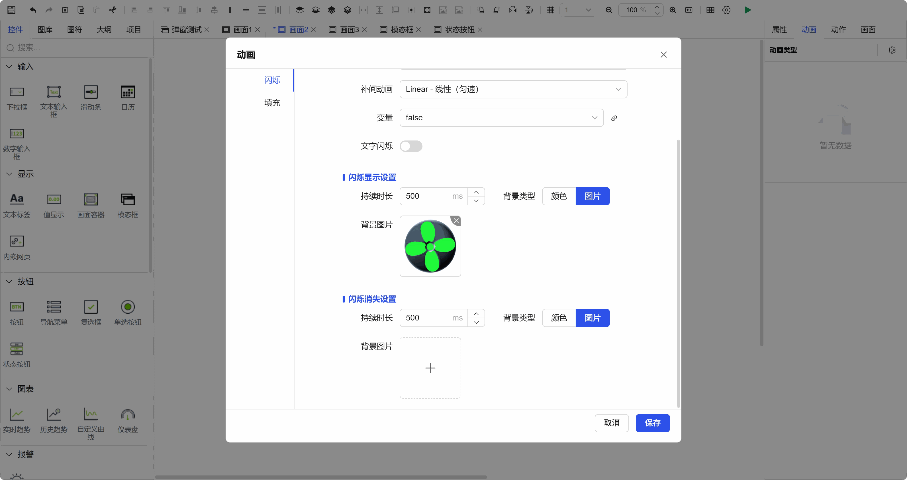
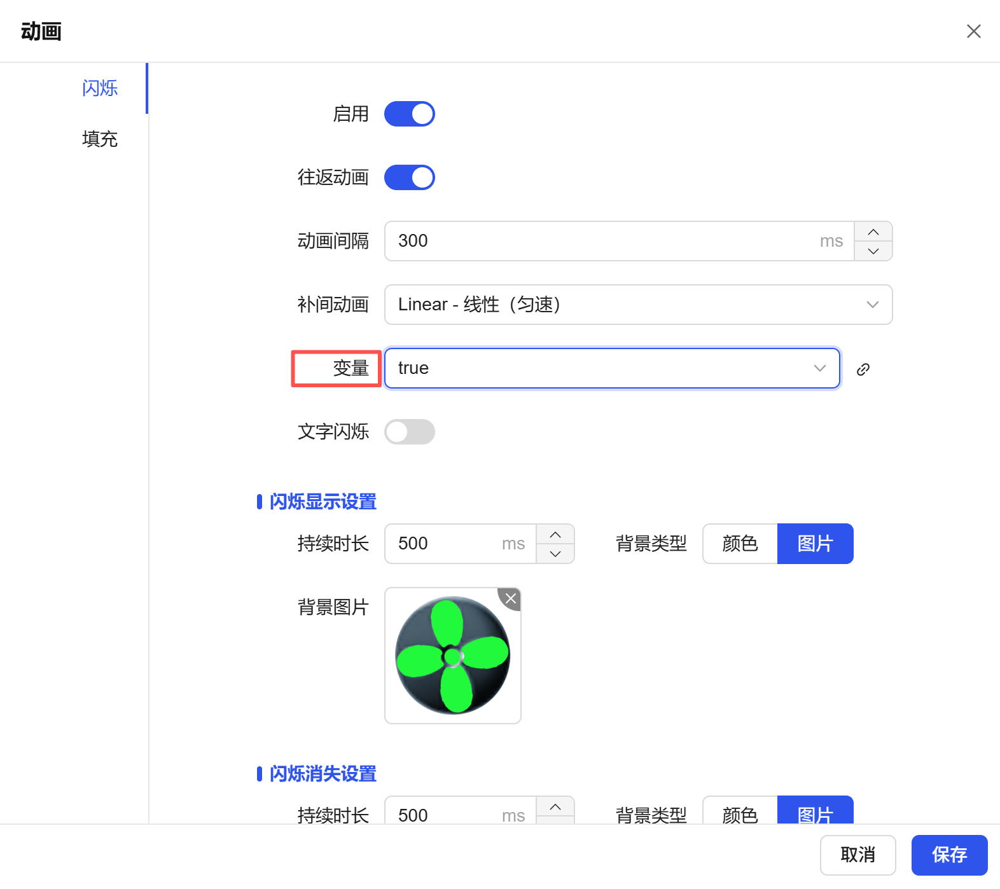

## 1. Overview

Animation effects can significantly enhance the interface's dynamic performance and state awareness. This case will use the **Text Label** control as an example to demonstrate how to configure a simple "blinking" animation, achieving alternating display of two images to simulate device running status.

## 2. Operation Steps

### Step 1: Select Control and Enable Animation

1. Place or select a control that can display content on the canvas, this case selects the **Text Label** control.
2. Find the **"Animation"** property panel in the right property panel.
3. Click the switch to the right of **"Blink"** to set it to **"Enabled"** state.

Fig 1-1

### Step 2: Configure "Blink Display" State

1. Click the settings button next to **"Blink Display"** to enter the detailed configuration of this state.
2. In "Background Type", select **"Image"**.
3. Click the image selection box to select an image from the image library, for example: **Fan Green-0°.png**. This image will be displayed when the control is "displayed".

Fig 1-2

### Step 3: Configure "Blink Disappear" State

1. Click the settings button next to **"Blink Disappear"** to enter the detailed configuration of this state.
2. Similarly, in "Background Type", select **"Image"**.
3. Click the image selection box to select another image from the image library, for example: **Fan Green-45°.png**. This image will be displayed when the control "disappears". The difference between the two images will constitute the dynamic effect.

Fig 1-3

### Step 4: Bind Animation Trigger Variable

1. At the top of the animation properties, find the **"Variable"** binding box that controls animation start/stop.
2. Click the bind button to bind it to a **Boolean variable**, and set the variable's value to `true`.
3. **Principle Explanation**: When the bound variable value is `true`, the control will start cycling between "blink display" and "blink disappear" states at the set frequency to form an animation effect; when the variable value changes to `false`, the animation stops.

Fig 1-4

### Step 5: Run and Test

1. Enter **Preview** or **Run** mode.
2. Ensure the variable controlling the animation has a value of `true`.
3. Observe the text label control, you will see its background alternating and blinking between **Fan Green-0°.png** and **Fan Green-45°.png**, thereby simulating the dynamic visual effect of fan rotation.
