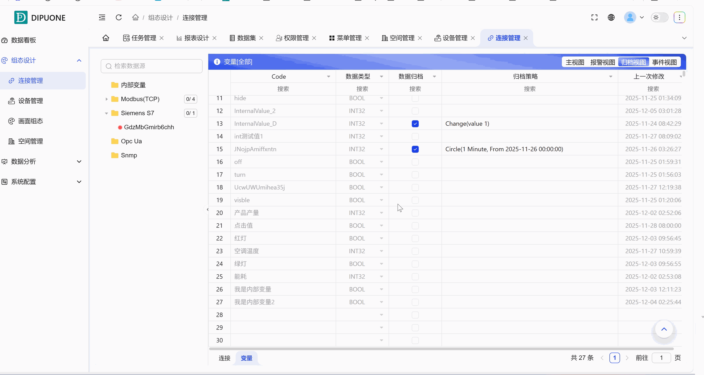
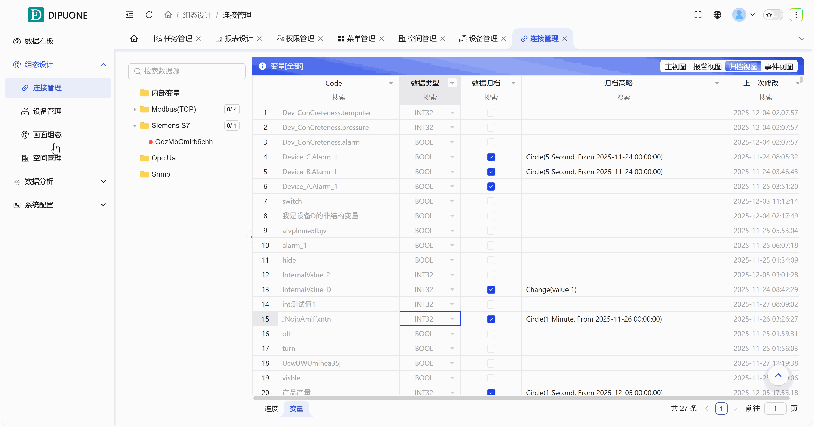
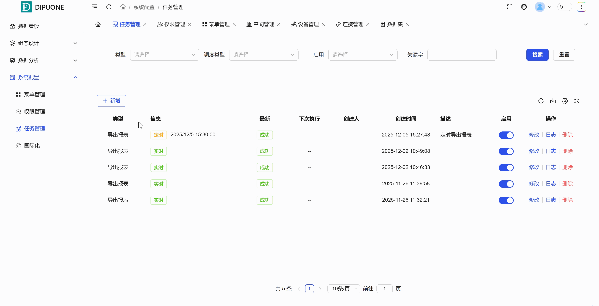
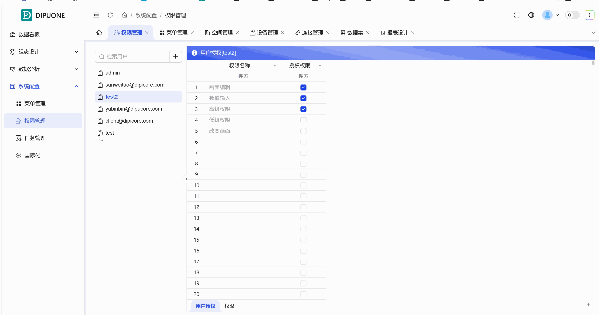

## 1. Overview

Timed report export is a key function for implementing automated data archiving and distribution. This case will completely demonstrate the full process from **configuring data archiving**, **creating datasets and reports** to **setting up scheduled tasks**.

## 2. Operation Steps

### Step 1: Configure Data Archiving (Determine which data to record)

Report data comes from historical records, so first you need to clarify which variable values need to be recorded by the system.

1. Enter **"Connection Management"**.
2. Find and select the **variables** that need to export data, switch to **"Archive View"**.
3. Click configure, set archiving strategy:

   1. **Record Type**: Choose recording method (such as: record by data change, timed recording).
   2. **Start Time**: Set from when to start recording this variable's historical values.
4. Save configuration. After this, this variable's value changes will be recorded to the historical database according to the strategy.

### Step 2: Create Dataset (Define report's data source)

The report needs a clear data scope.

1. Enter the **"Dataset"** management module.
2. Click **"Add New"** to create a new dataset.
3. In the dataset, **add variables that have been configured for archiving in step 1** as data sources. You can add multiple variables and perform filtering, sorting, etc. on them.

### Step 3: Design Report (Define data presentation format)

1. Enter the **"Report Design"** module.
2. Click **"Add New Report"** to create a new report.
3. In the report's **"Data Source"** settings, **select the dataset created in step 2**.
4. Design the report layout, such as adding tables, charts, and binding fields in the dataset. After saving, you can see the report content based on historical data in the preview.

### Step 4: Create Scheduled Export Task (Implement automation)

1. Enter the **"Task Management"** module.
2. Click **"Add New"** to create a new task.
3. Configure the task:

   1. **Task Name**: Name the task (such as "Daily Energy Consumption Report").
   2. **Report Selection**: **Select the report created in step 3**.
   3. **Schedule Type**: Select **"Scheduled"**.
   4. **Schedule Configuration**: Set the specific execution time (for example: 2:00 AM every day).
   5. **Data Time Range**: Set which time period's data the report should include each execution (for example: export "yesterday's" data).
4. Enable and save the task.

## 3. Process Summary

The entire automated process follows a clear data flow: **Configure Variable Archiving (Record Data)** → **Create Dataset (Organize Data)** → **Design Report (Display Data)** → **Set Scheduled Task (Auto Execute)**.

The task will run automatically according to your set time: the system will retrieve variable data from the specified time range in the historical database, organize it through the dataset, fill it into the report template, and finally generate files (such as Excel) for saving or sending, achieving unattended report automation.
