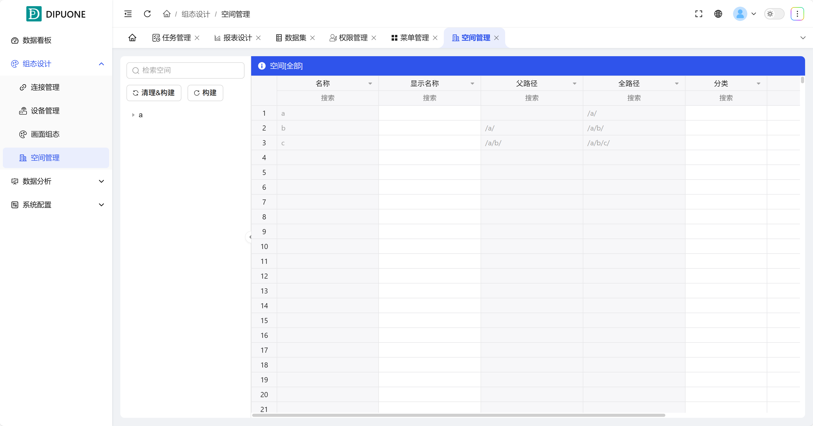

## 一、概述

空间管理模块用于对物理楼栋或区域进行数字化建模与量化管理。它以树形结构清晰展示所有空间的层级关系与属性信息，并提供完整的空间数据维护功能。

## 二、空间列表与操作

### 1. 空间属性展示

系统以表格形式量化展示每个空间的详细信息，主要字段包括：

- **空间名称**：空间的唯一标识符。
- **显示名称**：在界面中展示的友好名称。
- **父路径**：该空间在树形结构中的直接上级路径。
- **全路径**：从根节点到该空间的完整层级路径。
- **分类**：空间的类型分类（如：楼层、房间、区域等）。
- **注释**：对该空间的附加说明或备注。
- **上一次修改时间**：记录该空间信息最近一次的更新时间。

### 2. 空间导航与检索

- **树形导航**：用户可以通过左侧的**空间树**直观地浏览和选择特定空间。点击任一空间节点，右侧表格将自动筛选并展示**该空间及其所有下级空间**的列表。
- **全局检索**：支持通过空间名称、显示名称等关键信息对**全部空间**进行快速搜索定位。

### 3. 数据维护功能

空间表格支持对数据进行全方位的维护操作：

- **编辑**：修改任一空间条目的属性信息。
- **删除**：删除单个空间条目（需谨慎操作）。
- **批量操作**：支持对多个选中的空间条目进行批量编辑或删除，提升管理效率。

## 三、空间数据构建

系统提供两种模式来从源头系统（如BIM、CAD或空间数据库）同步或更新空间数据：

| 构建模式 | 功能与用途                                                                                                                                                     |
| -------- | -------------------------------------------------------------------------------------------------------------------------------------------------------------- |
| 全量构建 | 重新加载并构建全部的空间数据。此操作会使用最新的源数据，完全覆盖并重建现有的整个空间树。适用于首次导入或需要彻底更新所有数据的场景。                           |
| 增量构建 | 仅加载和同步发生变化的空间数据。此操作会检查源数据与现有数据的差异，只更新新增、修改或删除的部分。适用于日常维护，能够大幅提升同步效率，减少不必要的系统负载。 |
