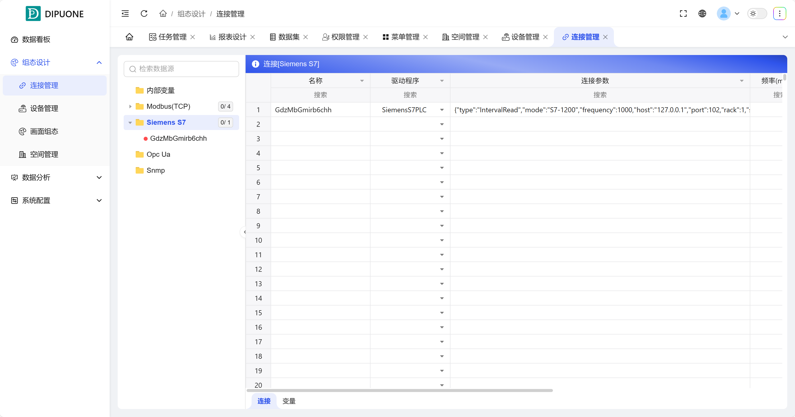
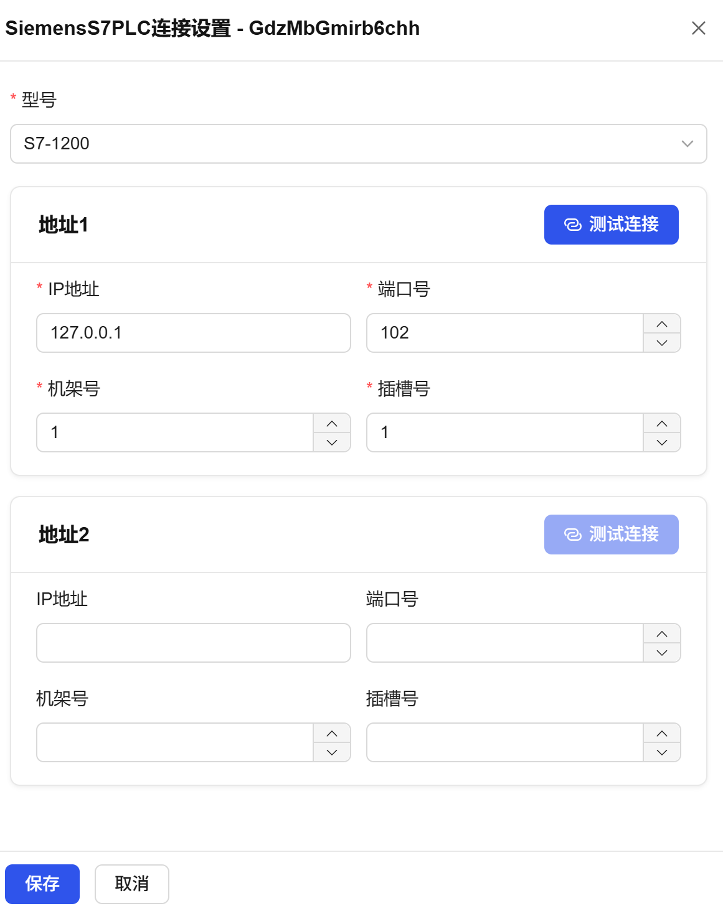
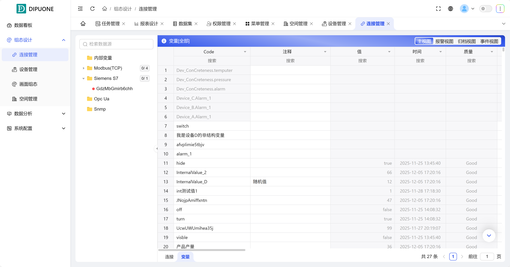
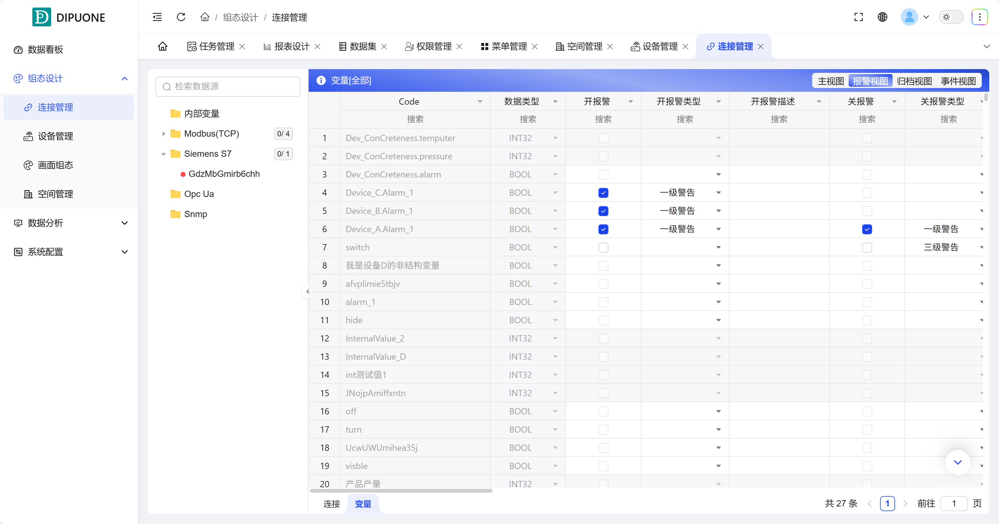

## 1. Overview

Connection Management is the core hub for system communication with external data sources. It is responsible for creating and managing connections with various protocol drivers, and managing variables and their advanced attributes (alarms, archiving, events) on top of that. It serves as a bridge for data flow from field devices to configuration screens.

**Protocol Support**: The system currently supports three mainstream industrial protocols: **Modbus (TCP), Siemens S7, and OPC UA**. The list does not support users adding or deleting protocols.

## 2. Connection Types and Management

Connections are organized in folders by protocol type. Each connection has status indicators and configuration items.

| Connection Type | Function and Status Indicators                                                                                         | Main Configuration Items                                                                    |
| --------------- | ----------------------------------------------------------------------------------------------------------------------- | ------------------------------------------------------------------------------------------- |
| Internal Variables | Create system internal variables that do not depend on external devices.                                                | Define variable attributes such as code, comments, data type, initial value, unit, group, etc. |
| Modbus (TCP)    | Establish connections with devices supporting Modbus TCP protocol. •Green indicator: Connection normal, device online. •Red indicator: Connection failed or device offline. | Connection name, connection parameters (IP, port, station number), polling frequency, group, communication alarm settings, etc. |
| Siemens S7      | Establish connections with Siemens S7 series PLCs. •Green indicator: Connection normal, device online. •Red indicator: Connection failed or device offline. | Connection name, connection parameters (IP, rack number, slot number, etc.), polling frequency, group, communication alarm settings, etc. |
| OPC UA          | Establish secure connections with OPC UA servers. •Green indicator: Connection normal, device online. •Red indicator: Connection failed or device offline. | Connection name, connection parameters (endpoint URL, security policy, etc.), polling frequency, group, communication alarm settings, etc. |

### New Connection Process

1. **Click** on the target protocol folder in the left tree.
2. Click **"Connection"**.
3. Enter the connection name, and the system will automatically generate default parameters for the corresponding driver.
4. **Double-click** connection parameters for detailed configuration, and **test the connection** to verify that the configuration is correct.

Figure 1-1

Figure 1-2

## 3. Variable Management

Multiple variables can be managed under each connection. The system provides four management views for each variable to achieve comprehensive data control.

| View      | Function Description                           | Key Operations                                                                                                                                                |
| --------- | ---------------------------------------------- | ------------------------------------------------------------------------------------------------------------------------------------------------------------- |
| Main View | Display the core information and real-time values of variables. | Internal variables: Some attributes can be edited. External connection variables (from device management): Attributes cannot be edited, automatically synchronized with device configuration. Can view connection source, real-time values, addresses, data types, associated devices, and other information. As shown in Figure 1-3 |
| Alarm View | Configure and manage alarm conditions for variables. | Set upper and lower limit alarm values, alarm types, and alarm descriptions. Alarm functions can be enabled or disabled for each variable. As shown in Figure 1-4 |
| Archive View | Configure historical data storage strategies for variables. | Double-click "Archive Strategy" to set conditions for triggering archiving (such as timing, change rate). The system will save variable historical value change records according to these conditions for historical query and analysis. As shown in Figure 1-5 |
| Event View | Configure event records triggered by variable value changes. | Mainly set open events (false→true) and close events (true→false) for Boolean variables. When events occur, they will be recorded by the system and can be viewed in the "Event Control" in the configuration. As shown in Figure 1-6 |

Through Connection Management, you can uniformly connect various data sources to the system and perform fine-grained configuration of real-time monitoring, alarm notifications, historical traceability, and event records for each data point.

Figure 1-3

Figure 1-4

Figure 1-5

Figure 1-6
