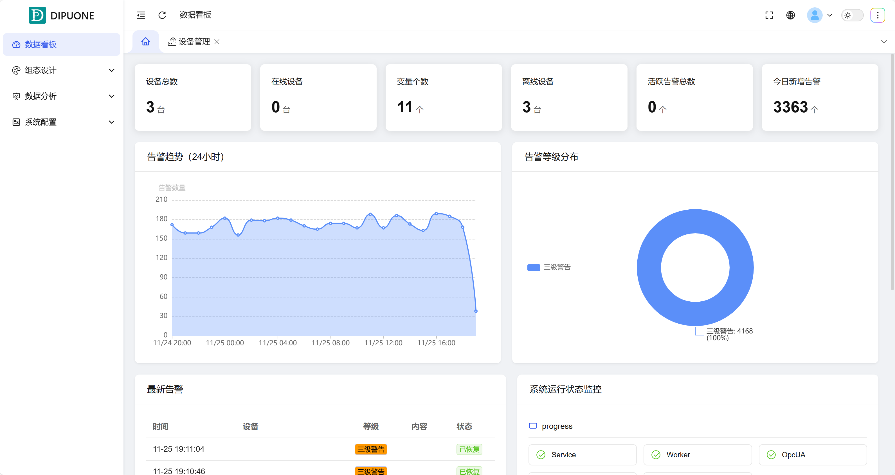

## 1. Overview

The Data Dashboard is the system's comprehensive information dashboard that centrally presents the core data and system operation overview that users care about most. Through intuitive charts and cards, it dynamically displays device status, alarm conditions, and system health, and provides configurable widgets to provide users with efficient global monitoring and interaction entry points.

## 2. Core Information Display

### 1. Device Overview

Display the overall operating status of devices at a glance in the form of key indicator cards:

| Indicator Item | Description |
| -------------- | ----------- |
| Total Devices  | The total number of physical devices registered and managed in the system. |
| Online Devices | The number of devices currently in normal communication connection status. |
| Offline Devices | The number of devices with interrupted communication or unable to connect. |
| Variable Count | The total number of all defined data points (variables) in the system. |
| Active Alarms  | The total number of unconfirmed alarms currently in active status. |
| Today's New Alarms | The total number of new alarms added to the system today. |

### 2. Alarm Situation Analysis

Through visual charts, analyze the distribution and trends of alarms in depth:

| Component            | Function Description                                                                           |
| -------------------- | ---------------------------------------------------------------------------------------------- |
| Alarm Trend Chart    | Displays the time series changes of alarm quantities in recent periods (such as 24 hours, 7 days), helping to identify peak alarm periods. |
| Alarm Level Distribution Chart | Displays the quantity proportion of different alarm levels (such as critical, important, warning) in pie or ring charts, quickly locating risk levels. |
| Latest Alarm List    | Scrolls to display recently generated alarm entries, including time, device, description, and level, facilitating immediate response. |

### 3. System Running Status

Monitor the health and performance indicators of the system itself:

- **Service Status**: The running status of core backend services.
- **Data Status**: The running status of related database services.

## 3. Widget Configuration Function

To improve user experience, the dashboard supports a certain degree of personalization:

- **Custom Components**: Define the functions and usage of some widgets.

Through the Data Dashboard, users can quickly grasp the global operating situation, identify potential problems, and make efficient decisions based on rich visual information.

