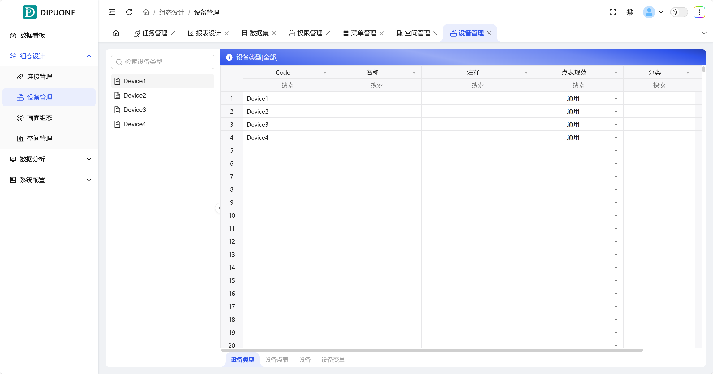

## 1. Overview

The Device Management module is responsible for connecting physical world device assets, modeling, configuring, and data access through digital means. It adopts a layered design, managing **Device Types, Device Point Tables, and Devices** in sequence, and finally automatically generating usable **Device Variables** to form a complete device data chain.

## 2. Core Function Modules

### 1. Device Type

**Device Type** is the top-level classification of device management, used to define a template for a class of devices with the same characteristics.

- **Function**: Create different types of device models (such as: "Water Pump", "Fan", "Smart Meter").
- **Editable Attributes**: Attribute annotation **Code** is the unique code of this device type. **Name** is the display name of this device type. **Comments** are descriptions of this type of device. **Point Table Specification** defines the communication **Protocol Specification** that this type of device should follow (such as: Modbus, OPC UA). **Category** is the major category of devices (such as: Power Equipment, Environmental Equipment). **Last Modified** records the last modification time.

### 2. Device Point Table

**Device Point Table** is the definition of all accessible **data points (registers)** for devices of this type after selecting a specific **Device Type**.

- **Function**: Configure the specific data structure for standard device types.
- **Editable Attributes (Key Items)**:

  - **Code/Name/Comments**: The identifier, name, and description of the data point.
  - **Source/Data Type/Length/Offset/Offset Bit**: Define the **address, data type, and read rules** of this data point in the protocol.
  - **Unit**: The measurement unit of the data point.
  - **Category/Data Conversion/Conversion Script**:

    - **Data Conversion**: After checking, scripts can be applied to the read raw values for secondary processing.
    - **Conversion Script**: Double-click to enter the script editor, write custom logic (such as: linear conversion, formula calculation) to convert raw data into engineering values.

### 3. Device

**Device** is a specific instance of a device type in a project, representing a real physical device.

- **Function**: Create device instances and configure their specific communication parameters and ownership information.
- **Editable Attributes (Key Items)**:

  - **Code**: The unique code of the device.
  - **Connection**: **Core Setting**. From the connection list created in "Connection Management", **select the correct communication connection** for this device (such as a specific Modbus TCP connection).
  - **Start Address/Group/Space**: The specific address, group, and physical location of the device.
  - **Device Brand/Model/Type/Code**: Physical attribute information of the device.
  - **Category/Last Modified Time**: Device category and modification records.

### 4. Device Variables

**Device Variables** are the final product automatically generated by **Devices** and **Device Point Tables**, and are **structured variables** that can be directly bound and used in projects.

- **Generation Principle**: The system automatically generates a corresponding set of variables for each specific device based on the "Device Type" selected by the "Device" and its "Device Point Table".
- **Attribute Information**: Each variable inherits the definition of the device point table (such as Code, unit, data conversion script), and is associated with the instance information of the specific device (such as connection, address, device name, space location, etc.), while also containing dynamic information such as real-time values, timestamps, and data quality.

**Variable Management View Details**

For device variables, the system provides four professional views for fine-grained management, each used to display information from different dimensions and configure corresponding functions. The following table details the core functions and roles of each view:

| View Name | Core Function                                                   | Key Configuration Items                                                                                                                                                                                                                          | Features and Notes                                                                                                                                                                                                            |
| --------- | -------------------------------------------------------------- | --------------------------------------------------------------------------------------------------------------------------------------------------------------------------------------------------------------------------------------------------- | ------------------------------------------------------------------------------------------------------------------------------------------------------------------------------------------------------------------------- |
| Main View | Display and manage the basic attributes and real-time information of variables. | •Basic Attributes: Variable name, comments, data type, length, unit, group, etc. •Connection Information: Data source, connection, address, associated device. •Device Information: Space location, device brand, model, type, name, code. •Real-time Data: Current value, timestamp, data quality code. •Data Conversion: Can be enabled and conversion scripts can be written. | Note: If special processing of raw values is required (such as unit conversion, formula calculation, range mapping), you can enable the "Data Conversion" function and write JavaScript scripts in the "Conversion Script" editor to achieve data preprocessing. |
| Alarm View | Configure and manage alarm conditions and strategies for variables. | •Alarm Types: -Boolean: Switch alarm. -Numeric: Upper limit, lower limit, upper upper limit, lower lower limit alarms. •Alarm Parameters: Alarm value, alarm description, alarm level. •Advanced Settings: Delayed alarm, recovery delay. | Important Feature: After enabling "Delayed Alarm", alarms will only be officially triggered when the alarm state persists beyond the set delay time. If the state recovers during this period, it is considered a transient interference and will not be recorded. This can effectively filter transient fluctuations and avoid false alarms. |
| Archive View | Configure historical data storage strategies for variables, recording key data to the historical database. | •Archive Mode: 1. Timed Recording: Set start time and fixed time interval (e.g., record once every 5 minutes). 2. Change Recording: Only record when the variable's value changes (exceeds dead zone). •Archive Strategy: Storage period, compression strategy, storage location. | Application Scenarios: Timed recording is used to generate trend reports; change recording is used to track key operations or state switches, saving storage space. After configuration, data will be persisted for use by historical trend charts, reports, and historical retrieval. |
| Event View | Configure event records triggered by variable value changes, used for key action tracking and auditing. | •Event Types: -Numeric: Assignment event (value is changed). -Boolean: Open event (false→true), Close event (true→false). •Event Parameters: Event trigger conditions, event description. | Core Value: Unlike archiving which records all values, the Event View focuses on recording state transitions with business significance. For example, recording each start/stop of a device (open/close events) or modification of key parameter set values (assignment events). Recorded events can be viewed in the "Event List" control, facilitating operation traceability, fault analysis, and compliance auditing. |

Through these four views, you can manage device variables comprehensively from different dimensions: define their identity and real-time status in the **Main View**; set safety boundaries in the **Alarm View**; plan their historical memory in the **Archive View**; mark their important moments in the **Event View**, together forming a full lifecycle management system for variables from generation, monitoring to analysis.

## 3. Workflow Summary

The standard device access process is: **Define Device Type → Configure Device Point Table → Create Device Instance (Select Connection) → Automatically Generate Device Variables**. Through this process, physical devices can be seamlessly mapped to standardized data sources in the configuration system.
