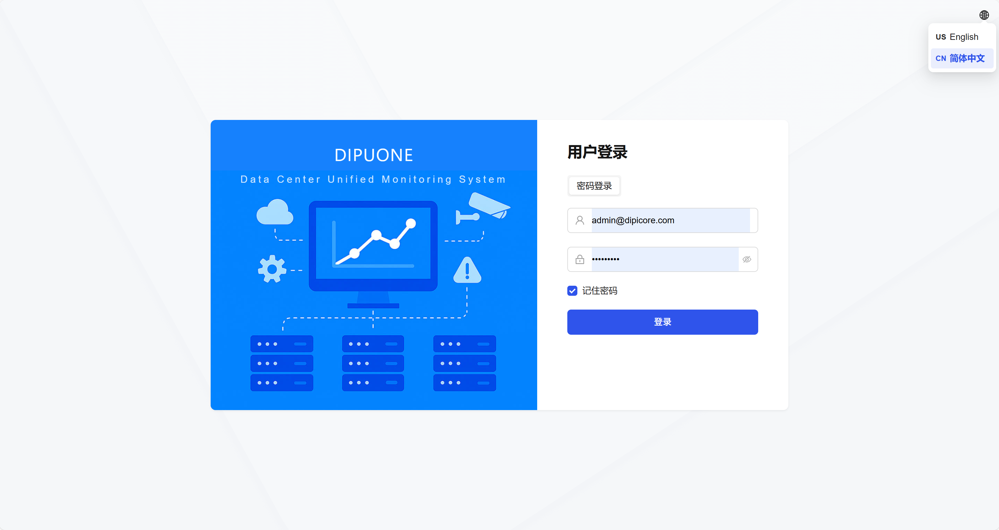
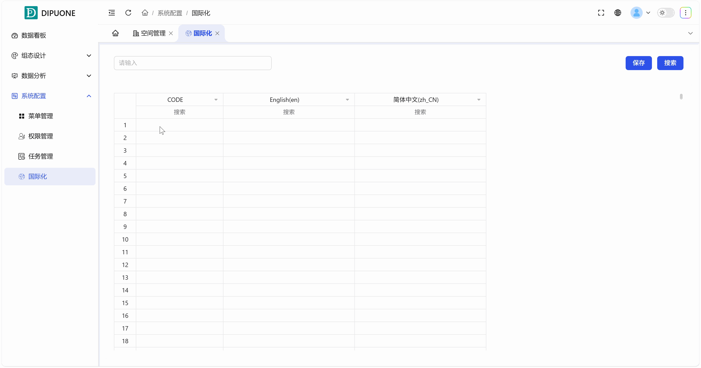
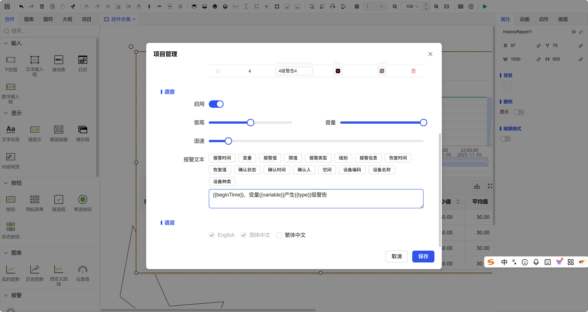
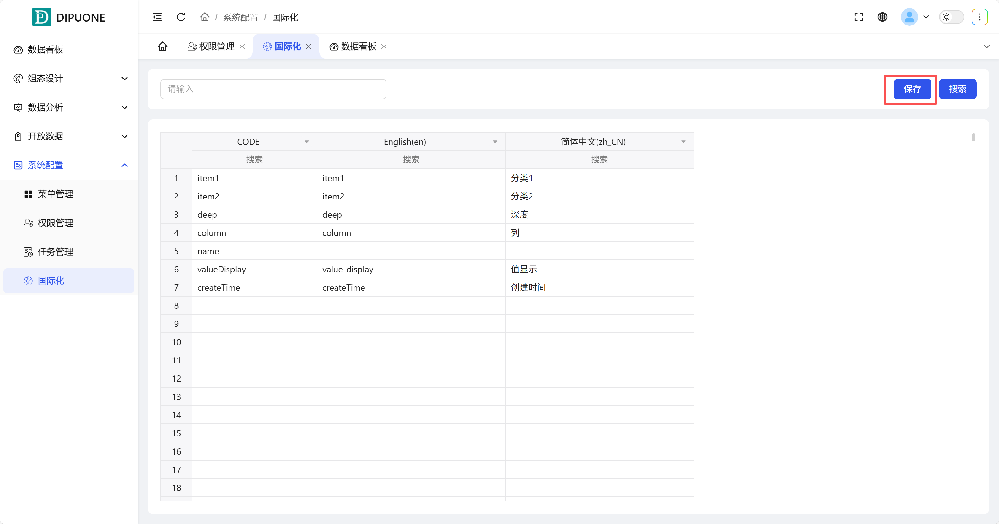
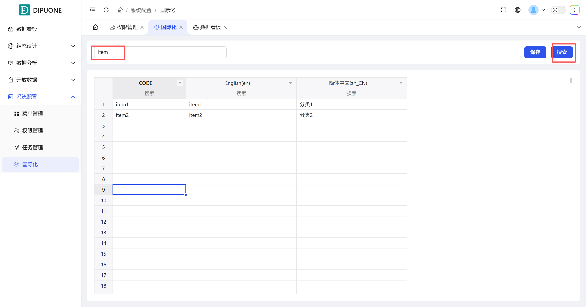

## 1. Overview

To accommodate global users, the system provides complete internationalization (i18n) support, allowing users to select the interface language according to their needs and customize translation content to achieve flexible localization of interface text.

## 2. User Language Switching

Users can select the language supported by the system in the **upper right corner of the login interface**. The system will dynamically switch the display text of all interface elements according to the selected language.

## 3. Custom Translation Items

DipuCore provides advanced users and developers with the ability to customize internationalization translations.

### 1. Core Functions

- **Custom Keywords (CODE)**: You can create your own translation keywords, such as "Name", "Age".
- **Multi-language Translation**: Fill in the corresponding translations for each CODE in different enabled languages.
- **Reference Method**: In scripts or properties that support dynamic text, use the form `t("CODE")` to reference custom translations. When the system switches languages, this will automatically be replaced with the translation in the corresponding language.

### 2. Translation Item Management

- **Batch Operations**: Supports **batch addition, modification, and deletion** of custom translation items.
- **Fuzzy Search**: The management interface provides a search box in the upper left corner, which can perform fuzzy searches based on **CODE** or **translation text in any language** to quickly locate target entries.

## 4. Project Language Configuration

Although users can switch languages after logging in, projects need to pre-configure which language packs are enabled.

- **Configuration Path**: In the **Toolbar Options** of **Screen Configuration** (Editor), click **"Settings"**.
- **Configuration Item**: In the project settings, find and set **"Enabled Languages"**. Only languages enabled here will appear in the user's switching list.

Users can access the language system supported by the system in the upper right corner of the login interface. For countries using different languages, users can select the appropriate language when logging in.

## 5. Custom Translation Items

DipuCore provides users with custom internationalization language switching. Users can customize keywords (CODE) and fill in the corresponding language translations, then click the save button. When using this keyword (CODE) later, use the form `t("CODE")`. When performing internationalization switching, the language can be correctly switched.

Using Custom Translation Items:

This custom translation item supports batch addition/modification/deletion.

The input box in the upper left corner supports fuzzy search, which can match CODE and translations in corresponding languages.

### Setting Enabled Languages

You can set the languages enabled for this project in the Settings under the Toolbar Options in component design.
